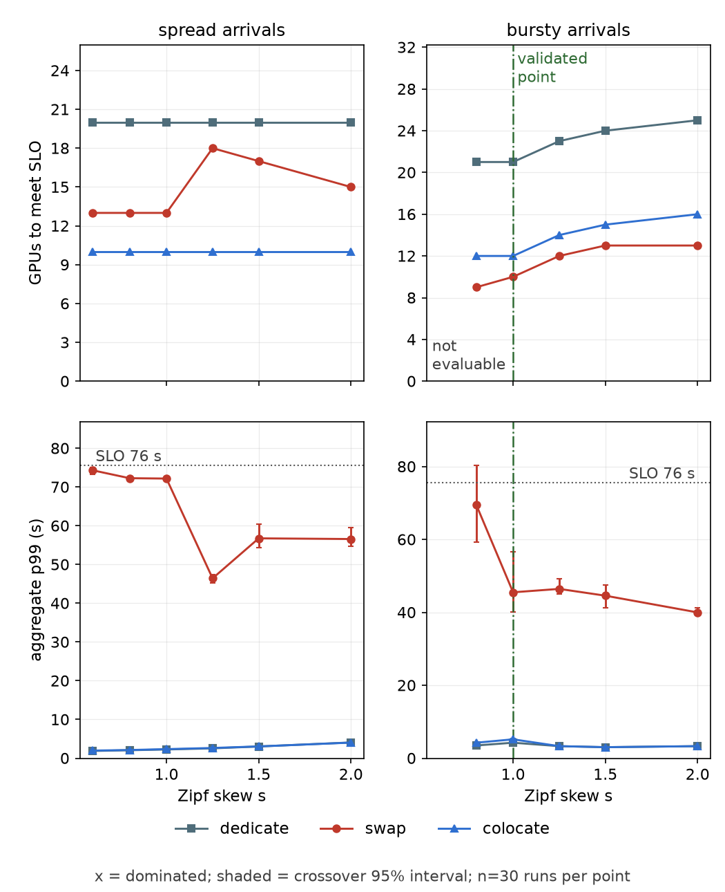
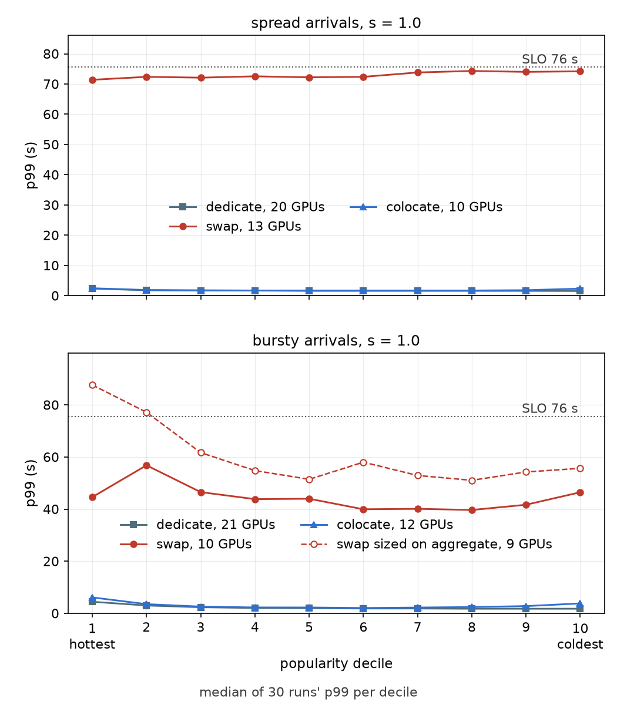
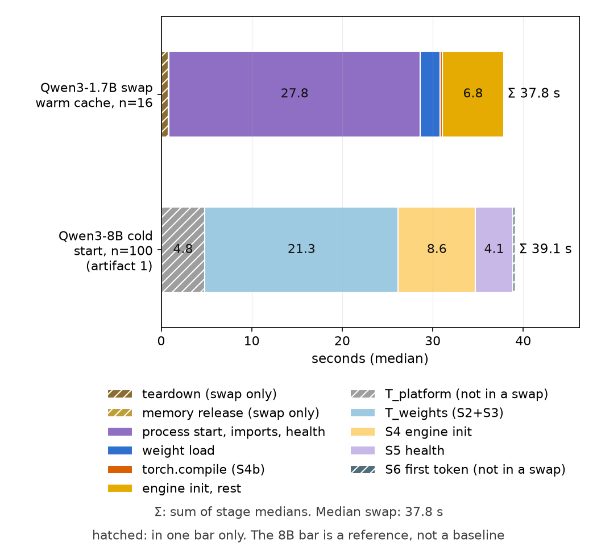
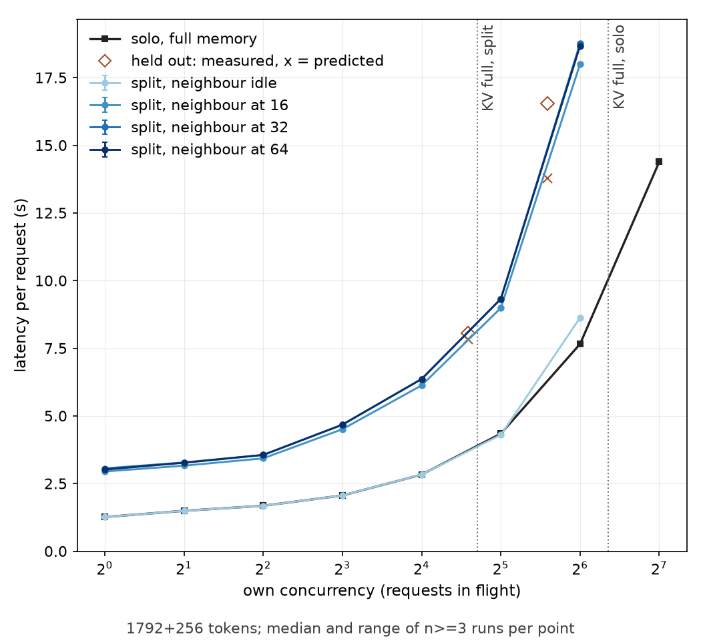

<!--
Permanent slug: /experiments/multi-model-placement
Never changes, per the portfolio contract. It names the question the experiment
asked (where to place many models on GPUs), not the headline it ended with, so the
title can be reworded at publication without breaking the URL.

The byline date is the publication date. PUBLICATION-DATE is a placeholder the
owner sets at publication. The spend is recorded, from RunPod's billing API, in
`docs/spend-a4.md`.

DRAFT for the owner's review. Every headline number below is rendered by
`placement/post_numbers.py` from `data/a4/analysis.json`, and
`tests/test_a4_post.py` fails if one is missing or has drifted.
-->

# Dedicate, swap or share: placing twenty small models on GPUs, and a simulator that missed its own test

**Oleksii Ostapiuk** · PUBLICATION-DATE · `/experiments/multi-model-placement`

For twenty small models on rented RTX 4090s, the cheapest placement depends on how
the traffic arrives, not on how skewed it is. When each model's requests are spread
across time, **co-locate two models per GPU**. When each model's requests come in
bursts with long gaps between them, **swap models in and out of a GPU**. As a rule over
the Zipf skew s that I swept, it reads: spread arrivals, s = 0.6–2.0: colocate; bursty
arrivals, s = 0.8–2.0: swap. **Dedicating a GPU to each model was never the cheapest**
in either regime. At the reference point (bursty arrivals, Zipf skew
s = 1.0), dedicating needs 21 GPUs and costs $850.43 per tenant per month, which is
$2.84 per million tokens; swapping needs 10 GPUs, $404.97 per tenant per month, $1.35
per million tokens; co-locating needs 12 GPUs, $485.96, $1.62. For twenty tenants,
dedicating costs $8,909.28 more per month than the cheapest option. The price of a
GPU-hour is $1.11, derived from RunPod's billing API.

**Read those numbers as a simulator's, because the simulator failed its test.** The
placement comparison runs in a simulator fed with measured inputs, and it was to be
trusted only after it reproduced a real one-GPU, three-model replay under a
pre-registered test. It did not: the validation outcome is failed, with 10 of 13
judged bins outside the band of three real repeats, and one of two held-out
interference cells missed. The ordering is wide (dedicating costs about twice
the cheapest option), but the gate measures latency, and I did not test whether the
model's error is small enough to leave the ordering unchanged; the exact GPU counts
are not validated. Below: the answer, then what was measured, then the failure and what
I know about it.

Harness, raw data, analysis and figure code:
[github.com/alexostapiuk11/coldstart-recon-worker](https://github.com/alexostapiuk11/coldstart-recon-worker)

---

## The crossover



The figure has two columns, one per arrival regime, and the same x axis, the Zipf skew
of the twenty models' popularity (higher is more skewed). The top row is the number
of GPUs each strategy needs for every popularity decile to meet the SLO of 75.6 s
p99. The bottom row is the aggregate p99 that fleet delivers.

- **Spread arrivals** (each model's requests spread across the whole window, with no
  memory of which model came before): s = 0.6–2.0: colocate. Co-locating needs 10 GPUs
  at every skew, half of dedicating (20). That is the floor of its search: it starts with
  every model paired, so 10 GPUs is the smallest fleet the strategy can have, and the
  SLO was met there at every skew. Swapping needs 13 to 18. The pre-registration
  expected swap to thrash where arrivals carry no memory; I did not diagnose why it needs
  more GPUs at s = 1.25 than at s = 0.6.
- **Bursty arrivals** (a model is active for a burst of about 120 s, about a fifth of
  the time): s = 0.8–2.0: swap. Swapping needs 9 to 13 GPUs, co-locating 12 to 16,
  dedicating 21 to 25. The bursty regime has one gap, s = 0.6: not evaluable. At that
  skew some popularity decile did not receive enough requests, in some repetition,
  to compute a p99, and the pre-registered rule is to publish no number there, not to
  fill it from the repetitions that did.
- **No crossover in the swept range, within either regime.** The estimator reports
  no crossover in the swept range for spread arrivals and none for bursty ones: one
  strategy is cheapest at every skew that could be evaluated. The boundary is between the
  regimes, not along the skew axis. Section "Where the boundary moves" says what that
  does and does not show.

The SLO matters, and a screen I pre-registered chose it. It is 2 times the median swap,
75.6 s, and the offered load is 1 GPUs of the measured solo saturation (8.89 requests
per second) spread over twenty models. Dedicating and co-locating deliver a p99 of 4 to 5 s at the
reference point; swapping delivers about 45 s. Swapping is cheapest here at an SLO loose
enough to absorb a swap. A tighter SLO would need a larger swap fleet and could remove its
advantage; I swept the SLO only over the screen's three multiples of the swap median.

## Why the naive answer is wrong



The obvious way to size a fleet is to find the smallest one whose **aggregate p99**,
over all requests, meets the SLO. With twenty models and Zipf-shaped popularity, the
aggregate p99 is largely the p99 of the popular models' requests, because they send
most of them. At the reference point, sizing the swap fleet that way gives 9 GPUs, not 10.
With 9 GPUs the aggregate looks fine, but the hottest decile of models has a p99 of
87.7 s against the SLO of 75.6 s. The right sizing meets the SLO for every popularity
decile, and costs a GPU more.

I expected the opposite failure: that the cold tenants, whose models are evicted most
often, would be the ones to suffer. At this point they are not. The coldest decile
breaches the SLO by 0% at 9 GPUs; it is the hottest that does. I have not measured
why, and I do not claim an explanation.

## The three primitives, measured

### A swap

A swap stops one engine and starts another. The median is 37.8 s (16 swaps, warm
page cache, compile cache hit):



| stage | seconds (median) |
|---|---|
| teardown | 0.8 |
| memory release | 0.04 |
| process start, interpreter imports, health | 27.8 |
| weight load | 2.2 |
| engine init, rest | 6.8 |
| torch.compile (a cache hit) | 0.3 |

A swap skips the stages a cold start pays on a new host: platform scheduling and the
weight download, which dominated artifact 1's cold start of Qwen3-8B (4.8 s and
21.3 s of 39.1 s). It also skips compilation, because the compile cache is warm. But
a process-level swap still re-pays interpreter startup, imports and the health
check, and that is 27.8 s of the 37.8 s. For a model this small, a swap is about as
long as artifact 1's 8B cold start; the 8B bar in the figure is a reference, not a
baseline, because the models differ.

**Sleep mode** avoids the process restart by putting the engine to sleep and waking
it. The median switch was 5.0 s over 8 repeats. In reconnaissance the card read 2,069
MiB in use with an engine asleep. I report it beside the crossover and I never fold it
into it: the host memory a sleeping model holds was not measured, so the simulator
cannot price it.

### Co-location



Two engines on one card, each with 45% of its memory and a pinned KV budget. With an
idle neighbour a model is as fast as alone. With a busy neighbour its latency is about
2.0 to 2.4 times higher at every concurrency I measured (own concurrency 16: 2.83 s
alone, 6.13 s with a neighbour at 16, about 6.4 s at 32 or 64; own concurrency 64:
8.63 s, 18.0 s, about 18.7 s). That is slightly worse than half the card, not better,
so co-located models do not get their share for free when both are busy. My reading of
why co-locating still halves the fleet in the simulation is that the per-model load is
low, so a pair seldom has both models at high concurrency at once; I did not test it.

Neighbour levels of 32 and 64 give the same latency because the neighbour is then at
its ceiling, 26 to 28 requests running, with the rest queued. The interference surface
was checked on two cells it was not built from: `pair:o24:n48` passed, and `pair:o48:n24`
missed, predicted at 13.8 s against a real median of 16.5 s. That is 1 of 2 held-out cells
passing, and the miss is reported against co-locating.

### The KV split

A split engine has 55,104 tokens of KV cache against 168,464 for a lone one: a ceiling
of 26 requests of this shape (1,792 input and 256 output tokens) against 82 requests. The cache
shrinks by a factor of 3.1 while the memory share shrinks by 2.0, because the weights
and graph buffers are a fixed cost that comes out of the smaller budget first. That
is why a shrunken KV budget hurts more than proportionally. A model co-located with
a neighbour can hold fewer than a third of the requests in flight that it could alone.

## Method

- **What the simulator is given, all measured on RunPod:** the solo service curve
  (latency and throughput at concurrency 1 to 128, three or more runs per level);
  the co-located latency surface (28 cells of own and neighbour concurrency, with
  held-out cells); 16 swap durations; 8 sleep-mode switches.
- **What it simulates:** twenty models whose popularity follows a Zipf law of skew s,
  in two regimes. In the spread regime arrivals are Poisson and each is labelled with a
  model independently. In the bursty regime each model alternates between ON periods
  (mean 120 s) and OFF periods, ON a fifth of the time, with Poisson arrivals while ON, at
  the same long-run rate per model. Three strategies: dedicate (one GPU per model),
  swap (a shared pool, least recently used), co-locate (models paired two to a GPU,
  the busiest with the least busy). A model whose load exceeds 0.7 of one GPU is
  pinned solo in all three. Each point is repeated 30 times.
- **How a fleet is sized:** the smallest number of GPUs at which the median-over-
  repetitions p99 meets the SLO for every popularity decile. The rule is pre-registered
  and identical for the three strategies; sizing happens once per grid point.
- **Measured against simulated:** swap time, solo and co-located latency, KV ceilings
  and sleep switches are measured. Traffic, fleet dynamics and queueing are simulated.
- **Pre-registration.** The design was fixed in `docs/experiment-a4.md` before the
  measurements it governs, in steps, with dated amendments for what the measurements
  forced (below). The git history carries the timestamps. See that pre-registration for
  every rule and threshold.
- **The model.** The pre-registered primary, Qwen3-4B, failed the co-residency
  go/no-go (two engines at 45% of memory each left only 9,456 to 9,520 tokens of KV
  against the 16,384 required), so every measurement uses the pre-registered fallback,
  Qwen3-1.7B. This is a small-model result.

### The amendments

One pre-registered branch and three amendments, all in `docs/experiment-a4.md`, each
dated and made before the cell data was analysed:
1. The branch: reconnaissance ended with the fallback model class, as the pre-registration
   said it would if the primary failed (2026-10-05).
2. Amendment: the co-located pair's KV memory is pinned to the split's 55,104 tokens,
   because an engine that hit the compile cache was given more KV than one that
   compiled, and two of them did not fit (2026-10-05).
3. Amendment: a neighbour level above one engine's capacity counts as reached when it
   sat at capacity with the rest queued (2026-10-06).
4. Amendment: the neighbour's ramp wait can be lengthened, because the load generator
   needs longer to prepare larger prompt sets (2026-10-06). That re-run was 44 cell
   runs, and its windows were set from stored data, not from the probe, which could not
   observe the ramp.

### The validation, and its failure

The test: three tenants of the measured model on one GPU, a 900 s bursty trace of
1,562 requests, real swaps, replayed three times; the simulator replays the same
trace and its per-30 s median latency is held to the band of the three real repeats.
At most half the judged bins may miss. The operating point that was to be validated
is bursty, s = 1.0, three models, one GPU.

It failed: 10 of 13 judged bins missed, the largest by 67.8 s, always on the same side,
the simulator predicting the engine slower than it was. The swap count agreed:
predicted 11, real 10 in all three repeats. Everything beyond that operating point is
extrapolation.

What I found afterwards is in `docs/findings-a4-validation-swap-cost.md`, and it is
exploratory, run after the verdict was known:
- A uniform host-speed difference of up to 30% does not close the miss.
- The simulator charged each swap at the swap campaign's 37.8 s. The swaps inside the
  replays took about 25 s, on a different pod. Swap time differs by pod by about 50%
  across the pods I saw.
- Charged at the replays' own swap time, the simulator predicts latency **lower** than
  real in every bin that still misses, by about 10% in the busiest bins and by half or
  more in the bins after the last burst, and holding each repeat to its own prediction
  still fails: 12 of 13 bins. No single fixed swap cost matches the real system. The
  model has no term for what a swap costs the requests around it, and I did not
  measure that.

So the failure is partly the host and partly a real gap in the model, and I cannot
say how the two split.

## Where the boundary moves

The data shows a boundary between the regimes: co-locating wins when traffic is
spread, swapping when it is bursty. It does not show where, between the two regimes
I built, the winner changes, because I built only the two. The bursty regime used
bursts of about 120 s at a duty of 0.2; a different burst length or duty would move
the boundary, and swap time is one of the numbers it depends on. A fleet whose swap
took 25 s, as it did on one pod, would probably find swapping cheaper than I report; I
did not simulate it. The 75.6 s SLO sets how much swap latency a fleet may spend; I did
not sweep it, so I cannot say how the boundary moves with it.

## The excluded option

I left out adapter multiplexing: serving many fine-tuned variants of one base model
from a single engine. It is not a fourth point on the same axis. Its precondition is
that the models are variants of a shared base, which most fleets of twenty distinct
models are not, and "serve twenty models" is a different business situation from
"serve twenty variants of one". Artifact 5 measures it on the same hardware, and
artifact 5 reads this experiment's cost per tenant (`data/a4/cost_per_tenant.json`),
which carries the validation caveat above.

## Limits

- **The validation failed**, and the decision rule is a simulator's. The GPU counts are
  not validated at the operating point I tested, and I did not test other points.
- **A small-model regime.** Qwen3-1.7B, not the pre-registered 4B; 3.8 GiB of weights.
  Swap and co-location costs scale with model size.
- **Homogeneous sizes.** Twenty models of one size and one request shape (1,792 input
  tokens, 256 output tokens), always at the 2,048-token limit.
- **Least recently used only.** Swap decisions follow LRU, with no prediction.
- **One GPU class, one datacenter** (RTX 4090, EU-RO-1), and one pod measured most of the
  curve.
- **Warm swaps only.** The page-cache eviction I tried (`fadvise`) dropped 3.2 GiB
  against the 3.75 GiB the pre-registered rule required, so cold swaps are not
  reported; a fleet with more models than host memory would pay more per swap.
- **Rare request rejections.** A few runs failed because one request of the 2,048-token
  shape was rejected; the affected cells were re-run. I did not establish the cause.
- **The SLO is 2 times the median swap.** The multiple was chosen by a pre-registered
  screen before the campaigns, and the seconds follow from the measured swaps; it
  applies to all three strategies and favours swapping, as the section on the crossover
  says.
- **Sleep mode** is measured, never simulated.

## Reproduce it

```bash
git clone https://github.com/alexostapiuk11/coldstart-recon-worker && cd coldstart-recon-worker
bash scripts/a4_parity_check.sh
```

The parity script runs the tests and lint, re-derives `data/a4/analysis.json` from the
committed measurement stores, `data/a4/cost_per_tenant.json`, and all eight published
images, and compares each byte for byte. The sweep's evaluations are cached under
`build/a4-sweep`, so a fresh clone takes hours of CPU the first time. The paid runs,
248 jobs on one RTX 4090 endpoint, billed $25.23 for 22.77 hours; the record is
`docs/spend-a4.md`. Reconnaissance, the campaigns and their runbooks are
`docs/recon-a4.md`, `docs/runbook-a4-recon.md` and `docs/runbook-a4-campaigns.md`.

## Next

Artifact 5 takes the same twenty tenants and serves them as adapters on one base model.
For this experiment, the open question is the swap's cost to the requests around it,
which the simulator has no term for and the validation says it needs. Measuring that
on one pod, with the replay's own requests, is the next step, and it would also say
whether the decision rule above survives.
