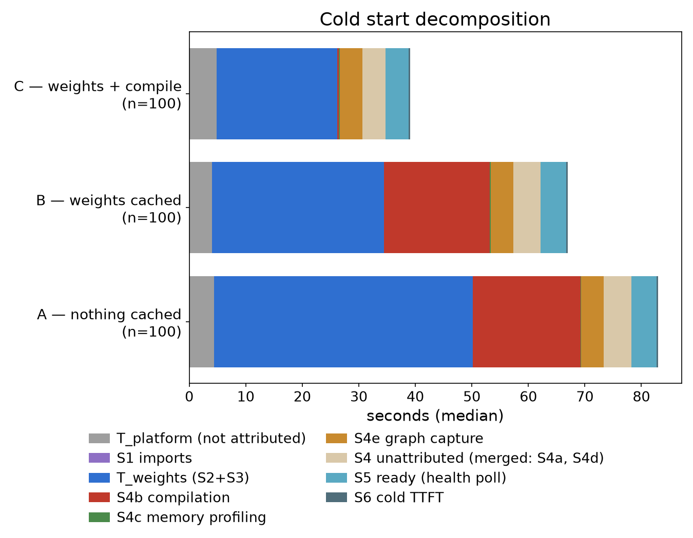
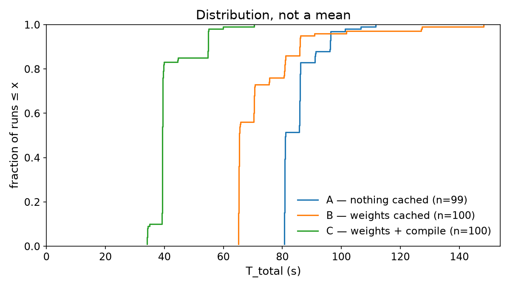
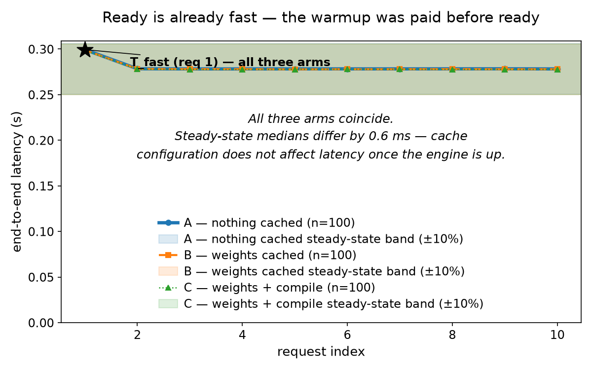
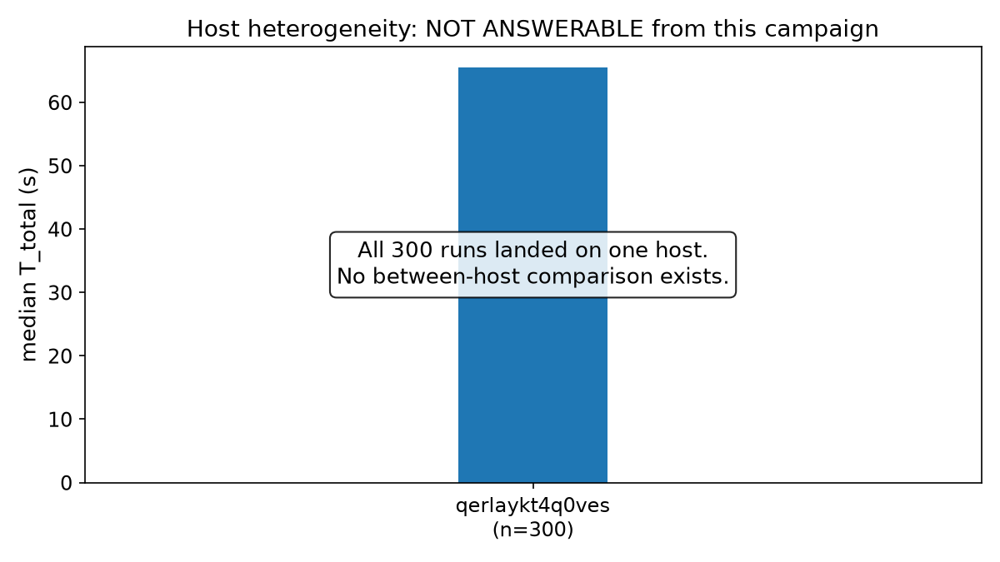

# Where a vLLM cold start actually goes

Three hundred measured cold starts on rented GPUs, decomposed into phases, with
every published number re-derivable from committed data on a laptop.

---

## Headline ranking, by the pre-registered rule

The pre-registration commits to leading with the finding that transfers
furthest to a reader on different infrastructure, not the one that cost the
most effort. Ranked before writing anything below:

1. **A warm compile cache is worth more than a warm weight cache** — the
   difference of the two contrasts on `t_total` is **−10.39 s, 95% bootstrap
   [−20.30, −5.54]**: the compile-cache contrast is about 10 s larger per
   event, and the interval never crosses zero. The number is quoted here
   rather than only in the analysis below because the pre-registration forbids
   making this ranking claim anywhere without it. The two caches are also not
   substitutes. Transfers to any `torch.compile`-based serving stack; the
   mechanism does not depend on this GPU, this model, or this provider.
2. **The compile cache buys KV cache capacity, not just seconds.** Transfers
   wherever memory profiling runs a real forward pass, which is everywhere in
   vLLM.
3. **A cold compile also slows weight loading**, by more than measurement
   noise and for reasons this experiment does not settle. Transfers as a
   caution about attribution: the phase you name is not the only thing the
   cache changes.
4. **"Ready" and "fast" coincide here** — the pre-registered expectation was
   that they would not. Transfers as a method correction, not a law.
5. **The absolute seconds.** Least transferable, and last: they are a property
   of one GPU, one model, and one engine version.

The headline is (1).

---

## What was measured

| | |
|---|---|
| Engine | vLLM 0.27.1 |
| Model | `Qwen/Qwen3-8B` @ `b968826d9c46dd6066d109eabc6255188de91218` |
| Context | `--max-model-len 8192` |
| Hardware | NVIDIA RTX 4090 (24 GB), RunPod serverless, EU-RO-1 |
| Image | `ghcr.io/…/coldstart-recon-worker@sha256:d41f67dd…` |
| Runs | 300 — 100 per arm |
| Measured cold-start time | 6.14 GPU-hours — the sum of `T_total` over all 300 runs, of which 0.63 is the single first-touch run below. Not an invoice: this campaign measured seconds, never billing |

Three arms differing in **exactly one interface**, the cache configuration:

| arm | weights | compile cache |
|---|---|---|
| A | downloaded from the hub | cold |
| B | read from a network volume | cold |
| C | read from a network volume | warm |

Runs were issued as randomised interleaved triples, so each triple contains one
of each arm. All 100 triples are host-complete, which makes the paired
within-host analysis available for every triple rather than a subset.

**Failures: 0. Discards: 0.** Not "none worth reporting" — the exclusion rules
were fixed in advance and never fired, so the failure and discard tables are
empty by outcome rather than by omission. Both are per arm: A 0/100, B 0/100,
C 0/100.

---

## The decomposition



Median seconds per phase. Every row sums to that arm's median total; nothing is
hidden in a residual.

| phase | A | B | C |
|---|---:|---:|---:|
| `T_platform` (queue, not attributable to us) | 4.37 | 4.07 | 4.83 |
| S1 imports | 0.00 | 0.00 | 0.00 |
| `T_weights` (S2+S3, load into HBM) | 45.83 | 30.35 | 21.34 |
| S4b compilation | 19.01 | 18.79 | **0.33** |
| S4c memory profiling | 0.09 | 0.11 | 0.17 |
| S4e CUDA graph capture | 4.00 | 4.00 | 4.00 |
| S4 unattributed (merged: S4a, S4d) | 4.46 | 4.38 | 3.83 |
| S5 ready (health poll) | 4.43 | 4.57 | 4.10 |
| S6 cold TTFT | 0.30 | 0.30 | 0.30 |
| **`T_total`** | **81.12** | **65.43** | **39.37** |

S4a and S4d are not separately delineated by this engine build. They are shown
merged into the unattributed row rather than dropped, and the row is drawn on
the chart rather than left as whitespace — an unlabelled 4.4 s is exactly the
kind of gap a reader is entitled to see.

## The distribution, not the mean



| arm | p50 | p90 | p95 |
|---|---:|---:|---:|
| A — nothing cached | 81.1 | 96.3 | 96.4 |
| B — weights cached | 65.4 | 85.9 | 86.4 |
| C — weights + compile | **39.4** | **54.8** | **54.9** |

Percentiles are over all 300 publishable runs; the ECDF below plots the 299
repeat-host runs. The two differ only in arm A's extreme tail (p95 96.4 vs
96.3) because the excluded run is arm A's, and it sits far past p95.

The arm ranking holds all the way out to p95. Past it, the ECDF shows something
the summary table cannot: **arm B's largest observations run longer than arm
A's.** Among repeat-host runs the biggest B run is 148.2 s against A's 111.6 s,
and B's curve is visibly the last to reach 1.0.

That is an observation about a handful of runs, not a distributional claim.
Roughly 100 runs per arm does not resolve the far tail — this analysis
deliberately publishes no p99, because a single order statistic out of 100 is
not an estimate. What it is worth saying is the negative: the median ranking is
not evidence about the far tail, and on this data the far tail does not look
like the median.

### The number that dwarfs all of them

The ECDF plots 299 of 300 runs. The one excluded run is the only **first-touch**
run of the campaign — the first time this host ever pulled the image — and it
took **2266.6 seconds.** Thirty-eight minutes; 28× the median cold start of its
own arm.

That single measurement puts the rest of this post in proportion. Every cache
effect measured here is worth 15–26 s. Landing on a host that has never seen
your image costs about two thousand. If your scale-up path can route to
genuinely new hosts, image distribution dominates every other term combined,
and no amount of weight or compile caching touches it.

It is one observation, so it carries no interval and it is not a headline
claim.

**And the rule that separates it was written after I saw it.** The threats
table required a first-touch versus repeat-host split from the beginning, but
the explicit separation rule was committed roughly half an hour after window
one's data landed — because that window contained a 2174 s `t_platform` that
made a pooled ECDF unreadable. That is a post-hoc analysis decision, and
calling it anything else would be the exact failure this artifact is built to
avoid.

What keeps it honest is that the criterion is mechanical rather than a
judgement about this run: a run is first-touch when it is the first on its
`host_id`, derived from the store, applied retroactively to every run. It
excludes no run for being large. Had the slowest run been a repeat-host run, it
would still be in the ECDF. The amendment and its timing are recorded in
`docs/experiment.md`; you do not have to take my word for the ordering, because
the git history shows it.

---

## The two contrasts, and the interval on their difference

Stated before any ranking claim, as the pre-registration requires:

| contrast | median difference | 95% bootstrap |
|---|---:|---|
| A→B, on `t_weights` | 15.48 s | [14.46, 16.45] |
| B→C, on `t_compile` | 18.46 s | [18.35, 18.64] |
| A→B, on `t_total` | 15.68 s | [10.67, 20.47] |
| B→C, on `t_total` | 26.07 s | [25.97, 31.01] |
| **difference of contrasts, on `t_total`** | **−10.39 s** | **[−20.30, −5.54]** |

The difference excludes zero across its whole interval. That is what licenses
the ranking claim — which is why the last row is quoted alongside the claim at
the top of this post rather than held back until here:

> **Caching the compiled artifacts buys more total cold start than caching the
> weights** — about 10 s more per event, and the interval never crosses zero.

The paired within-host contrast for A→B is 14.93 s [13.86, 15.93], consistent
with the pooled 15.48 s. With a single host these two estimators see nearly the
same data, so this is a consistency check, not independent evidence.

### The part the compile cache saves that isn't compilation

B→C saves 26.07 s of total cold start but only 18.46 s of compilation. The
missing ~7.6 s is **weight loading**: arm C loads weights 8.85 s [8.37, 9.66]
faster than arm B, paired within all 100 triples — far outside noise, on arms
that differ only in compile cache configuration.

I checked what it is not. Not host placement (one host; the contrast is
within-triple). Not position in the triple (C ran third 40 times, B 38). Not
the preceding arm (that effect is 1–2 s). Candidate mechanisms it *could* be —
compile work beginning before the S3 boundary and being attributed to loading,
or CPU contention from compilation workers during load — are hypotheses this
campaign cannot separate. It writes its compile cache to container disk rather
than the volume, so contention for the weight volume is ruled out.

Reported because the honest version of "the compile cache saves 26 seconds" is
that **18.5 s of it is compilation and the rest is something else.**

---

## KV capacity — the second dividend

| arm | KV cache | concurrent requests @ 8192 ctx |
|---|---:|---:|
| A | 35,792 tokens | 4 |
| B | 35,792 tokens | 4 |
| C | **43,040 tokens** | **5** |

A warm compile cache leaves **20.3 % more KV cache**, which at the pinned 8192
context is one additional concurrent request — a 25 % capacity increase on a
24 GB card, for free.

This was hypothesis H5, registered in advance with a mechanism: memory
profiling measures free HBM by running a real forward pass, and on a cold arm
the compiler's own working set is resident during that measurement. The
profiler is not wrong; it correctly reports less free memory, and vLLM sizes
the cache to what it saw. The capacity loss then persists for the entire life
of the replica — long after the compiler's memory is gone.

---

## Ready is already fast



The pre-registered expectation, written before measurement, was "ready is not
fast": that a freshly-ready replica would serve its first requests slowly.

**It does not, at this configuration.** Request 1 lands 7.6–7.7 % above steady
state — inside the tolerance band — so `T_fast` equals request 1 for all three
arms, and all three arms' steady-state medians differ by 0.6 ms. Cache
configuration has no effect on latency once the engine is up, which is what you
would expect and is worth showing rather than assuming.

The warmup is real and expensive; it is simply paid *before* the health check
passes, inside S4, where the waterfall shows it. The title changed to match the
data. The data did not change to match the title.

---

## What it costs

Converted through assumptions published so you can substitute your own.

| assumption | value | provenance |
|---|---:|---|
| GPU hourly rate | $1.00 | **illustrative** round number |
| scale-ups per day | 24 | **illustrative** — one per hour |
| steady-state tokens/sec | 800 | **illustrative** — not measured here |
| volume monthly cost | $3.50 | **illustrative** — 50 GB volume |
| assumed context length | 8192 | **measured** — the pinned `--max-model-len` |
| version changes per month | 2 | **illustrative** |

Only the context length is measured. This campaign measured seconds and tokens;
it never recorded an invoice, and a rate quoted from memory would be the one
number here you could not re-derive. A round $1.00/GPU-hour also means every
dollar figure rescales by inspection.

| arm | GPU-seconds/event | cost @ $1/GPU-h | foregone tokens |
|---|---:|---:|---:|
| A | 81.1 | $0.0225 | 64,894 |
| B | 65.5 | $0.0182 | 52,413 |
| C | 39.4 | $0.0109 | 31,513 |

The GPU-seconds column is measured; multiply it by your own contract rate.

### Break-even, and why the two caches are not the same shape

| cache | saves | breaks even at | worth it at 24/day? |
|---|---:|---:|---|
| weight cache | 15.60 s/event | **26.6 events/day** | **no** |
| compile cache | 26.13 s/event | **0.16 events/day** | **yes** |

This is the operational point, and it is about *shape* rather than size:

- **The weight cache is a volume you rent continuously.** It bills whether or
  not you scale up today. At the assumed frequency it does not quite pay for
  itself — break-even sits at 26.6 events/day against 24 assumed. That is a
  marginal call, and it flips if your traffic is spikier or your volume cheaper.
- **The compile cache is free to store**, so it breaks even almost immediately.
  But it is **invalidated by any change to engine version, model, hardware, or
  flags** — every upgrade pays the cold compile again unless warming is built
  into the deploy pipeline. Its cost is lumpy and per-version, not monthly.

A compile cache is therefore the better buy *and* the more fragile one. Those
are not in tension; they are the same fact viewed from the accounting side and
the operational side.

---

## The four mechanisms

**Why memory profiling needs a forward pass.** There is no way to ask a GPU how
much HBM will be free for a KV cache except to run the model once and look at
what is left. vLLM allocates weights, runs a profiling pass at the largest
batch it must support, records peak usage, and gives the remainder to the KV
cache. This is also the mechanism behind H5: on a cold arm the compiler's
working set is resident during that pass, so the profiler sees less free memory
and sizes the cache smaller — permanently, for the life of the replica.

**What CUDA graph capture costs and buys back.** Capture replays a fixed
sequence of kernel launches instead of dispatching them one at a time,
removing per-step launch overhead from every subsequent decode. Here it costs a
flat 4.00 s of startup in all three arms — identical, because it depends on the
shapes captured rather than on what was cached. That is a real trade: skipping
capture (`--enforce-eager`) would cut 4 s from every cold start and pay for it
on every token thereafter. Worth it for a replica serving millions of tokens;
arguably not for one that scales up, answers briefly, and dies.

**What invalidates a compile cache.** Engine version, model, hardware
generation, and engine flags — each is part of the cache key, and each is a
thing that changes routinely. A vLLM upgrade invalidates it. Moving from a 4090
to an A100 invalidates it. Changing `--max-model-len` invalidates it. This is
the operational fragility that weight caching does not have: model weights are
immutable and content-addressed, so a weight cache stays valid until you change
models deliberately. A compile cache silently becomes a cold cache on a routine
dependency bump, and the first scale-up after that deploy pays 18.5 s it did
not pay yesterday.

**What happens to a cold replica the moment a load balancer routes to it.**
Under continuous batching a fresh replica accepts work the instant it reports
ready — there is no warmup period the scheduler holds it out of. Whatever gap
exists between "ready" and "fast" is therefore served to real users, not
absorbed quietly. That is why the ready-vs-fast question was worth
pre-registering. On this configuration the gap turns out to be ~0.1 s because
vLLM finishes its warmup before answering `/health` — the expensive work is
inside S4, ahead of readiness. That is a property of this engine's startup
ordering, not a general guarantee, and on a stack that reports ready earlier
the same measurement would find real user-visible cost.

---

## Host heterogeneity: not answerable



The design intended to test whether host placement drives the tail (H4). It
cannot be answered from this campaign. **All 300 runs landed on the same host**
(`qerlaykt4q0ves`), with exactly one first-touch run in 300. RunPod kept
re-allocating the machine that already held the image, and no endpoint setting
changes that for a serially-submitting driver.

This is reported as a failure of the design, not quietly dropped. The
compensation is that every triple is host-complete, so the paired analysis is
fully supplied — the confound H4 was meant to detect is instead held constant.

---

## Scope

One provider, one GPU model, one model, one engine version, one region, one
host. The seconds do not transfer. The mechanisms — profiling under memory
pressure, cache invalidation shape, capture-versus-decode trade — do.

The windows are stamped 2026-09-02 to 2026-09-04 UTC but were hours apart
inside one working period, not three independent days of fleet conditions.
`t0_wall` is on every record, so the real spacing is recoverable rather than
implied.

---

## Reproducing this

Every number above comes from `data/campaign.jsonl`, committed. No GPU
required:

```bash
python scripts/analyse.py --store data/campaign.jsonl > analysis.json
```

```bash
python scripts/render_figures.py --store data/campaign.jsonl --out build/figures
```

The bootstrap is deterministically seeded, so a re-run reproduces
`data/analysis.json` byte for byte.

The pre-registration in `docs/experiment.md` was committed **2026-08-28**, four
days before the first run on **2026-09-01T22:01 −07:00**. Every hypothesis,
both contrasts, the exclusion rules, the stopping rule and the headline
selection rule predate the data.

Three amendments landed after measurement began, and it is worth being exact
about which:

- **the first-touch separation rule** (32 minutes after window one) — a
  post-hoc analysis decision, discussed above;
- **the window spacing note** — a disclosure that the windows were hours apart
  rather than separate days, which weakens a claim rather than enabling one;
- **the stopping decision** — recorded after stopping, which is the only order
  in which it can be recorded.

None of these changed a hypothesis or a contrast. The git history is the
evidence, and it is public precisely so the ordering is checkable rather than
asserted.
