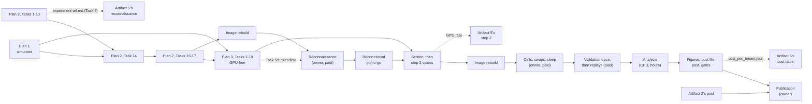

# Artifact 4 — Implementation Timeline

**Date:** 2026-10-04
**Artifact:** 4 of 5, *Dedicate, swap, or share*
**Governs:** the order in which artifact 4's three plans run, who runs each step, what each costs, and what each waits on. The plans hold the work itself; [the scope amendment](../specs/2026-09-26-multi-model-serving-economics-scope.md) holds the decisions. This document replaces the amendment's §15, which now points here.

---

## Where every piece stands, 2026-10-04

| # | Phase | Document | Waits on | Who | GPU | Status |
|---|---|---|---|---|---|---|
| 0 | Scope and the twelve decisions | amendment §1–§13 | — | owner | none | Done, 2026-09-26 |
| 0a | §14: bursty-regime sizing | amendment §14 | — | owner | none | Decided 2026-10-04: size on ON-period load |
| 0b | Harness extraction and shared in-container tooling | `2026-09-03-harness-extraction.md`, `2026-10-04-shared-in-container-tooling.md` | — | agents | none | Done: merged at `39c20b3` and `ca9afbc` |
| 1 | The GPU-free simulator and analysis | [plan 1](2026-09-26-artifact-4-plan-1.md), 17 tasks | 0b | agents | none | Ready |
| 2A | The worker side, the first pre-registration step, the reconnaissance probes | [plan 2](2026-10-04-artifact-4-plan-2.md), Tasks 1–17 | 0b; plan 1 for Task 14 | agents | none | Ready |
| 3A | Step 2's rules, the screen, the replay driver, validation, analysis, figures, cost file, rehearsal | [plan 3](2026-10-04-artifact-4-plan-3.md), Tasks 1–18 | plans 1 and 2 merged | agents | none | Ready |
| 4 | Image rebuild, then paid reconnaissance | plan 2, Task 18; `docs/runbook-a4-recon.md` | 2A, and 3A's Task 5 if the rules are to predate the answers | owner | 35–70 min | Owner's decision |
| 5 | Reconnaissance record and go/no-go | plan 2, Task 19 | 4 | agent | none | After 4 |
| 6 | The screen, then step 2's values | plan 3, Tasks 19–21 | 5, and the owner's GPU rate | agent | none (CPU, about 25 min) | After 5 |
| 7 | Image rebuild with plan 3's worker code, then the cell, swap and sleep campaigns | plan 3, Task 22; `docs/runbook-a4-campaigns.md` | 6 | owner | 8–14 h | Owner's decision |
| 8 | The validation trace, then three replays | plan 3, Task 23 | 7 | agent, then owner | about 1.5 h | After 7 |
| 9 | The analysis: the sweep on measured inputs | plan 3, Task 24 | 8 | agent | none (CPU, hours) | After 8 |
| 10 | Figures, cost file, post draft, gates | plan 3, Tasks 25–27 | 9 | agent, then owner review | none | After 9 |
| 11 | Spend, definition of done, publication | plan 3, Task 28 | 10, and artifact 2's post | owner | none | Last |

**Readiness, checked on 2026-10-04.** Plans 2 and 3 were executed from their own text, in order, on a clean copy of `main` at `03d9345` with plan 1's files added. A script created each file, applied each edit, and ran each test, lint and commit step, checking that every expected failure failed and every expected pass passed.

| After | Suite | Lint | Parity |
|---|---|---|---|
| plan 1's files | part of the plan 2 run below (plan 1 adds 121 tests) | clean | `PARITY OK` |
| plan 2 | 1,841 passed (plan 2 adds 90) | clean | `PARITY OK` |
| plan 3 | 1,993 passed (plan 3 adds 152) | clean | `PARITY OK` |

Plan 1's own text was last executed step by step on 2026-10-03, against an earlier `main`. Its files pass on `03d9345`, but that step-by-step run has not been repeated there. Plan 3's Part B scripts and tests also ran end to end on a simulated publication, its parity script included.

## The order, and what can run in parallel

- **Plan 1 and plan 2's Tasks 1–13 are independent.** They can run at the same time in separate worktrees. Plan 2's Task 14 waits for plan 1 to merge.
- **Plan 3's Part A waits for both plans to merge,** because it edits their files.
- **Commit plan 3's Task 5 before reconnaissance's answers are read, if possible.** Then its commit timestamp shows the step 2 rules were fixed first. If reconnaissance runs earlier, the rules still predate the first measurement, which is all the amendment's §12 requires. The commit message says which happened.
- **Plan 3's Part A should land before the first image rebuild,** so one rebuild serves reconnaissance and the campaigns. If reconnaissance comes first, phase 7 needs a second rebuild.
- **The critical path runs through the owner's paid steps:**
  - reconnaissance;
  - the campaigns, about 12 GPU-hours spread over several sessions, the longest stretch;
  - the replays.

  Everything else is agent work or CPU.

## What only the owner decides

| When | Decision | Where |
|---|---|---|
| Before phase 4 | Fund artifacts 4 and 5 together (portfolio contract); run reconnaissance | amendment §9 |
| Phase 5 | Both model classes failing the go/no-go changes the design | plan 2, Task 19 |
| Phase 6 | The GPU hourly rate, read off the console, and its provenance | plan 3, Task 19 |
| Phase 6 | A step 2 rule that cannot be applied (`NotDecidable`) | plan 3, Tasks 19–21 |
| Phase 7 | Running the campaigns, and any pre-registered cut | runbook, section D |
| Phase 8 | No feasible validation draw | plan 3, Task 23 |
| Phase 9 | A failed or refused validation, or a failed held-out cell | plan 3, Task 24 |
| Phase 10 | Swap dominated at artifact 5's reference point | plan 3, Task 26 |
| Phase 10–11 | The post's text, and publication | plan 3, Tasks 27–28 |

## Calendar, as an estimate

These dates assume each gate is passed when it is reached, agents run the plans, and the owner has the 8–12 hours a week the portfolio contract states. They are not commitments. The fixed constraint is that artifact 4 publishes after artifact 2.

| Window | What happens |
|---|---|
| Week of 2026-10-05 | Plans 1 and 2 Part A, then plan 3 Part A; one image rebuild |
| Week of 2026-10-12 | Reconnaissance, its record, the screen and step 2's values |
| Weeks of 2026-10-19 and 2026-10-26 | The cell, swap and sleep campaigns, then the validation replays |
| Week of 2026-11-02 | The analysis, figures, cost file and post draft |
| Weeks of 2026-11-09 and 2026-11-16 | The owner's review; publication once artifact 2's post is out |

## GPU and CPU budget, as an estimate

**Inputs:**
- **Startup:** artifact 2's pilot on this image measured an 8B engine's startup at 84.5 s cold and 30.6 s warm. Nothing has been measured under load for a 4B engine.
- **Job counts:** at the example design in plan 3's tests. The real counts follow from the registered design, and `scripts/a4_measure.py` prints them before submitting.
- **Rate:** RunPod's per-second price is read off the console at each paid step. The rate below is the repository's illustrative one.

| Step | Jobs | GPU time | At an illustrative $0.00031/s |
|---|---|---|---|
| Reconnaissance | 8 | 35–70 min | about $0.65–1.30 |
| Cells: solo grid, co-located grid, held-out cells | about 140 | 7–11 h | about $8–12 |
| Swaps | about 36 | 1–2 h | about $1–2 |
| Sleep mode, if it works | 8 | under 1 h | under $1 |
| Validation replays | 3 | about 1.5 h | about $1.70 |
| **Total** | about 195 | **about 11–16 h** | **about $12–18** |

**Network-volume storage:** about 36 GB of staged checkpoints, for as long as they stay staged.

**This replaces two earlier estimates:**
- the amendment's §9 figure, "$30–45, incomplete";
- §15's working estimate of about 10 hours and $12.

The cells dominate: about 35 conditions, 4 repeats each. **If the budget binds, the pre-registered cut order (amendment §9) starts with the interference grid's resolution.** A cut is an amendment to step 2, committed before the campaign it shapes.

**CPU:**
- **The screen:** 25.5 minutes on 8 cores, measured on the example report.
- **The sweep on measured inputs:** hours of CPU the first time, then cached. Plan 1's placeholder sweep took 45 minutes for 8 grid points; the registered sweep has 12 points and longer bursty windows, so expect several times that. This is unverified.

## Coordination

- **Artifact 5:**
  - **The experiment's pins.** Plan 2's Task 8 commits the base model, revision, GPU class and vLLM digest in `docs/experiment-a4.md`, which artifact 5's reconnaissance reads.
  - **The rate.** Plan 3's Task 21 commits the GPU hourly rate, which artifact 5's step 2 reads.
  - **The cost file.** Plan 3's Task 26 writes `data/a4/cost_per_tenant.json`, the input to artifact 5's cost table.

  Each handover is a message to artifact 5's session, not an edit to its files.
- **Shared files.**
  - Plan 2's Task 10 edits `worker/Dockerfile`, `.github/workflows/build-worker.yml` and `tests/test_harness_boundary.py`.
  - Artifact 5's plan 2 edits the same three, and artifact 2's session also changed the Dockerfile on 2026-10-04 (`03d9345`, the load-balancer worker).
  - Every edit only adds lines, so whichever lands later keeps the others. Plan 2's edit anchor was checked against `03d9345`.
- **Artifact 2:** artifact 4 publishes after artifact 2's post. Nothing else in artifact 4 waits on artifact 2.
