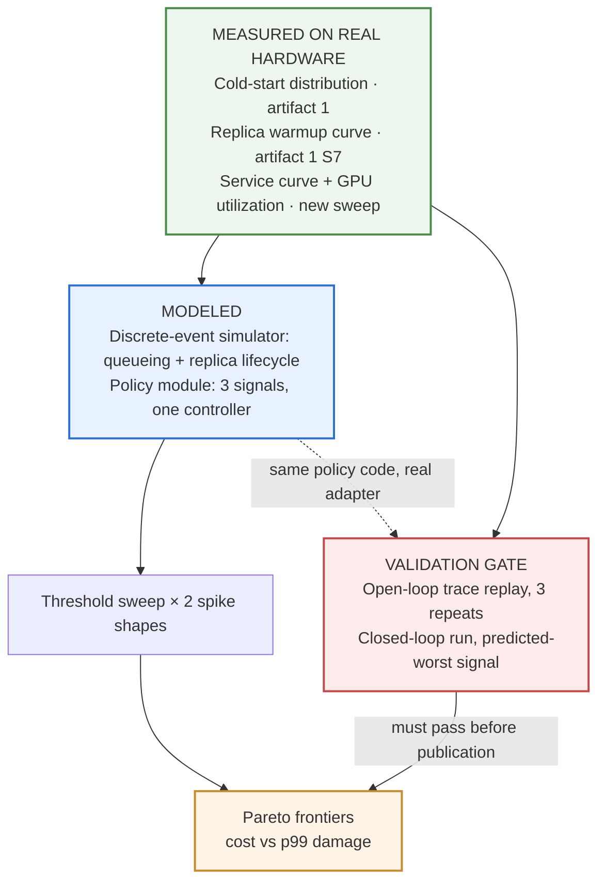
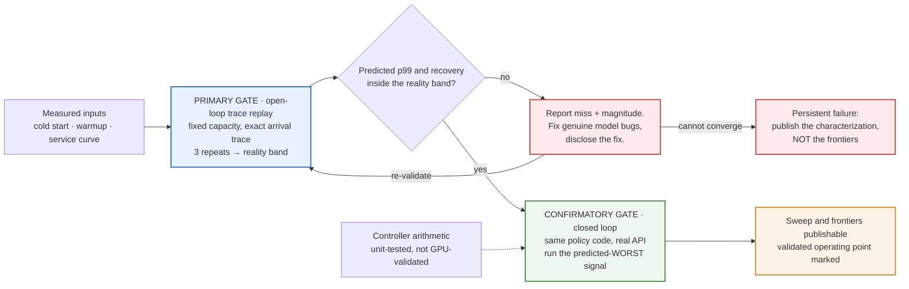

# Which Autoscaling Signal Survives a Cold Start — Design

**Date:** 2026-08-17
**Status:** Approved design, ready for implementation planning
**Artifact:** 2 of 5
**Depends on:** [Artifact 1 — What a vLLM Replica Does Before It Can Serve](2026-08-17-cold-start-decomposition-design.md)

**Working post title:** *Which autoscaling signal survives a cold start.* Exact wording set at
publication; the decision is that the title names the mechanism, not the method.

**Learning guide:** §13b — concepts to work through before building, with self-check questions.

---

## 1. Context and relationship to artifact 1

This is the second half of **Claim 1** in the portfolio contract: *what elastic LLM serving
actually costs, measured.* Artifact 1 establishes what a cold replica costs. Artifact 2
establishes how often you pay it, and what choosing a different scaling signal buys you.

Three things flow directly from artifact 1 into this one:

- The measured **cold-start distribution**, which makes scale-up lag stochastic rather than a
  constant.
- The measured **warmup curve** (`S7`), which makes it possible to model a replica as
  absent → serving-but-slow → fast rather than as a binary.
- The **harness and repo**, shared per the portfolio contract. Artifact 2 is a new experiment
  against existing infrastructure, tagged at the commit that produced artifact 1's numbers.

**Artifact 1 must be complete before this artifact's parameters can be bound.** That ordering is
deliberate and preserved. What this spec does instead of guessing those numbers is **fix the
rules that convert them into parameters** (§8), so artifact 1's results plug in mechanically with
no post-hoc discretion.

**Why this spec is written before artifact 1 is implemented:** artifact 2 is the second consumer
of artifact 1's harness. Knowing its requirements now means the harness gets built once rather
than retrofitted. That is the only reason to design this early, and it is a good one.

---

## 2. Scope

### In scope

- A comparison of three autoscaling signals under two traffic-spike shapes, evaluated as
  cost/latency Pareto frontiers rather than single operating points.
- One new hardware measurement: the load-dependent service curve.
- A discrete-event simulator with measured parameters and a modeled control loop.
- A validation protocol that gates the entire result.

### Out of scope

- Multi-model, multi-tenant, or heterogeneous-request-shape serving.
- Predictive or scheduled autoscaling. Reactive signals only.
- Generalizing the simulator into an adoptable tool (see §11 — scaffolding now, deferred
  decision later).
- Contention between simultaneously cold-starting replicas. Inherited as a stated limitation
  from artifact 1; if it is ever measured, this is where it would belong, and that decision is
  explicitly deferred.

### Fixed constraints

Same discipline as artifact 1. The dominant failure mode is an unfinished comprehensive project.

- Three signals, two spike shapes. Not four signals, not five shapes.
- One serving configuration, inherited unchanged from artifact 1.
- The simulator stays scaffolding. Adoptability is a later decision, not a build requirement.
- Sweep only the parameters named in §7. Everything else is fixed and published.

---

## 3. Claim and question

### Claim

When scale-up is gated by cold start, the choice of autoscaling signal determines how much p99
damage a traffic spike does and how long recovery takes. The ranking is not obvious, and it is
not free — each signal buys latency with provisioned capacity, at a different exchange rate.

### Question

For an LLM serving deployment whose scale-up latency is a measured cold-start distribution, what
cost/p99 tradeoffs can each of GPU utilization, queue depth, and in-flight concurrency actually
achieve under a step and a ramp — and does any signal's frontier dominate the others?

The question is deliberately framed as *achievable frontiers*, not *which signal is best*. The
latter is ill-posed: every policy has thresholds, and whichever set you publish determines the
winner. Comparing frontiers is what makes the comparison fair and what makes the result robust
to the obvious objection that the loser was mistuned.

---

## 4. Architecture



Every parameter is measured. Only the control loop is modeled. That division is the whole
methodological argument, and the validation gate exists to test exactly the modeled part.

---

## 5. Measured inputs

| Input | Source | Why it matters |
|---|---|---|
| Cold-start distribution | Artifact 1, full distribution not a mean | Scale-up lag is stochastic; the tail is where p99 damage originates |
| Replica warmup curve | Artifact 1, `S7` | Lets a replica be modeled as absent → slow → fast instead of binary |
| Service curve | New sweep: one replica, concurrency swept | Captures continuous-batching behavior empirically instead of modeling it |
| GPU utilization vs concurrency | Same sweep | Makes the censoring effect in §6 measured rather than asserted |

### The warmup curve is the input most analyses omit

A replica does not transition from absent to fully useful. It goes **absent → serving but slow →
fast**, and during that middle interval a load balancer is already routing production traffic to
it. Modeling replicas as binary would understate every policy's damage, and understate it
*unequally* — policies that scale later spend proportionally more of the spike with replicas
inside their degraded window. Artifact 1's `S7` measurement is what makes representing this
possible, and the `degraded-window share` metric in §9 is what quantifies it.

### The service curve sweep

One replica, inherited configuration, concurrency swept across the operating range. At each
level, record end-to-end latency, TTFT, throughput, and GPU utilization.

This keeps artifact 2 from being a pure modeling exercise downstream of artifact 1's data — it
has its own contact with hardware. It is also a publishable figure independently of the
autoscaling argument, and it connects directly to the KV capacity number from artifact 1.

**Limitation, stated:** the curve is measured at one fixed request shape. Real traffic is
heterogeneous in input and output length, and the curve shifts with both. Sequel material, not
papered over.

---

## 6. The three signals

| Signal | Definition | Behavior under continuous batching |
|---|---|---|
| `S_util` | GPU utilization percentage, as a platform exposes it | Rises early, then **saturates and stops being informative** |
| `S_queue` | Requests waiting, not yet admitted to a running batch | Near zero until KV cache fills, then climbs — a **late** signal |
| `S_concurrency` | Requests in flight: admitted plus running | Rises monotonically with load across the whole range |

This table is the intellectual core of the artifact and the reason the comparison is worth
running rather than obvious.

Continuous batching means vLLM admits requests into the running batch until KV cache capacity is
exhausted, and only then queues them. That gives the three signals structurally different
response curves. GPU utilization moves earliest but **censors** — a batch of four running flat
out and a batch of forty running flat out can both read near 100%, so past a point the signal
cannot distinguish busy from drowning. Queue depth is the inverse: an accurate saturation alarm
that by construction says nothing until you are already saturated, which is exactly when a
cold-start-gated scale-up is too late. In-flight concurrency is the only one of the three that is
both early and monotonic across the operating range.

**The utilization mapping is measured, not assumed.** The service sweep records GPU utilization
at each concurrency level, so the simulator's concurrency→utilization mapping — including where
it censors — comes from hardware. Assuming linearity there would fabricate the exact effect under
test.

### Pre-registered hypotheses

Committed to `docs/experiment.md` before any sweep is run, alongside artifact 1's hypotheses.

**H1.** In-flight concurrency dominates the other two on the cost/p99 frontier for the step spike.

**H2.** GPU utilization is the worst of the three, and the mechanism is censoring — its frontier
degrades most in the high-load region where the signal has saturated.

**H3.** The frontier gap between signals narrows as cold start shrinks. Tested by re-running the
sweep against artifact 1's uncached distribution versus its fully cached one.

**H4.** The ranking is stable across step and ramp, but the margins shrink on the ramp, because a
gradual buildup gives even a lagging signal time to respond.

---

## 7. Policy structure and sweep

All three policies share one controller. Only the signal differs — the same single-variable
discipline artifact 1 applies to its cache configuration.

```
every T_s seconds:
    sample signal
    if signal > threshold_up for N consecutive samples and not in cooldown:
        add step_size replicas   (subject to max_replicas)
        enter cooldown
    if signal < threshold_down for M consecutive samples and not in cooldown:
        remove replicas          (subject to min_replicas)
        enter cooldown
```

### Real-world constraints are modeled, not idealized away

Sampling interval, consecutive-sample confirmation, cooldown after each action, quantized step
sizes, and a bounded scale rate are all present in the simulated policy. A frontier computed
without them would be unreachable by any real controller, which would make the comparison a
statement about idealized controllers rather than a guide to choosing one.

### Sweep dimensions

**Swept:** `threshold_up`, `step_size`.

**Derived:** `threshold_down`, from `threshold_up` by a fixed published ratio.

**Fixed and published:** `T_s`, confirmation counts `N` and `M`, cooldown duration,
`min_replicas`, `max_replicas`.

Sweeping everything would be combinatorially large and would also make the frontier
uninterpretable — the comparison would stop being between signals and start being between
controller tunings. Sensitivity to the fixed values goes in an appendix, not the main result.

### The two-driver structure

The policy module is written once with two drivers: a simulated clock for the sweep, and the real
platform API for closed-loop validation. This makes validation an adapter rather than a second
implementation, and it means the code that produced the frontiers is literally the code that was
validated — not a reimplementation of it.

---

## 8. Traffic model

**Arrivals:** Poisson with time-varying rate.

**Baseline:** rate set so the system sits at a stated fraction of saturation from the measured
service curve. Fixed, because starting headroom silently changes how a utilization signal behaves
relative to a queue signal, and leaving it floating would be a hidden variable doing real work.

**Step:** rate jumps instantaneously to `k ×` baseline, sustained for `D`.

**Ramp:** rate rises linearly to `k ×` baseline over `R`, then sustained for `D`.

### Binding rules — fixed now, so artifact 1's numbers plug in mechanically

| Parameter | Rule |
|---|---|
| `D` (sustain) | a stated multiple of measured **p95** cold start |
| `k` (magnitude) | sized to require a stated number of additional replicas at the measured service rate |
| `R` (ramp) | chosen relative to `D` so the ramp is meaningfully gradual, not a rounded step |
| baseline | a stated fraction of measured saturation |

**Why p95 and not p50:** a spike that only outlasts median cold start is one where the tail
replicas arrive after it is over. That measures a scenario in which scaling cannot help anyone
regardless of signal, and would flatten the very differences the experiment exists to detect.

**Why both shapes.** A step is the worst case for any lagging signal — demand arrives before any
indicator can have moved, so response is bounded entirely by cold start. A ramp gives every
signal a chance to see it coming, which is where the signals genuinely differentiate. Running
only the step risks a flat result where everything is bad and nothing discriminates; running only
the ramp risks an optimistic result that does not describe the incident operators actually fear.
If the ranking holds across both, the claim is robust. If it flips, that is the finding.

**Request shape:** fixed input and output token lengths, matching the service-curve sweep. Stated
as a limitation.

---

## 9. Metrics and analysis

| Metric | Definition |
|---|---|
| **p99 damage** (primary) | excess-latency-seconds: ∫ max(0, p99(t) − SLO) dt over the episode |
| peak p99 | maximum p99 during the episode |
| recovery time | spike onset → p99 back below SLO and staying there |
| cost | replica-seconds provisioned across the episode |
| degraded-window share | requests served by replicas still inside their warmup interval |

**Why integrated excess is primary.** Peak p99 alone rewards policies that are briefly
catastrophic over policies that are mildly bad for a long time, and operationally those are not
equivalent. The SLO threshold is stated in advance, and its sensitivity is shown in an appendix.

**Degraded-window share exists only because artifact 1 measured the warmup curve.** It quantifies
traffic served by replicas that had joined but were not yet fast — damage a binary replica model
scores as exactly zero.

### The frontier

Pareto frontier of **cost against p99 damage**, per signal, per spike shape. Compare frontiers,
not points.

**The headline is the iso-cost slice.** Take the frontiers at equal provisioned capacity and the
result becomes one sentence: *at the same spend, signal X cost N seconds of excess p99 versus
signal Y.* That is the sentence that travels; the frontier is what makes it defensible.

### The artifact 1 composition slice

Re-run the entire sweep against artifact 1's **uncached** cold-start distribution as well as its
**fully cached** one. This answers a question neither artifact can answer alone: *does fixing your
cold start make your signal choice matter less?*

If the frontiers converge as cold start shrinks, cold-start work buys slack in policy choice. If
they do not, the two are independent levers and both are worth pulling. Either way it is the
result that makes artifacts 1 and 2 one argument rather than two adjacent posts, and it costs
one additional parameterization of an already-built simulator.

---

### Business framing — required

The frontier is reported in money as well as in replica-seconds. Published assumptions: GPU hourly
rate, spikes per week, and either the cost of an SLO breach or the p99 budget one consumes.

| Quantity | Definition |
|---|---|
| cost per spike | replica-seconds × hourly rate, per signal |
| **annual delta between signals** | cost-per-spike difference × spike frequency |
| p99 damage in tokens | excess-latency-seconds × measured steady-state throughput |

**Both slices come from the same frontier, and the second is the one a budget owner reads.** At
equal spend, choosing one signal over another costs N ms of p99. Held at equal p99, it costs $X per
year more. Same data, two audiences, and the frontier is what makes either defensible.

## 10. Validation protocol

The gate. Nothing publishes until it passes or its failure is characterized.



### Reconnaissance — what must be discovered on hardware first

Artifact 2 is the most cloud-independent of the GPU artifacts: the simulator, policy module, sweep,
and every analysis path run against **synthetic** cold-start distributions and service curves long
before real ones exist. Roughly nine tenths of it is buildable and testable offline.

Two things still require hardware before the real runs, and they inherit artifact 1's
reconnaissance discipline (artifact 1 §6.8):

- **Whether the platform API exposes what the closed-loop driver needs** — scale-up and scale-down
  actions, their acknowledgement semantics, and their latency. The real-API driver cannot be written
  against a guess.
- **The concurrency range the service sweep should cover**, which depends on where the measured
  latency curve actually bends. A short pilot sweep sets the range for the full one.

Both are capture-only: raw API responses committed as fixtures, pilot sweep not published as a
result. The full service curve is measurement and runs only after the analysis path is proven.

### Primary gate — open-loop trace replay

Fix replica count. Drive a real transient load. Compare the simulator's predicted latency
trajectory against what actually happened.

**Replay the exact arrival trace, not a statistically similar one.** The driver records every
arrival timestamp during the real run and the simulator is fed those exact timestamps. Comparing
two independent Poisson draws would let sampling noise masquerade as model error in either
direction — failing a correct model or passing a wrong one. Replaying the identical trace makes
this a clean test of the service and queueing model with the arrival process held exactly
constant.

### Tolerance derived from reality's own repeatability

Run the real validation spike **three times**. The spread between those runs sets the tolerance.
The simulator must land inside the band reality itself occupies.

This is the honest construction: a model cannot be required to be more reproducible than the
system it models. If three identical real spikes produce p99 values spanning 30%, then agreement
within 30% is the ceiling on any meaningful claim, and matching to 5% would indicate coincidence
or overfitting rather than accuracy. Deriving the tolerance this way also pre-empts the reader who
suspects the target was chosen after seeing the result.

The three repeats have a second payoff: run-to-run spread in real spike response is itself a
publishable number, and it is the same "variance is a finding, not noise" move artifact 1 makes
with host heterogeneity.

### Confirmatory gate — closed loop, on the predicted loser

One real closed-loop run, same policy code as the sweep, driving actual replica changes through
the platform API.

**Run it with GPU utilization — the signal H2 predicts is worst.** Validating the policy expected
to win invites the obvious objection: *you modeled your favorite carefully and the others
sloppily.* Reproducing the real behavior of the policy being argued **against** is the harder test
and the one that disarms that reading. If the simulator predicts the loser's actual trajectory,
the claim that it also models the winner is far stronger than the reverse demonstration.

### Not validated empirically, deliberately

**Controller arithmetic** — signal crosses threshold, decision fires, delay elapses, replica
joins — is deterministic bookkeeping covered by unit tests with hand-computed scenarios. Spending
GPU money to confirm arithmetic would be theatre.

**Frontier regions far from the validated operating point are extrapolation, and the post says so
in those words.** Validation happens at a small replica count and one spike magnitude; the sweep
explores much wider territory. This is the single largest limitation of the artifact and it
belongs in the body, not a footnote. The validated operating point is marked directly on the
frontier charts so a reader can see which parts rest on measurement and which rest on a model
behaving sensibly outside its tested range.

### Disclosure rule

Pre-committed in `docs/experiment.md`. Misses are reported with magnitude. A genuine model bug may
be fixed and re-validated, but the post discloses that a fix occurred and what it was. Silently
tuning a simulator until it agrees, then publishing the agreement, is fabrication with extra
steps, and the entire artifact rests on not doing it. Persistent failure to validate is itself a
publishable result: *here is where a measured-parameter simulation of LLM autoscaling stops
predicting reality.*

---

## 11. Publication

### Figures

1. **Pareto frontiers** — cost versus p99 damage, three signals, two panels for step and ramp,
   validated operating point marked. The main argument.
2. **Validation overlay** — predicted versus actual latency trajectory with the three-run reality
   band. The credibility figure; appears early in the post, not buried in method.
3. **Measured service curve with utilization censoring visible** — latency, throughput, and GPU
   utilization against concurrency. Shows the mechanism behind H2 in measured data rather than
   asserting it.
4. **Frontier convergence** — frontiers under cached versus uncached cold start. The artifact 1
   composition.

Same constraints as artifact 1: no truncated axes, N stated, legible on a phone, and figures
rendered and visually inspected before being called done.

### Post structure

1. **Lead** — the iso-cost sentence.
2. **The frontier chart.**
3. **Why — the mechanism.** Censoring and lateness, with the service curve as evidence.
4. **What this means for your autoscaler config** — concrete and actionable.
5. **How I know the model is trustworthy** — validation overlay, reality band, miss magnitude
   stated plainly.
6. **Method** — measured inputs, simulator, policy structure, sweep, pre-registration link.
7. **Does fixing cold start reduce signal sensitivity?** — the artifact 1 tie-in.
8. **Limits** — extrapolation beyond the validated region, fixed request shape, one platform and
   configuration, a simulated control loop with measured parameters.
9. **Reproduce it** — repo, runbook, cost estimate.
10. **Next** — one line toward artifact 3.

### Required explanations

Four short paragraphs, no additional measurement. Domain fluency shows in the prose around the
numbers, not in the numbers.

- Why GPU utilization censors under continuous batching, and why that makes it structurally
  unsuited to LLM serving.
- Why queue depth is a saturation alarm rather than an early warning, and why that is fatal when
  scale-up is cold-start-gated.
- What happens to a replica during its warmup window when the load balancer routes to it
  immediately.
- Why cooldowns exist, and what they cost during a spike.

### Deliverable and adoptability

Post plus code in the shared artifact 1/2 repo. The simulator ships as **scaffolding**: measured
inputs behind a small data interface, policies as pluggable objects (already forced by the
two-driver structure), sweep separated from model.

Adoptability is deliberately deferred. Making it a general tool means input validation, a stable
format, error messages, and support for parameters not measured here — real work that competes
directly with artifact 3, which is already designed to be the adoptable-tool artifact and should
not have a rival for that role. The structural decisions above mean promoting it later is a
documentation exercise rather than a rewrite, and that decision is better made after the post's
reception reveals whether anyone wants it.

### Pre-publish gate

Same as artifact 1, including the non-negotiable item: confirm every number, diagram, and claim
derives from the rented-hardware experiments and independent reasoning, with nothing traceable to
employer internal material.

---

## 12. Budget

| Item | Estimate |
|---|---|
| Service curve sweep, including GPU utilization | ~$5 |
| Open-loop validation, three repeats | $15–25 |
| Closed-loop validation run | $15–30 |
| **Artifact 2 subtotal** | **$35–60** |
| Artifact 1 | $45–75 |
| **Combined against the $200 envelope** | **$80–135** |

That leaves $65–120 for debugging across both artifacts — adequate, not generous. Artifact 2's
live components run through the same GPU-free development loop as artifact 1: simulator, sweep,
and analysis are exercised against synthetic inputs before any paid run, and the two-driver
structure means the real API adapter is the only genuinely new code path that touches money.

Artifact 2's live spend is three small independently abortable campaigns, so a cost overrun is
detectable and stoppable rather than discovered at the end.

---

## 13. Risks and limitations

| Risk | Handling |
|---|---|
| Simulator not credible | Validation is a gate, not a section; tolerance from reality's own repeatability; characterized failure is publishable |
| "You rigged the comparison" | Full threshold sweep published; frontiers rather than points; closed-loop validation on the predicted loser |
| Extrapolation beyond the validated region | Stated in the body, validated operating point marked on the frontier charts |
| Scope creep into a general autoscaling framework | Scaffolding decision; adoptability deferred |
| Combined budget overrun across artifacts 1 and 2 | GPU-free loop for both; three small abortable campaigns |
| Artifact 1 slips, blocking parameter binding | Binding rules are fixed here; only the numbers are pending, so all code and analysis can be built and tested against synthetic inputs meanwhile |

### Standing limitations, stated in the post

- The control loop is modeled. Every parameter feeding it is measured.
- Frontier regions far from the validated operating point are extrapolation.
- One request shape; the service curve shifts with input and output length.
- One platform, one GPU class, one model, one serving configuration, inherited from artifact 1.
- Reactive signals only; no predictive or scheduled autoscaling.
- No contention between simultaneously cold-starting replicas.

---

## 13b. Learning guide

**How this is used.** Before each build stage we work through the relevant modules together —
you ask questions until each one is solid, then we build that part. The modules are ordered so each
depends only on the ones above it. The self-check questions at the end are for you to answer out
loud or in writing; if any answer feels vague, that module needs another pass before the code does.

### Module 1 — Continuous batching, the thing that makes LLM serving different

A traditional server handles a request and finishes it. An LLM server keeps a *running batch*: new
requests join it mid-flight, finished ones leave, and every step generates one token for everyone in
the batch at once. More requests in the batch means better GPU efficiency — until the KV cache is
full, at which point new arrivals wait.

**Why it matters here:** every behavior in this artifact follows from this. It is why throughput
rises with load, why latency bends sharply at a specific point, and why the three signals behave so
differently.

### Module 2 — Why latency explodes rather than degrades

Below saturation, work arrives about as fast as it is served and queues stay short. As arrival rate
approaches service rate, small fluctuations no longer drain — they pile up. Wait time does not grow
gently; it grows toward a wall. This is why systems feel fine, then suddenly do not.

**Why it matters here:** the whole artifact is about what happens when demand crosses that line
before capacity arrives.

### Module 3 — Little's Law, the one formula worth memorizing

**In-flight requests = arrival rate × average time in system.** That is all. If 10 requests arrive
per second and each takes 2 seconds, roughly 20 are in flight.

**Why it matters here:** it links the three signals. Concurrency is arrival rate times latency, so
watching concurrency is watching both at once — which is the argument for it being the informative
signal.

### Module 4 — Why GPU utilization stops telling you anything

GPU utilization roughly means "was the GPU doing something." Under continuous batching, a batch of 4
and a batch of 40 can both keep it busy essentially all the time. The number pins near its maximum
and stays there while load keeps climbing.

**Why it matters here:** this is hypothesis H2 — the metric everyone reaches for first is
structurally blind in the region where you most need it.

### Module 5 — Dead time, and why cold start makes control hard

Control loops assume that when you act, something happens. Cold start inserts **dead time**: you
decide to add capacity, and nothing changes for a minute or more. Dead time is the classic cause of
overshoot and oscillation — you keep asking for more because nothing has responded yet, then
everything arrives at once.

**Why it matters here:** this is precisely why the signal choice matters. With no dead time, all
three signals would work acceptably.

### Module 6 — Cooldowns, and what they cost

A cooldown stops the controller from acting again immediately. It prevents oscillation, and it also
guarantees you respond more slowly than you could. It is a deliberate trade.

**Why it matters here:** cooldowns are in the simulated policies on purpose. Without them the
frontiers would be unreachable by any real controller.

### Module 7 — Discrete-event simulation, plainly

Rather than simulating every millisecond, you keep a list of *events* — request arrives, request
finishes, replica becomes ready — ordered by time, and jump from one to the next, updating state.
Fast, exact for this class of problem, and easy to inspect.

**Why it matters here:** it is how the sweep runs thousands of configurations that could never be
afforded live.

### Module 8 — Pareto frontiers and dominance

Each policy setting gives a (cost, damage) pair. A setting is *dominated* if another is better on
both. The ones left over form the frontier — the achievable trade-offs. Comparing frontiers compares
what each signal can do at its best, instead of comparing two arbitrary tunings.

**Why it matters here:** it is the answer to "you tuned your favorite and hobbled the others."

### Module 9 — Why validation replays the exact trace

If the real run and the simulated run each draw their own random arrivals, any disagreement might be
model error or might be luck, and you cannot tell. Feed the simulator the *exact* arrival timestamps
the real run saw, and the randomness is held fixed — the only thing left that can differ is the
model.

**Why it matters here:** it turns a vague comparison into an actual test.

### Module 10 — Integrated excess versus peak

Two incidents: one hits 10 seconds of p99 for 5 seconds; another sits at 2 seconds for 5 minutes.
Peak says the first is worse. Integrated excess — area above the SLO line — says the second is. The
second is usually the one users notice.

**Why it matters here:** the primary metric is integrated excess for exactly this reason.

### Self-check questions

1. Explain continuous batching to someone who knows web servers but not LLMs.
2. Using Little's Law, if 20 requests per second arrive and average latency is 3 seconds, how many are in flight?
3. Why does GPU utilization saturate before the system does? Draw the shape you would expect.
4. A colleague proposes scaling on queue depth. Give the strongest argument for it, then the strongest against.
5. What is dead time, and why does it make an autoscaler oscillate?
6. Why is a cooldown both a fix and a cost?
7. Two policies produce (cost, damage) of (100, 50) and (120, 40). Is either dominated? Explain.
8. Why must the validation run replay the exact arrival trace rather than the same arrival *distribution*?
9. Predict: if the ranking of the three signals flips between the step and the ramp, what have you learned?
10. Predict: if the simulator matches reality at 3 replicas but the sweep explores 30, what can and cannot be claimed?
11. Why is the closed-loop validation deliberately run with the signal you expect to lose?

---

## 14. Definition of done

- Learning-guide modules (§13b) worked through and self-check questions answered before the
  corresponding build stage.

- Artifact 1 complete, with cold-start distribution and warmup curve available as inputs.
- Service curve measured, including GPU utilization at each concurrency level.
- `docs/experiment.md` extended with artifact 2's hypotheses, binding rules, validation tolerance
  construction, and disclosure rule — committed **before** the first sweep.
- Reconnaissance completed: platform scale-action API semantics captured as fixtures, service-sweep
  concurrency range set by a short pilot.
- Simulator and sweep exercised end to end against synthetic inputs with no GPU.
- Controller arithmetic unit-tested against hand-computed scenarios.
- Open-loop validation run three times; reality band established; simulator inside it, or the
  miss reported with magnitude.
- Closed-loop validation run on the predicted-worst signal with the same policy code.
- Full threshold sweep completed for three signals × two spike shapes.
- Composition slice run against both cached and uncached cold-start distributions.
- Four figures rendered and visually inspected, with the validated operating point marked.
- All four required explanations present in the post.
- Post published at a permanent slug, linking the shared repo.
- Headline finding stated in **both systems units and money**, with all conversion assumptions
  published so a reader can substitute their own.
- Pre-publish boundary gate completed.
