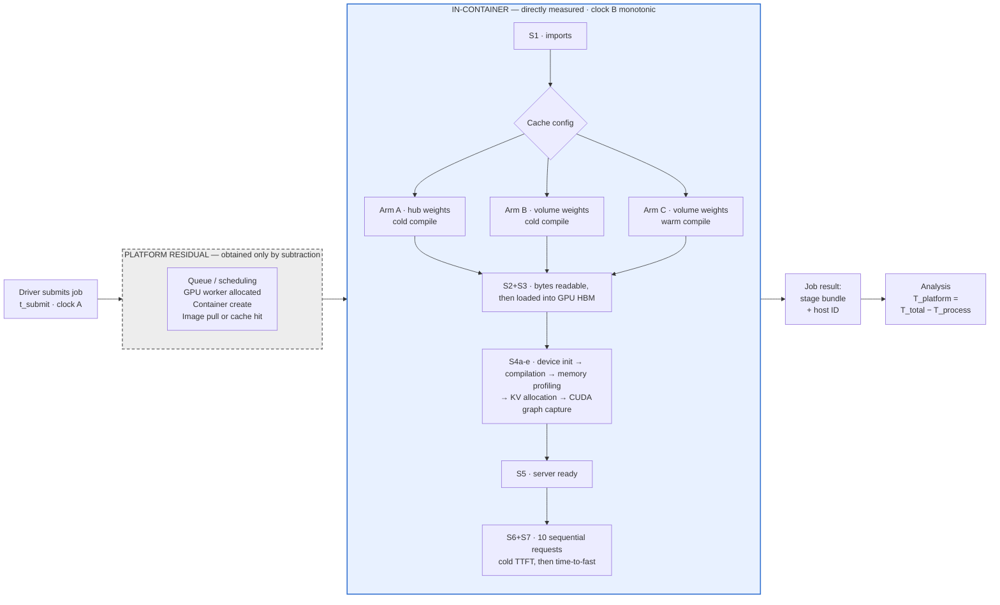
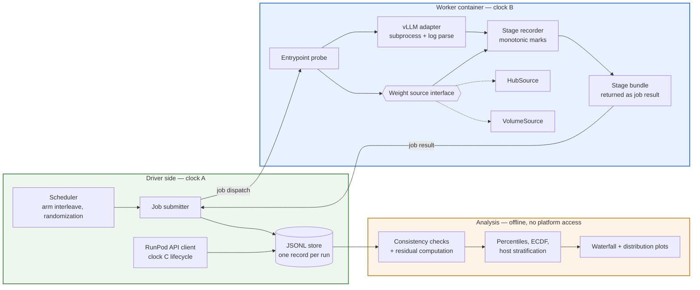

# What a vLLM Replica Does Before It Can Serve — Design

**Date:** 2026-08-17
**Status:** Approved design, ready for implementation planning
**Artifact:** 1 of 5
**Working post title:** *What a vLLM replica actually does before it can serve a token.* Exact
wording is set at publication; the engine-centric framing is the decision, not the phrasing.
"Cold-start decomposition" is accurate but generic, and generic titles do not signal domain
before the click.

**Learning guide:** §9b — concepts to work through before building, with self-check questions.

---

## 1. Context and goal

The problem being solved is legibility, not capability. Substantial backend and cloud
infrastructure experience reads on paper as backend/cloud engineering; hands-on work in
cold-start serving systems and LLM/agent integration is not visible outside the current
employer. A hiring manager screening for inference infrastructure cannot distinguish this
profile from a backend engineer who has read about it.

The mechanism for closing that gap is measurement, not explanation. Anything derivable from
understanding alone has been written many times and can be generated on demand. A number
produced on a configuration you built exists nowhere else and cannot be faked from reading.
An experiment demonstrates instrumentation, variable isolation, signal-versus-noise judgment,
and honest interpretation — which are the skills the target role hires for.

**Success:** inbound and warm conversations from target companies; a linkable body of work
that makes "ML platform / inference infrastructure" read as description rather than
aspiration; interviews where technical evaluation is partly complete before it starts; a
network of roughly 100–150 relevant engineers at target companies.

**Explicitly not success:** follower count, impressions, viral reach, general audience growth.

**Boundary (non-negotiable):** all material derives from independent reasoning and
reproducible experiments on rented or personal hardware. Nothing from employer internal
documentation, architecture diagrams, or production metrics.

---

## 2. Scope

### In scope for this spec

- Artifact 1: cold-start decomposition for LLM serving — waterfall plus one intervention.
- The portfolio contract shared by all artifacts: venue, structure, naming, sequence,
  the two through-line claims.
- The documentation layer that supports understanding and later reuse.

### Out of scope for this spec

- Artifact 2 (autoscaling signal comparison). Deliberately not finalized: its design should
  absorb artifact 1's real numbers and reader feedback. Gets its own spec.
- Artifact 3 (tool-calling reliability harness). Independent substrate, independent
  deliverable. Gets its own spec.

### Fixed constraints

The dominant failure mode is an unfinished comprehensive project rather than a finished
narrow one. These are fixed in advance and not revisited during implementation:

- One GPU class, one serving framework, one model family.
- Publish the narrow, honest version; sequels are cheap once the harness exists.
- Two coherent claims across the portfolio, not five scattered posts.
- Staged releases — each publication is a separate occasion to post, reach out, and be seen.

### Resource envelope

- **Time:** ~8–12 hours per week.
- **Money:** $200 maximum, total.
- **Timeline:** deliberate. 4–6 months, no hard external deadline. Sequential execution.

Budget note: measurement itself is cheap — a few hundred cold starts at a couple of minutes
each — ~300 runs across three arms — lands around $45–75. The budget is consumed by debugging
on live GPUs, which is why the
GPU-free development loop (§6.7) is a load-bearing part of the design rather than a nicety.

---

## 3. Portfolio contract

### Structure

Own domain, static site, one repo per artifact. Writeups live at stable slugs under an
`/experiments/` path. Each writeup links to its harness repo; each repo README links back as
canonical.

Artifacts 1 and 2 share a single repo — artifact 2 is a new experiment against the same
instrumented harness, tagged at the commit that produced artifact 1's numbers. Artifact 3
gets its own repo, because there the repo *is* the deliverable rather than supporting
evidence.

Each artifact carries a publication date, a byline, and a permanent slug that never changes.
Corrections are appended as dated notes, never edited into the original. This costs nothing
and makes the work citable — serving the interview case (you can point at what you knew when)
and the immigration-petition case (dated, attributable, self-controlled publication) without
either distorting the writing.

**Prerequisite:** a GitHub account exists; a domain does not. Domain plus site skeleton plus
repo conventions must exist before artifact 1 publishes, so the URL is permanent from day one.
Small task, roughly a few hours and ~$12/year.

### The two claims

**Claim 1 — what elastic LLM serving actually costs, measured.** Artifacts 1, 2, 4 and 5, as one
arc: *what does a replica cost to start* (1), *when should you add one* (2), *should you share one
across models* (4), *should you share one across adapters* (5). Cold start is the cost; autoscaling
signal choice determines how often you pay it; placement strategy determines whether you pay it at
all. Artifacts 4 and 5 are the ones that read as platform rather than serving, because they are
about allocating finite GPUs across competing demands — and together they produce the portfolio's
strongest business number, cost per tenant per month three ways.

Note on percentiles across the two artifacts: artifact 2's p99 is taken over the thousands of
*requests* generated during a spike, which supports that percentile comfortably. Artifact 1's
percentile ceiling of p95 (§5) applies to *cold-start runs*, of which there are ~100 per arm.
Different populations, different achievable resolution — not an inconsistency.

**Claim 2 — how you know your agent works.** Artifact 3, standalone.

### Findings are stated in two units

**Every artifact states its headline finding twice: once in systems units, once in money.** The
conversion assumptions — GPU hourly rate, request volume, event frequency — are published in each
post so a reader can substitute their own and re-derive.

This costs no additional measurement. Every artifact already computes GPU-seconds and token counts;
the money view is arithmetic on numbers already collected. What it buys is the difference between a
systems result and a decision: "the cache saves 18 seconds" is a fact, "above N scale-ups per day
the cache pays for itself" is something a platform lead can act on, and only the second one gets
forwarded to someone with a budget.

### Sequence

1. **Prerequisite** — domain, site skeleton, repo conventions.
2. **Artifact 1** — cold-start decomposition. Longest, because it builds the harness the next
   one inherits.
3. **Artifact 2** — autoscaling signal comparison. Substantially cheaper; harness, deployment,
   and analysis pipeline already exist. Design finalized *after* artifact 1's numbers land.
4. **Artifact 4** — multi-model serving economics. Composes on artifacts 1 and 2. **Not funded by
   the original $200 envelope**; see artifact 4 §11. The funding decision covers artifacts 4 and 5
   together, since they are one story.
5. **Artifact 5** — multi-LoRA serving. Cheapest GPU artifact of the set and the lowest complexity;
   requires artifact 4's base model, GPU class, and swap-cost reference line.
6. **Artifact 3** — tool-calling reliability harness. **Last and optional.** No GPU, no budget,
   independent. Weakest of the set for the $250k+ target band; retained as the agent-positioning
   hedge, built only if hours remain.

Strictly sequential. The timeline does not require a hedge artifact.

### Audience and register

Written for engineers and managers on inference-platform teams. Leads with SLO consequence.
Distributed via LinkedIn, X, and direct outreach.

Depth is non-negotiable — it is the part that cannot be faked from reading — but the document
is structured for two reading depths so a skimming reader reaches the claim without wading
through method.

### Distribution track

Runs in parallel starting now, independent of artifact progress, because network accumulation
has a lead time that publishing cannot compress.

### Explicit non-goals

No follower or impression targets. Not designed for Hacker News. No cross-posting to
aggregators as a growth mechanism. Reach, if it happens, is a byproduct and is not evidence
the plan is working — inbound from target companies is.

---

## 4. Documentation layer

Markdown with Mermaid diagrams, versioned in the harness repo. Mermaid because it renders on
GitHub, diffs cleanly, and can be edited conversationally rather than through a drawing tool.

| Doc | Question it answers |
|---|---|
| `docs/experiment.md` | What is measured, the hypotheses, the arms, what would falsify them |
| `docs/harness.md` | The components, what each owns, how they communicate |
| `docs/measurement.md` | Where each timestamp originates, how three clocks reconcile, what is in the residual and why |
| `docs/runbook.md` | How to run it — local loop, then GPU, then analysis |

These serve three purposes: understanding the system while building it, raw material for the
published post, and durable context so future work reads the docs rather than reconstructing
from conversation.

### Orientation diagram — one measurement run



The dashed grey box is the honest limit of the experiment. Everything inside it happens
before the measuring code exists, so it can only be obtained by subtraction. The intervention
lives entirely inside the blue box at the `Cache config` branch — the only point where the three
arms differ, which is what keeps this a single-dimension manipulation despite having three
levels. Note that the two cache effects land in *different* stages: weight caching acts on
`S2+S3`, compile caching acts inside `S4`. That is why `S4` must be sub-decomposed rather than
reported as one bar — otherwise half the experiment is invisible.

---

## 5. Experiment design

### Question

A cold vLLM replica starts with **two** empty caches, not one: the model weights, and the
engine's compiled artifacts. The first is universally discussed. The second is invisible to
anyone who has not operated the engine.

So: on a serverless GPU platform, how is cold-start latency for an 8B vLLM deployment
distributed across stages, **which of the two caches actually matters more**, and how long
after the replica reports healthy does it serve at steady-state latency?

### Platform and configuration

| Dimension | Decision | Rationale |
|---|---|---|
| Platform | RunPod serverless | Cheapest per GPU-second, so the budget buys hundreds of cold starts rather than dozens — which is what makes distribution reporting possible instead of mean reporting. Full control of the container image. |
| GPU | One pinned 24 GB SKU (A10-class or L4-class) | Cheapest tier holding 16 GB of weights with KV-cache headroom. Selection rule: cheapest 24 GB SKU with adequate serverless availability in a single region; frozen once selected and stated in the post. |
| Region | One, pinned | Removes region as a variance source. |
| Model | Qwen3-8B instruct, **checkpoint-native dtype (bf16, not fp16)**, ~16 GB, exact revision hash pinned and published | Ungated weights: a reader can reproduce without a license-approval step. Gated checkpoints would quietly break the reproducibility claim, which is load-bearing. 8B is where weight fetch is a real multi-tens-of-seconds term and is representative of latency-sensitive deployments. **Dtype must match the checkpoint.** Qwen ships bf16; loading it as fp16 inserts a conversion pass *inside the stage being measured*, contaminating the primary metric with work that exists only because of a configuration mistake. |
| Framework | vLLM, version pinned | Most widely deployed and most recognizable to the target audience. Emits timestamped startup phases, so much of the waterfall is instrumentation to *verify* rather than invent. Readers can grep their own logs for the same phase names. |

Platform caveat accepted deliberately: serverless platforms hide some stage boundaries behind
their own abstractions. Establishing what can and cannot be attributed is part of the method
work, and saying so plainly is itself the signal.

### Hypotheses — pre-registered

**H1 (decomposition).** Weight handling is the dominant directly-measured stage — more than
half of `T_process` — in the fully uncached arm.

**H2 (weight caching).** Pre-staging weights on a network volume materially reduces
weight-handling time relative to fetching from the hub.

**H3 (compile caching).** Engine compilation on a cold artifact cache is a non-trivial term in
`S4`, and warming that cache materially reduces engine-init time.

**H4 (tail).** The spread between median and p95 total cold start is driven substantially by
host heterogeneity rather than by variance within any single stage.

H2 is genuinely uncertain at even odds. A network volume is network-attached storage; a hub
download is a parallel multi-connection transfer that can be fast. The volume may be no faster,
or slower.

H3 is the one with novelty risk in the good direction: the term is real for operators but
essentially unpublished, so any credible number is new information. **The relative ranking of
H2 and H3 is the most interesting result available in this experiment.** If warming the compile
cache buys more than caching 16 GB of weights, that inverts the intuition nearly every reader
brings, and it is a fact only obtainable by measuring.

**Version dependency, resolved by the reconnaissance run (§6.8):** whether the pinned vLLM
version compiles at startup, and where it caches those artifacts, varies by version and
configuration. **This cannot be determined locally** — it requires running the engine on a GPU, so
it is answered by reconnaissance rather than by the GPU-free loop. If the pinned version does not
compile at startup, H3 and its arm are dropped, the experiment reverts to the two-arm design with
nothing else changed, and the post records that this is what happened.

**Pre-registration mechanism:** hypotheses and the full analysis plan are committed to
`docs/experiment.md` before the first paid run. The git timestamp then proves the hypothesis
was not retrofitted to the result.

### Stage taxonomy

| Stage | Starts at | Ends at | Source |
|---|---|---|---|
| `T_platform` | job submitted | container process starts | residual (subtraction) |
| `S1` imports | entrypoint `t0` | torch + vLLM imported | clock B |
| `S2` acquisition | fetch begins | weight bytes locally readable | clock B |
| `S3` HBM load | load begins | weights resident on GPU | clock B |
| `S4a` device init | post-load | CUDA context and device setup complete | clock B + vLLM logs |
| `S4b` compilation | post-device | engine compilation complete (cold or cached) | clock B + vLLM logs |
| `S4c` memory profiling | post-compile | dummy forward pass complete, free HBM known | clock B + vLLM logs |
| `S4d` KV allocation | post-profile | cache blocks allocated | clock B + vLLM logs |
| `S4e` graph capture | post-alloc | CUDA graphs captured across batch sizes | clock B + vLLM logs |
| `S5` ready | engine up | server reports healthy | clock B |
| `S6` cold TTFT | request 1 dispatched | first token of request 1 emitted | clock B |
| `S7` warmup curve | request 1 dispatched | request 10 complete | clock B |

**Primary comparison unit is `T_weights = S2 + S3`, not `S2` alone.** In the volume arms,
weights may be memory-mapped from the volume rather than copied, fusing acquisition and HBM
load into one lazy operation with no clean boundary. Comparing `S2` across arms would measure
an artifact of how each arm happens to be structured rather than the thing intervened on.

**One request measures readiness; ten measure competence.** A single `max_tokens=1` request
answers "when did the first token appear," which is not the question an operator has. The
operational question is **time-to-ready versus time-to-fast**: a replica that passes its health
check but serves its first several requests at multiples of steady-state latency is a replica
that will damage p99 during exactly the scale-up event cold start exists to describe — and the
load balancer routing to it cannot tell. So `S6` is the cold first-token measurement and `S7`
records the full per-request latency curve across ten sequential identical requests, from which
time-to-fast is derived. The marginal cost is a few seconds per run on GPU time already paid
for.

**Engine init has already run a forward pass — `S6` is not a cold execution path.** vLLM's
memory profiling (`S4c`) executes a dummy forward pass to determine how many KV cache blocks
fit in available HBM. By the time the first real request arrives, allocator state, kernel
selection, and some caches are already warm. `S6` therefore measures first *served* token, not
first-ever execution, and the post must say so. This also means any warmup curve observed in
`S7` is a floor on the true cold-execution penalty rather than the whole of it.

**Why `S4` is sub-decomposed rather than reported as one bar.** A single "engine init" bar is
where domain content goes to hide. Split into its phases, the waterfall stops being four
generic infrastructure stages plus a mystery box and becomes a picture of what an inference
engine actually does before it can serve: establish a device context, compile, discover how
much memory is free by running the model once, allocate the KV cache against that budget, and
capture CUDA graphs. Each of those phases is separately actionable, and `S4b` and `S4e` are the
two that trade startup time against steady-state serving performance.

**Attribution caveat, handled the same way as the platform residual.** Sub-phase boundaries are
extracted from the pinned version's engine logs. Any phase that version does not delineate is
reported merged, with the merge stated explicitly rather than guessed apart. The bracketed
`S4` total from clock B is authoritative; the sum of identified sub-phases is subtracted from
it and the difference published as unattributed-within-`S4`. The waterfall never sums to a
suspiciously exact 100%.

### Variables

**Independent — one dimension, three levels: what is cached.**

| Arm | Weights | Compile artifacts | What it isolates |
|---|---|---|---|
| A | hub download | cold | fully cold baseline |
| B | pre-staged network volume | cold | value of caching weights alone |
| C | pre-staged network volume | pre-warmed | marginal value of caching compiled artifacts |

This remains a **single intervention dimension** — caching — measured at three levels, not two
independent variables. A→B isolates the weight cache exactly as originally designed. B→C
isolates the compile cache with weight handling held constant. The A→C total is the full
warm-cache benefit.

The deliberately omitted fourth cell (weights cold, compile warm) has no operational meaning —
nobody warms a compile cache while re-downloading weights every start — so measuring it would
spend runs to fill a table rather than answer a question.

**Held fixed:** GPU SKU, region, vLLM version, model revision hash, container image digest,
`max_model_len`, `gpu_memory_utilization`, dtype = checkpoint-native bf16, tensor parallel = 1,
graph capture on, one identical fixed prompt, a fixed sequence of ten sequential requests with
fixed `max_tokens` (small but greater than 1, so decode behavior is observable and not only
prefill), one cold start in flight at a time.

**Recorded per run:** host identifier, GPU model, driver version, timestamp, arm, run index,
whether this host has been seen before, **KV cache blocks allocated and the resulting token
capacity** (reported by vLLM at startup), **per-request latency and TTFT for all ten warmup
requests**, and **whether the compile cache was present and used**, verified from engine output
rather than assumed from configuration.

### Deliberate exclusion — the baked-image arm

Weight caching has three plausible configurations: hub download, network volume, and weights
baked into the container image. Only the first two are used.

Baking weights into the image does not remove the bytes — it relocates them into image pull,
which lives inside the unattributable residual. The baked-image arm would therefore produce a
flattering number for a reason the harness structurally cannot observe. Excluding it
deliberately, and explaining exactly this in the post, is stronger than including it: it
demonstrates seeing a confound before it flatters you.

### Sample plan

**Arms are interleaved, not blocked** — A, B, C rotating, with order randomized within each
triple. This is the most important validity decision in the design. Running 100 of A, then 100
of B, then 100 of C would confound the intervention with time-of-day fleet conditions, and on a
heterogeneous rented fleet that confound is large enough to manufacture or erase the entire
effect.

Target ~100 runs per arm — **~300 runs total** — spread across at least three separate time
windows on different days. At roughly two minutes of billed GPU time per run this is on the
order of $45–75 depending on the selected SKU's rate, comfortably inside the $200 envelope with
the majority still reserved for debugging iteration.

**Within-host triples** replace within-host pairs for the confound-free secondary analysis: any
triple whose three runs land on the same physical host yields both contrasts with host effects
removed. These will be rarer than paired landings were, so the subset is smaller and its
intervals wider — reported as supporting evidence, never as the headline estimate.

**What N=100 supports:** stable p50, p90, p95, and a full ECDF. It does **not** support a
credible p99 — at 100 samples that is one or two observations. The artifact reports up to p95
as measurement and labels anything beyond as anecdote. Publishing a p99 from 100 runs would be
precisely the sloppiness this work argues against.

### Threats to validity

| Threat | Handling |
|---|---|
| Host heterogeneity | interleaving, host IDs recorded, host-stratified reporting |
| Clock skew across three sources | per-run consistency check; discard rule fixed in advance |
| Image already cached on a host | first-touch vs. repeat-host flag, reported separately |
| Volume page cache warming over runs | interleaving; run index checked for trend |
| Compile cache leaking into a cold arm | cache presence verified per run from engine output; runs where an arm's expected cache state does not match observed state are discarded with reason recorded |
| Compile cache invalidated by a config change mid-experiment | image digest, vLLM version, model revision, and engine flags pinned and recorded per run; any change ends the experiment rather than continuing across a boundary |
| Fleet drift over time | multiple time windows across days |
| Run attrition biasing the distribution | all failures logged, failure rate published, exclusion rules pre-committed |
| Version and configuration specificity | everything pinned and stated; claims scoped to that configuration |

**Cost asymmetry between arms, reported in the post.** Neither cache is free, and a latency win
reported without its standing cost is overstated. The weight cache is a network volume you pay
to keep. The compile cache carries an operational cost instead of a rental one: it must be
warmed, and it is invalidated by changes to the engine version, model, hardware, or flags —
meaning every upgrade pays the cold compile again unless the warming step is built into the
deployment pipeline. That fragility is part of the honest answer to "should you do this," and
it is the kind of consideration that only shows up from having operated the thing.

### What counts as a result

Every outcome below is publishable, which is what makes pre-registration safe:

- **Compile cache beats weight cache (B→C larger than A→B)** — the most valuable result
  available. It inverts the intuition nearly every reader holds, it is unpublished, and it
  cannot be derived from reading. If the data says this, it leads.
- **Residual dominates** — strongest pure-SLO takeaway: on rented serverless GPU most of cold
  start is not the operator's to fix, so scale-up SLOs have a floor set by the provider.
- **Neither cache helps much** — implies the bottleneck is elsewhere in the engine; the `S4`
  sub-decomposition then says exactly where, which is why sub-decomposing it matters.
- **Engine init dominates every arm** — caching has a hard ceiling; report the bound.
- **Weight cache wins big** — clean and actionable, but the narrowest in scope.

**Headline selection rule, fixed in advance.** Rank candidate findings by how far they transfer
to a reader on different infrastructure, and lead with the most transferable. "This provider's
volume beats this hub's CDN" is a fact about two vendors. "The cache everyone warms is not the
cache that matters," "readiness and competence are different events," and "this fraction of
cold start is structurally outside operator control" are claims about serving on rented elastic
capacity, and they survive the reader changing providers. Committing to this ordering before
seeing data prevents selecting the headline by which result cost the most effort.

### Stopping rule

Stop at 100 runs per arm, or when the confidence intervals on **both** contrasts — A→B and
B→C — are tight enough to distinguish "large effect" from "no effect," whichever comes first.
Both must qualify: stopping early because one contrast resolved would leave the comparison
between them, which is the most interesting result, underpowered.

---

## 6. Harness architecture

### 6.1 Approach

Reconciled harness with dual clocks and an explicit residual. Three independent time sources:
the driver's monotonic clock (A) for end-to-end, the in-container emitter (B) for everything
from process start onward, and RunPod's API job lifecycle timestamps (C) as a third reference.

```
T_total (clock A) = T_platform (residual) + T_process (clock B)
```

Two reasons this is worth the discipline over simpler alternatives. First, three clocks
cross-check each other — with a single source you cannot detect that it is lying; with three
you can bound skew and discard inconsistent runs for a stated, recorded reason. Second, the
residual is the honest core of the artifact: most published cold-start numbers quietly
attribute all time to stages the author could see. A named bucket labeled "time I cannot
attribute from inside the container, and here is why" is more credible than a waterfall that
suspiciously sums to 100% — and it carries direct SLO consequence, since it is the portion of
scale-up latency an operator cannot engineer away.

### 6.2 Components



| Component | Owns | Depends on | Testable without GPU |
|---|---|---|---|
| Scheduler | arm sequence, randomization, run index | nothing | yes |
| Job submitter | clock A timestamps, dispatch, result capture | RunPod endpoint | yes, against a stub |
| RunPod API client | clock C lifecycle timestamps | RunPod API | yes, against recorded fixtures |
| Stage recorder | clock B monotonic marks, bundle serialization | nothing | yes — pure |
| Weight source | making bytes readable, nothing else | filesystem, network | yes |
| vLLM adapter | engine startup, phase extraction | vLLM subprocess | yes, against captured logs |
| Store | append-only durability, schema version | nothing | yes |
| Analysis | reconciliation, statistics, plots | schema only | yes — pure |

Every component except the vLLM adapter and the weight sources is testable with no GPU and no
money. This is the mechanism that protects the budget.

### 6.3 Two decisions worth calling out

**The vLLM adapter runs `vllm serve` as a subprocess, not the Python engine API.** The Python
API would give cleaner boundaries but would measure a startup path nobody deploys — and the
target audience is precisely the readers who would notice. Instead the probe brackets the
canonical server startup with its own monotonic marks (outer bounds it fully controls) and
extracts internal phase splits from the server's log output. Outer bounds are authoritative
for durations; log-derived splits are attribution within them. Any gap between the sum of
splits and the bracketed total is reported as unattributed-within-process time, not smoothed
away.

**Cache configuration is a single interface with three implementations, and it is the only
thing that differs between arms.** Same image digest, same entrypoint, same engine flags — one swapped
object. This makes the single-variable claim structurally true rather than merely intended.
If arm behavior diverges anywhere else in the code the experiment is compromised; keeping the
difference behind one narrow interface makes that easy to audit and hard to violate by accident.

### 6.4 Data contract

One JSONL record per run — the interface between worker, driver, store, and analysis:

```
schema_version, run_id, run_index, arm
clock_A: { t_submit, t_result }
clock_C: { queued_at, started_at, completed_at }   # if exposed by the API
clock_B: { t0, marks: [{stage, t_mono}], log_phases: [...] }
warmup:  [ {req_index, ttft, end_to_end} × 10 ]
engine:  { kv_cache_blocks, block_size, kv_capacity_tokens, dtype_loaded,
           compile_cache_expected, compile_cache_observed, s4_subphases: {...} }
host:    { host_id, gpu_model, driver_version, first_touch }
config:  { image_digest, vllm_version, model_revision, engine_flags }
status:  { outcome, failure_class, failure_detail }
```

Versioned, because it will change at least once and old runs must remain analyzable.

### 6.5 Clock discipline

1. **Durations are computed only within a single clock domain.** Never subtract a clock B
   timestamp from a clock A timestamp to obtain a stage duration.
2. **Exactly one cross-domain subtraction is permitted** — the defined residual,
   `T_platform = T_total(A) − T_process(B)`. It is named, approximate, and the post says so.
3. **Every run gets a consistency check.** `T_process` must not exceed `T_total` less a
   network round-trip floor. Violations are discarded with the reason recorded, never silently.

**Opportunistic upgrade:** if RunPod's API exposes both queued-at and started-at, clock C
splits the residual into queue delay versus container bring-up, turning one grey box into two.
Treated as a nice-to-have; the design must work if the API provides nothing useful.

### 6.6 Failure handling

Failures are data, not noise. Classified at minimum as: submit error, provisioning timeout,
image pull failure, weight acquisition failure, OOM, engine init failure, health timeout,
TTFT timeout.

**Failed runs are recorded as their own records and the schedule continues — never retried
into the same record.** Retrying in place would silently replace slow or unlucky runs with
faster ones, biasing the distribution toward the optimistic tail. That is exactly the error
this artifact argues against, so the harness must make it structurally impossible. The
published post reports failure rate per arm alongside latency numbers.

### 6.7 Local development loop

A stub weight source and a stub engine emitting realistic stage marks with configurable
delays. This exercises scheduler, submitter, recorder, store, consistency checks, statistics,
and plots end to end for free.

Paid GPU time then only ever runs *measurement* code paths already proven correct. It also means
the analysis code is finished and tested *before* the first real number arrives, removing the
temptation to tune analysis after seeing results.

### 6.8 Reconnaissance run — discovery before measurement

The GPU-free loop has a bootstrap problem, and pretending otherwise would make the schedule
dishonest. **Three things cannot be known without hardware:**

| Unknown | Why local work cannot answer it |
|---|---|
| Engine startup log format and phase names | The `S4` sub-decomposition parses them. vLLM's CPU backend has a materially different startup path — no HBM load, no graph capture, different memory profiling — so its logs would not contain the phases being measured |
| Platform API lifecycle fields | Whether queued-at and started-at are exposed determines whether the residual can be split (§6.5). Discovered, not designed |
| Compile-at-startup behavior and cache location | Determines whether H3 and arm C exist at all (§5) |

So **step one is a deliberately cheap reconnaissance run** whose only purpose is capture, not
measurement:

- A handful of cold starts at the pinned image, version, and configuration.
- Save raw engine log output verbatim, as fixtures committed to the repo.
- Save raw platform API responses verbatim, as fixtures.
- Record whether compilation happens at startup and where artifacts land.

Budget: a few dollars. Nothing from it is published as a result — the sample is far too small and
the configuration is not yet frozen.

The parser, the API client, and the residual logic are then built and tested offline against those
fixtures. **The discipline survives intact, restated precisely: discovery comes first, and paid
measurement runs only code already proven against real captures.** Committing the fixtures also
means a reader can run the parser's tests without a GPU, which is part of the reproducibility claim.

**On the absence of a local GPU path:** development happens on macOS, so there is no CUDA and no
meaningful local vLLM. There is no middle ground between laptop and rented hardware, which is what
makes the fixture-and-stub discipline load-bearing rather than a nicety.

---

## 7. Analysis

### Pipeline

Records flow one direction, each step a pure function over the previous: **validate → derive →
aggregate → plot**. Analysis never touches the platform; it runs offline on stored JSONL and
is fully exercised against synthetic data before the first real run.

### Derived metrics

| Metric | Definition |
|---|---|
| `T_total` | clock A, submit → first token of request 1 |
| `T_process` | clock B, `t0` → first token of request 1 |
| `T_platform` | residual, `T_total − T_process` |
| `T_weights` | `S2 + S3`, the primary comparison unit |
| stage shares | each stage as a fraction of `T_process` |
| ceiling bound | best case achievable if `T_weights` went to zero |
| steady-state latency | median end-to-end latency of warmup requests 8–10 |
| `T_fast` | clock A, submit → first request within 10% of steady-state latency |
| warmup penalty | request-1 latency ÷ steady-state latency |
| KV capacity | allocated cache blocks converted to tokens |
| supported concurrency | KV capacity ÷ assumed context length, stated with the assumption |
| `T_compile` | `S4b`, cold minus warm, the compile-cache term |
| cache contrast | A→B (weights) vs. B→C (compile), the primary ranking |
| foregone tokens | `T_fast` × steady-state tokens/sec — cold start denominated in output |

The ceiling bound keeps the intervention honest. If weight handling is 40% of `T_process` and
`T_process` is 60% of `T_total`, perfect weight caching removes at most ~24% of cold start.
Stating that bound before reporting the measured improvement prevents overselling in either
direction.

`T_fast` is the operationally meaningful number and it is always ≥ `T_total`. The gap between
them is the interval during which a replica is receiving traffic it cannot yet serve at full
speed. If that gap is large, cold start is worse than the headline figure suggests for anyone
whose load balancer adds replicas on readiness — which is nearly everyone. The thresholds are
fixed here, before data, so the definition cannot be tuned to produce a preferred result.

**KV capacity connects startup to throughput.** vLLM reports allocated cache blocks at startup;
converting that to tokens states what concurrency the configuration actually supports. Without
it a cold-start number floats free of the capacity it buys, and a platform reader cannot use it
for sizing. The concurrency figure is always published with its assumed context length attached,
because the same cache supports very different concurrency at 2k versus 32k tokens.

**Cold start is also reported in tokens, not only seconds.** Multiplying `T_fast` by measured
steady-state throughput gives the output the replica could have produced during the interval it
was starting or still slow. Seconds are a systems unit; tokens are the unit capacity planning
and cost are denominated in, and translating between them is what makes the number usable to
someone deciding how aggressively to scale. Reported alongside the seconds figure, never
instead of it.

### Business framing — required

The systems findings convert to money through three published assumptions: GPU hourly rate for the
pinned SKU, scale-up events per day, and measured steady-state throughput.

| Quantity | Definition |
|---|---|
| cost per scale-up event | `T_fast` × GPU hourly rate, plus the value of foregone tokens |
| annual cost of cold start | cost per event × events per day × 365 |
| **cache break-even volume** | the scale-up frequency at which latency saved exceeds the standing cost of keeping a cache warm |

**The break-even is the answer a platform lead actually wants.** Both caches carry standing costs —
the weight cache rents a volume, the compile cache must be re-warmed on every version change. So
the honest question is not "does caching help" but "at what request volume does each cache pay for
itself." That number is derivable from the measurements plus published assumptions, requires no
additional runs, and is the sentence that travels to someone who owns a budget.

### Statistical treatment

**Non-parametric throughout.** Cold-start distributions are right-skewed with a heavy tail;
means and standard deviations would misrepresent them. Report p50, p90, p95, and the full
ECDF. Bootstrap confidence intervals on the median difference between arms.

**Two contrasts, reported together.** A→B estimates the weight cache, B→C the compile cache.
Both get bootstrap confidence intervals, and so does their *difference* — the ranking claim
needs its own interval, since "compile cache mattered more" is only a finding if the gap
between the two effects excludes zero. Asserting a ranking from two point estimates whose
intervals overlap would be exactly the error this artifact exists to avoid.

**Within-host triples — the cleanest estimate available.** Because arms are interleaved in
randomized triples, some triples will land all three runs on the same physical host, giving
both contrasts with the host confound removed entirely. This will be a minority of the data, so
it is a secondary analysis with wider intervals — but it is the strongest causal evidence in
the dataset and cross-checks the unpaired estimates. Disagreement between the two is itself a
finding about host heterogeneity.

**For H4:** per-host medians, plus the share of total variance attributable to host as a
grouping factor.

**No fishing.** Four pre-registered hypotheses. Anything else discovered is labeled
exploratory, in those words, and is never promoted to a headline claim.

### Figures

Four in the body, because the post has one argument. Anything else goes in an appendix.

1. **The waterfall** — stacked horizontal bars, one per arm (A, B, C), median stage durations,
   with `S4` shown as its sub-phases rather than one block, the platform residual visually
   distinct from measured stages, and unattributed-within-`S4` shown explicitly. This carries
   the main argument and is the one thing a skimming reader will look at. Three bars side by
   side make both cache effects readable as shrinking segments rather than as a table.
2. **The warmup curve** — per-request latency for requests 1–10, all arms, with the steady-state
   band marked and `T_fast` annotated. The figure that shows readiness and competence are
   different events.
3. **ECDF of `T_total`, all arms overlaid** — distributions and tails rather than collapsed
   numbers.
4. **Per-host medians** — the H4 evidence, showing heterogeneity directly.

Appendix: within-host triple deltas, if that subset is large enough to be worth showing.

Constraints: no truncated axes, N stated on every figure, failure rate reported adjacent to
latency numbers, legible on a phone, residual never colored to blend with measured stages.

**Verification requirement:** figures are rendered and visually inspected before being
considered done. A plot that executes without error is not a plot that reads.

### Published dataset

Raw JSONL, the analysis script, and the figure-generating code all ship in the repo. A reader
should be able to re-derive every number in the post from the published records without
running a single GPU.

---

## 8. Publication

### Post structure

Ordered for two reading depths, hiring-reader payload first:

1. **Lead** — the finding and the number, two sentences. Which finding leads is set by the
   headline selection rule in §5, not by which result took the most effort.
2. **The waterfall chart**, three arms, `S4` shown as sub-phases.
3. **Which cache actually mattered** — the two contrasts and the interval on their difference.
4. **Why this matters for a scale-up SLO** — short, concrete, including the capacity the
   configuration buys (KV cache tokens → supported concurrency at a stated context length) and
   cold start denominated in foregone tokens, so the number is usable for sizing rather than
   just interesting.
5. **Ready is not fast** — the warmup curve and `T_fast`, with the interval during which a
   replica serves traffic below steady speed stated explicitly.
6. **What I measured and what I cannot attribute** — the residual and unattributed-within-`S4`,
   stated plainly and early. Placing the limitation above the method is deliberate: it signals a
   measurement designed by someone who thought about it rather than defended after the fact.
7. **Method** — platform, model, framework, arms, controls, N, link to the pre-registration commit.
8. **Results** — distributions, host stratification, warmup behavior, within-host triples,
   failure rates.
9. **Limits** — version specificity, one GPU class, one region, N supports p95 not p99, the
   standing rental cost of the weight cache and the invalidation fragility of the compile cache,
   the fact that memory profiling has already run a forward pass before `S6` so cold TTFT is not
   a cold execution path, and that all measurements are single-replica with no contention (§9).

### Required explanations, not just numbers

Domain fluency shows in the prose around the measurements, not in the measurements themselves.
Four explanations are mandatory in the post, each a short paragraph:

- **What memory profiling is doing and why it needs a forward pass** — you cannot know how much
  HBM is free for KV cache without actually running the model once.
- **What CUDA graph capture costs and what it buys back** — startup seconds traded for per-step
  decode latency, which is why skipping it is a real option with a real price.
- **What invalidates a compile cache** — engine version, model, hardware, flags — and therefore
  why this optimization is operationally fragile in a way weight caching is not.
- **What happens to a cold replica the moment a load balancer routes to it** — under continuous
  batching a fresh replica accepts work immediately, so the gap between ready and fast is served
  to real users rather than absorbed by a warmup period nobody sees.

None of these require additional measurement. All of them are the difference between a post that
reports numbers and a post that demonstrates its author understands the system producing them.
9. **Reproduce it** — repo, runbook, honest cost estimate.
10. **What I am measuring next** — one line pointing at artifact 2. Not a promise with a date.

### Pre-publish gate

A short checklist run before anything goes live, with one non-negotiable item: **confirm every
number, diagram, and claim derives from the rented-hardware experiment and independent
reasoning — nothing traceable to employer internal material.** Making this a mechanical gate
rather than a good intention is what keeps it intact under editing pressure.

### Distribution

Three occasions per artifact: the publication, a follow-up note on what surprised you, and the
direct outreach round.

- **LinkedIn and X** — lead plus the waterfall chart plus the link. The chart travels; the
  prose does not.
- **Direct outreach** — individually, to named engineers and managers on inference-platform
  teams at target companies. The message shares the artifact and asks one real technical
  question their team would have a view on. That framing produces a conversation between
  engineers; "would you like to see my work" produces a pitch, and pitches get archived.

**Tracked:** which companies, who replied, what they asked about, which parts of the post drew
engagement. The last of these is the design input to artifact 2, which is intentionally
unfinalized so it can absorb this feedback.

### Success measures

- Inbound contacts from target companies.
- Warm conversations initiated.
- Count of relevant engineers in the network, against the 100–150 target.
- Interviews where the artifact was referenced before you raised it.

Not tracked, deliberately: impressions, followers, upvotes.

---

## 9. Risks and open items

| Risk | Mitigation |
|---|---|
| Scope creep into a comprehensive project | Constraints in §2 are fixed and not revisited during implementation. Sequels are the release valve. |
| Budget consumed by live-GPU debugging | GPU-free development loop (§6.7); analysis complete before first paid run. |
| RunPod fleet variance swamping the effect | Interleaved arms, host stratification, within-host triple subset. Variance treated as a finding, not noise. |
| Platform API exposes no useful lifecycle data | Residual remains a single bucket; design does not depend on the split. |
| Intervention shows no effect | Pre-registered as a publishable outcome; arguably the more interesting post. |
| Pinned vLLM version does not compile at startup, invalidating H3 | Verified in the local loop before any paid run. If absent, arm C and H3 are dropped, the design reverts cleanly to two arms, and the spec records that this happened. |
| `S4` sub-phases not delineated by the version's logs | Undelineated phases reported merged, stated as merged; bracketed `S4` total remains authoritative and the unattributed remainder is published. |
| Employer-boundary contamination | Mechanical pre-publish gate (§8). |

### Known limitation, stated not solved — cold-start contention

Every measurement is single-replica: one cold start in flight at a time. That is the correct
choice for isolating the intervention, and it is *not* the operationally dangerous scenario.
The scenario that hurts is many replicas cold-starting simultaneously during a spike and
contending for the same weight source — precisely the condition under which a shared network
volume may saturate and the cached arm's advantage could narrow or invert.

This is deliberately **not** measured here. Adding a contention dimension would double the run
matrix, introduce a second independent variable, and violate the scope discipline in §2. It is
named in the post as a limitation and flagged as the natural sequel, so the artifact
demonstrates awareness of the question without attempting it. It also sits close to artifact 2's
territory, and the decision on where it belongs should be made when artifact 2 is specified.

### Resolved — peer validation and practitioner-community distribution

Audience is set to hiring readers, so this spec's *publication* plan does not include
practitioner-community distribution. Those communities are where technical credibility gets
validated by unaffiliated engineers, and plausibly a source of the 100–150 engineer network.

**Resolved in [the distribution and network track](2026-08-17-distribution-and-network-track-design.md).**
Technical exchange in practitioner spaces — upstream contribution to the projects being measured,
repo threads, and light community presence — is budgeted there as the primary channel, precisely
because it is where strong advocacy comes from. The audience decision for the posts stands
unchanged; the exchange happens where practitioners are.

---

## 9b. Learning guide

**How this is used.** Before each build stage we work through the relevant modules together —
you ask questions until each one is solid, then we build that part. The modules are ordered so each
depends only on the ones above it. The self-check questions at the end are for you to answer out
loud or in writing; if any answer feels vague, that module needs another pass before the code does.

### Module 1 — What lives in GPU memory

A GPU has a fixed pool of fast memory (HBM). Three things compete for it: the model weights, the
scratch space a forward pass needs, and the KV cache. Weights are the easy part to size — an 8B
model at 2 bytes per parameter is about 16 GB. Whatever is left after weights and scratch is what
you have for the cache.

**Why it matters here:** the whole artifact is about time, but nearly every time cost traces back to
moving those 16 GB or deciding how to divide what remains.

### Module 2 — The KV cache, and why it *is* your concurrency limit

When a model generates text, it re-reads everything written so far. Rather than recompute that each
step, it stores intermediate values — keys and values — for every token. That store is the KV cache.
Each active request holds cache proportional to its length, so **the cache size divides into a
number of concurrent requests.** Run out of cache and new requests queue instead of running.

**Why it matters here:** this is why "how much memory is left" and "how many users can I serve" are
the same question, and why artifact 1 reports KV capacity alongside latency.

### Module 3 — Why the engine runs the model before serving anyone

vLLM cannot know how much scratch memory a forward pass needs until it tries one. So at startup it
runs a **dummy forward pass**, watches peak memory, subtracts, and gives the remainder to the KV
cache. That is the memory-profiling stage.

**Why it matters here:** it costs real startup time, it explains where the KV number comes from, and
it means the first *real* request is not the first execution — some warmup already happened. That is
why `S6` is "first served token," not "first ever token."

### Module 4 — CUDA graphs: paying at startup to be faster later

Generating one token launches many tiny GPU operations. The CPU-side cost of launching them can
dominate. A CUDA graph records the launch sequence once so it can be replayed as a unit. Recording
costs startup time; replaying saves time on every token afterward.

**Why it matters here:** it is a pure startup-versus-steady-state trade, it is a visible chunk of
`S4`, and it is the clearest example of why "make startup faster" is not automatically good.

### Module 5 — Compilation, and the cache you did not know you had

Modern vLLM compiles parts of the model at startup to produce faster code, then caches the result on
disk. On a fresh container that cache is empty, so the compile happens again. On a warm one it is
skipped.

**Why it matters here:** this is arm C and hypothesis H3 — the second cold cache almost nobody talks
about, and the artifact's best chance at a genuinely new number.

### Module 6 — What happens before your code exists

On a serverless platform, a request goes into a queue, a machine is found, a container is created,
and an image is pulled — all before your process starts. **You cannot instrument any of it**, because
nothing of yours is running yet.

**Why it matters here:** this is `T_platform`, the residual. It is obtained by subtraction only, and
being honest about that is the artifact's credibility hinge.

### Module 7 — Why you cannot just subtract timestamps

A wall clock can jump — clocks sync, drift, get corrected. A monotonic clock only ever moves forward
and is meaningless as a date, which makes it the right tool for measuring *durations*. Two different
machines' clocks are never exactly aligned.

**Why it matters here:** it is why durations stay inside one clock domain, why exactly one
cross-domain subtraction is allowed, and why every run gets a consistency check.

### Module 8 — Why the average is the wrong summary

Cold-start times are skewed: most are near some typical value, a few are much worse, none are much
better. An average sits between and describes nothing real. Percentiles describe the actual shape —
p50 is the middle, p95 means 95% were faster. An ECDF shows the whole distribution at once.

**A percentile needs enough samples to exist.** With 100 runs, p99 is one or two observations —
noise, not a measurement. That is why this artifact publishes p95 and refuses p99.

**Why it matters here:** it is the portfolio's signature and the most-repeated methodological point.

### Module 9 — Confounding, and why arms are interleaved

If you run 100 of arm A this morning and 100 of arm B tonight, and the platform is busier tonight,
you have measured *time of day* and labeled it *arm*. Alternating A, B, A, B spreads any such drift
evenly across both.

**Why it matters here:** it is the single most important validity decision in the design, and the
first thing a sharp reader checks.

### Module 10 — Bootstrap confidence intervals, plainly

You have one sample and want to know how much your estimate would wobble if you ran again. The
bootstrap answers this by resampling your own data thousands of times with replacement and watching
how much the answer moves. No formula, no assumption about the distribution's shape.

**Why it matters here:** skewed data breaks the usual formulas; the bootstrap does not care.

### Module 11 — Why a retry can lie to you

If a run fails and you silently retry until it succeeds, you have quietly deleted your slow and
unlucky runs. Your distribution now looks better than reality. This is survivorship bias.

**Why it matters here:** it is why failures are recorded as their own records and never retried in
place, and why the failure rate is published next to the latency numbers.

### Self-check questions

Answer these before the results arrive. If you can answer them, the numbers will mean something when
they land.

1. Explain in two sentences why a bigger KV cache means more concurrent users.
2. Why does the engine run the model once before it will serve anyone? What would break if it did not?
3. If CUDA graph capture takes 20 seconds, why might disabling it be a *bad* idea?
4. A colleague says "cold start is just how long it takes to download the weights." Name two stages they are ignoring.
5. Why can `T_platform` only be obtained by subtraction? What would it take to measure it directly?
6. You see a run where `T_process` is larger than `T_total`. What happened, and what should the harness do?
7. Your 100 runs give p50 = 90s and p95 = 210s. A reader asks for p99. What do you say and why?
8. Predict: if the compile cache turns out to matter more than the weight cache, what does that tell you about where cold-start time actually goes?
9. Predict: if arm B and arm C are nearly identical, what are two different explanations, and how would you tell them apart?
10. Why does the design refuse to bake weights into the container image, even though it would probably look fastest?
11. You are asked to cut the experiment in half to save money. What do you cut, and what claim do you lose?

---

## 10. Definition of done for artifact 1

- Learning-guide modules (§9b) worked through and self-check questions answered before the
  corresponding build stage.

- Domain, site skeleton, and repo conventions exist.
- `docs/experiment.md` with hypotheses and analysis plan committed **before** the first paid run.
- Reconnaissance run completed; engine log output and platform API responses committed as fixtures;
  compile-at-startup behavior recorded and H3's arm confirmed or dropped.
- Harness passes end-to-end against stubs and captured fixtures with no GPU.
- Compile-at-startup behaviour of the pinned vLLM version verified in the local loop, and arm C
  either confirmed viable or dropped with the decision recorded.
- ~100 runs per arm across three arms (~300 total), spread over at least three time windows,
  interleaved and randomized within triples.
- Each run issues ten sequential requests; per-request latency and TTFT recorded for all ten.
- `S4` sub-phases extracted per run, with any merged phases and the unattributed remainder
  reported rather than hidden.
- KV cache blocks, derived token capacity, and supported concurrency at a stated context length
  recorded per run and reported in the post.
- Cold start reported in foregone tokens alongside seconds.
- Dtype verified to match the checkpoint's native precision, with no conversion at load.
- Compile-cache state verified per run from engine output, not assumed from configuration.
- Consistency checks applied; discards and failures recorded with reasons and reported.
- Both contrasts (A→B, B→C) reported with confidence intervals, and the interval on their
  difference reported before any ranking claim is made.
- Analysis reproduces every published number from the stored JSONL.
- Four body figures rendered and visually inspected, including the warmup curve.
- All four required explanations (§8) present in the post.
- Post published at a permanent slug with byline and date, linking the repo.
- Repo published with raw data, analysis code, figure code, and runbook.
- Headline finding stated in **both systems units and money**, with all conversion assumptions
  published so a reader can substitute their own.
- Pre-publish boundary gate completed.
