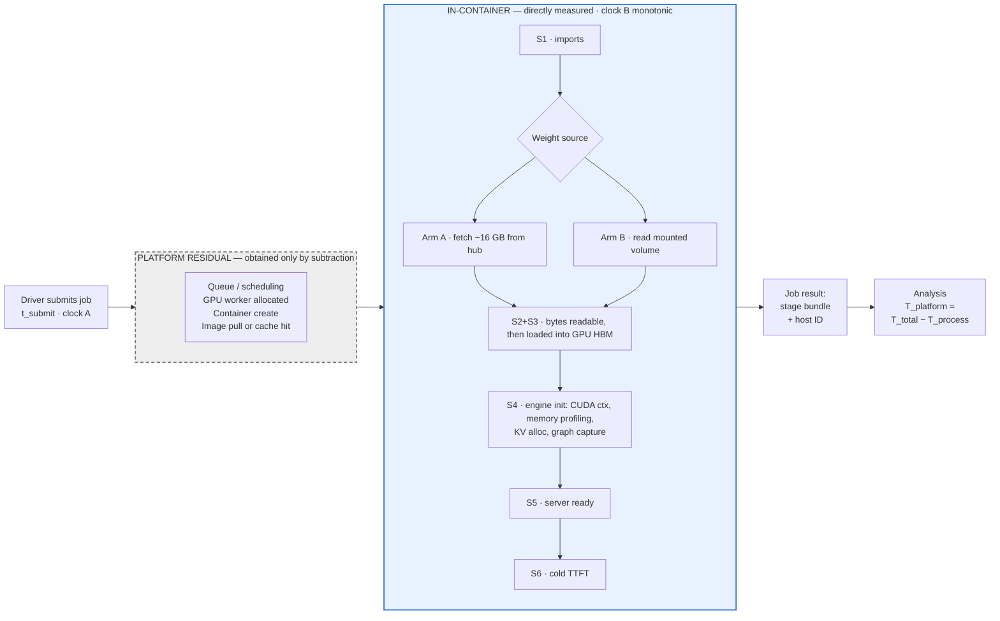
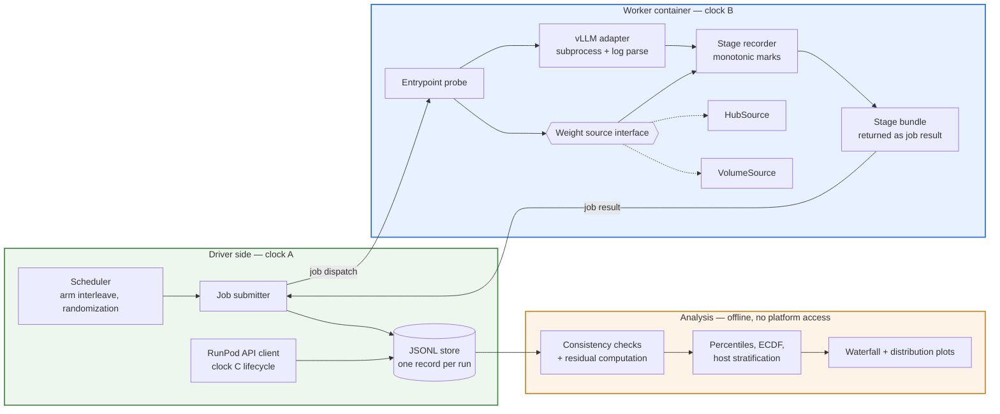

# Cold-Start Decomposition for LLM Serving — Design

**Date:** 2026-08-17
**Status:** Approved design, ready for implementation planning
**Artifact:** 1 of 3

---

## 1. Context and goal

The problem being solved is legibility, not capability. Substantial backend and cloud
infrastructure experience reads on paper as backend/cloud engineering; hands-on work in
cold-start serving systems and LLM/agent integration is not visible outside the current
employer. A hiring manager screening for inference infrastructure cannot distinguish this
profile from a backend engineer who has read about it.

The mechanism for closing that gap is measurement, not explanation. Anything derivable from
understanding alone has been written many times and can be generated on demand. A number
produced on a configuration you built exists nowhere else and cannot be faked from reading.
An experiment demonstrates instrumentation, variable isolation, signal-versus-noise judgment,
and honest interpretation — which are the skills the target role hires for.

**Success:** inbound and warm conversations from target companies; a linkable body of work
that makes "ML platform / inference infrastructure" read as description rather than
aspiration; interviews where technical evaluation is partly complete before it starts; a
network of roughly 100–150 relevant engineers at target companies.

**Explicitly not success:** follower count, impressions, viral reach, general audience growth.

**Boundary (non-negotiable):** all material derives from independent reasoning and
reproducible experiments on rented or personal hardware. Nothing from employer internal
documentation, architecture diagrams, or production metrics.

---

## 2. Scope

### In scope for this spec

- Artifact 1: cold-start decomposition for LLM serving — waterfall plus one intervention.
- The portfolio contract shared by all three artifacts: venue, structure, naming, sequence,
  the two through-line claims.
- The documentation layer that supports understanding and later reuse.

### Out of scope for this spec

- Artifact 2 (autoscaling signal comparison). Deliberately not finalized: its design should
  absorb artifact 1's real numbers and reader feedback. Gets its own spec.
- Artifact 3 (tool-calling reliability harness). Independent substrate, independent
  deliverable. Gets its own spec.

### Fixed constraints

The dominant failure mode is an unfinished comprehensive project rather than a finished
narrow one. These are fixed in advance and not revisited during implementation:

- One GPU class, one serving framework, one model family.
- Publish the narrow, honest version; sequels are cheap once the harness exists.
- Two coherent claims across the portfolio, not five scattered posts.
- Staged releases — each publication is a separate occasion to post, reach out, and be seen.

### Resource envelope

- **Time:** ~8–12 hours per week.
- **Money:** $200 maximum, total.
- **Timeline:** deliberate. 4–6 months, no hard external deadline. Sequential execution.

Budget note: measurement itself is cheap — a few hundred cold starts at a couple of minutes
each lands around $30–50. The budget is consumed by debugging on live GPUs, which is why the
GPU-free development loop (§6.7) is a load-bearing part of the design rather than a nicety.

---

## 3. Portfolio contract

### Structure

Own domain, static site, one repo per artifact. Writeups live at stable slugs under an
`/experiments/` path. Each writeup links to its harness repo; each repo README links back as
canonical.

Artifacts 1 and 2 share a single repo — artifact 2 is a new experiment against the same
instrumented harness, tagged at the commit that produced artifact 1's numbers. Artifact 3
gets its own repo, because there the repo *is* the deliverable rather than supporting
evidence.

Each artifact carries a publication date, a byline, and a permanent slug that never changes.
Corrections are appended as dated notes, never edited into the original. This costs nothing
and makes the work citable — serving the interview case (you can point at what you knew when)
and the immigration-petition case (dated, attributable, self-controlled publication) without
either distorting the writing.

**Prerequisite:** a GitHub account exists; a domain does not. Domain plus site skeleton plus
repo conventions must exist before artifact 1 publishes, so the URL is permanent from day one.
Small task, roughly a few hours and ~$12/year.

### The two claims

**Claim 1 — what elastic LLM serving actually costs, measured.** Artifacts 1 and 2 together.
Artifact 1 establishes where cold-start time goes and what the obvious fix is worth. Artifact
2 shows what scale-up lag does to p99 under a spike and which scaling signal minimizes the
damage. Cold start is the cost; autoscaling signal choice determines how often you pay it.

Note on percentiles across the two artifacts: artifact 2's p99 is taken over the thousands of
*requests* generated during a spike, which supports that percentile comfortably. Artifact 1's
percentile ceiling of p95 (§5) applies to *cold-start runs*, of which there are ~100 per arm.
Different populations, different achievable resolution — not an inconsistency.

**Claim 2 — how you know your agent works.** Artifact 3, standalone.

### Sequence

1. **Prerequisite** — domain, site skeleton, repo conventions.
2. **Artifact 1** — cold-start decomposition. Longest, because it builds the harness the next
   one inherits.
3. **Artifact 2** — autoscaling signal comparison. Substantially cheaper; harness, deployment,
   and analysis pipeline already exist. Design finalized *after* artifact 1's numbers land.
4. **Artifact 3** — tool-calling reliability harness. No GPU, no budget, independent.

Strictly sequential. The timeline does not require a hedge artifact.

### Audience and register

Written for engineers and managers on inference-platform teams. Leads with SLO consequence.
Distributed via LinkedIn, X, and direct outreach.

Depth is non-negotiable — it is the part that cannot be faked from reading — but the document
is structured for two reading depths so a skimming reader reaches the claim without wading
through method.

### Distribution track

Runs in parallel starting now, independent of artifact progress, because network accumulation
has a lead time that publishing cannot compress.

### Explicit non-goals

No follower or impression targets. Not designed for Hacker News. No cross-posting to
aggregators as a growth mechanism. Reach, if it happens, is a byproduct and is not evidence
the plan is working — inbound from target companies is.

---

## 4. Documentation layer

Markdown with Mermaid diagrams, versioned in the harness repo. Mermaid because it renders on
GitHub, diffs cleanly, and can be edited conversationally rather than through a drawing tool.

| Doc | Question it answers |
|---|---|
| `docs/experiment.md` | What is measured, the hypotheses, the arms, what would falsify them |
| `docs/harness.md` | The components, what each owns, how they communicate |
| `docs/measurement.md` | Where each timestamp originates, how three clocks reconcile, what is in the residual and why |
| `docs/runbook.md` | How to run it — local loop, then GPU, then analysis |

These serve three purposes: understanding the system while building it, raw material for the
published post, and durable context so future work reads the docs rather than reconstructing
from conversation.

### Orientation diagram — one measurement run



The dashed grey box is the honest limit of the experiment. Everything inside it happens
before the measuring code exists, so it can only be obtained by subtraction. The intervention
lives entirely inside the blue box at the `Weight source` branch — it is the only point where
the two arms differ, which is what makes this a clean single-variable manipulation.

---

## 5. Experiment design

### Question

On a serverless GPU platform, how is cold-start latency for an 8B vLLM deployment distributed
across stages, and how much of it does weight caching actually remove?

### Platform and configuration

| Dimension | Decision | Rationale |
|---|---|---|
| Platform | RunPod serverless | Cheapest per GPU-second, so the budget buys hundreds of cold starts rather than dozens — which is what makes distribution reporting possible instead of mean reporting. Full control of the container image. |
| GPU | One pinned 24 GB SKU (A10-class or L4-class) | Cheapest tier holding 16 GB of weights with KV-cache headroom. Selection rule: cheapest 24 GB SKU with adequate serverless availability in a single region; frozen once selected and stated in the post. |
| Region | One, pinned | Removes region as a variance source. |
| Model | Qwen3-8B instruct, fp16, ~16 GB, exact revision hash pinned and published | Ungated weights: a reader can reproduce without a license-approval step. Gated checkpoints would quietly break the reproducibility claim, which is load-bearing. 8B is where weight fetch is a real multi-tens-of-seconds term and is representative of latency-sensitive deployments. |
| Framework | vLLM, version pinned | Most widely deployed and most recognizable to the target audience. Emits timestamped startup phases, so much of the waterfall is instrumentation to *verify* rather than invent. Readers can grep their own logs for the same phase names. |

Platform caveat accepted deliberately: serverless platforms hide some stage boundaries behind
their own abstractions. Establishing what can and cannot be attributed is part of the method
work, and saying so plainly is itself the signal.

### Hypotheses — pre-registered

**H1 (decomposition).** Weight handling is the dominant directly-measured stage — more than
half of `T_process` — in the uncached arm.

**H2 (intervention).** Pre-staging weights on a network volume materially reduces weight-handling
time relative to fetching from the hub.

**H3 (tail).** The spread between median and p95 total cold start is driven substantially by
host heterogeneity rather than by variance within any single stage.

H2 is genuinely uncertain at even odds. A network volume is network-attached storage; a hub
download is a parallel multi-connection transfer that can be fast. The volume may be no faster,
or slower. That uncertainty is the experiment.

**Pre-registration mechanism:** hypotheses and the full analysis plan are committed to
`docs/experiment.md` before the first paid run. The git timestamp then proves the hypothesis
was not retrofitted to the result.

### Stage taxonomy

| Stage | Starts at | Ends at | Source |
|---|---|---|---|
| `T_platform` | job submitted | container process starts | residual (subtraction) |
| `S1` imports | entrypoint `t0` | torch + vLLM imported | clock B |
| `S2` acquisition | fetch begins | weight bytes locally readable | clock B |
| `S3` HBM load | load begins | weights resident on GPU | clock B |
| `S4` engine init | post-load | CUDA context, memory profiling, KV alloc, graph capture complete | clock B + vLLM logs |
| `S5` ready | engine up | server reports healthy | clock B |
| `S6` cold TTFT | request dispatched | first token emitted | clock B |

**Primary comparison unit is `T_weights = S2 + S3`, not `S2` alone.** In the cached arm,
weights may be memory-mapped from the volume rather than copied, fusing acquisition and HBM
load into one lazy operation with no clean boundary. Comparing `S2` across arms would measure
an artifact of how each arm happens to be structured rather than the thing intervened on.

### Variables

**Independent — the only thing that changes:** weight source. Hub download versus pre-staged
network volume.

**Held fixed:** GPU SKU, region, vLLM version, model revision hash, container image digest,
`max_model_len`, `gpu_memory_utilization`, dtype fp16, tensor parallel = 1, graph capture on,
identical warmup prompt, `max_tokens=1` for the TTFT measurement, one cold start in flight at
a time.

**Recorded per run:** host identifier, GPU model, driver version, timestamp, arm, run index,
and whether this host has been seen before.

### Deliberate exclusion — the baked-image arm

Weight caching has three plausible configurations: hub download, network volume, and weights
baked into the container image. Only the first two are used.

Baking weights into the image does not remove the bytes — it relocates them into image pull,
which lives inside the unattributable residual. The baked-image arm would therefore produce a
flattering number for a reason the harness structurally cannot observe. Excluding it
deliberately, and explaining exactly this in the post, is stronger than including it: it
demonstrates seeing a confound before it flatters you.

### Sample plan

**Arms are interleaved, not blocked** — A, B, A, B — with order randomized within pairs. This
is the most important validity decision in the design. Running 100 of A followed by 100 of B
would confound the intervention with time-of-day fleet conditions, and on a heterogeneous
rented fleet that confound is large enough to manufacture or erase the entire effect.

Target ~100 runs per arm, spread across at least three separate time windows on different days.

**What N=100 supports:** stable p50, p90, p95, and a full ECDF. It does **not** support a
credible p99 — at 100 samples that is one or two observations. The artifact reports up to p95
as measurement and labels anything beyond as anecdote. Publishing a p99 from 100 runs would be
precisely the sloppiness this work argues against.

### Threats to validity

| Threat | Handling |
|---|---|
| Host heterogeneity | interleaving, host IDs recorded, host-stratified reporting |
| Clock skew across three sources | per-run consistency check; discard rule fixed in advance |
| Image already cached on a host | first-touch vs. repeat-host flag, reported separately |
| Volume page cache warming over runs | interleaving; run index checked for trend |
| Fleet drift over time | multiple time windows across days |
| Run attrition biasing the distribution | all failures logged, failure rate published, exclusion rules pre-committed |
| Version and configuration specificity | everything pinned and stated; claims scoped to that configuration |

**Cost asymmetry between arms, reported in the post:** the cached arm carries a standing cost
the uncached arm does not — a network volume you pay to keep. The intervention trades storage
rent against startup latency. Reporting the latency win without the standing cost would
overstate it.

### What counts as a result

All four outcomes are publishable, which is what makes pre-registration safe:

- **Cache wins big** — clean, actionable result.
- **Cache barely helps** — more interesting; contradicts common intuition and implies the
  bottleneck is elsewhere.
- **Engine init dominates both arms** — the intervention has a hard ceiling; report the bound.
- **Residual dominates** — strongest SLO takeaway available: on rented serverless GPU, most of
  cold start is not the operator's to fix.

### Stopping rule

Stop at 100 runs per arm, or when the confidence interval on the median difference is tight
enough to distinguish "large effect" from "no effect," whichever comes first.

---

## 6. Harness architecture

### 6.1 Approach

Reconciled harness with dual clocks and an explicit residual. Three independent time sources:
the driver's monotonic clock (A) for end-to-end, the in-container emitter (B) for everything
from process start onward, and RunPod's API job lifecycle timestamps (C) as a third reference.

```
T_total (clock A) = T_platform (residual) + T_process (clock B)
```

Two reasons this is worth the discipline over simpler alternatives. First, three clocks
cross-check each other — with a single source you cannot detect that it is lying; with three
you can bound skew and discard inconsistent runs for a stated, recorded reason. Second, the
residual is the honest core of the artifact: most published cold-start numbers quietly
attribute all time to stages the author could see. A named bucket labeled "time I cannot
attribute from inside the container, and here is why" is more credible than a waterfall that
suspiciously sums to 100% — and it carries direct SLO consequence, since it is the portion of
scale-up latency an operator cannot engineer away.

### 6.2 Components



| Component | Owns | Depends on | Testable without GPU |
|---|---|---|---|
| Scheduler | arm sequence, randomization, run index | nothing | yes |
| Job submitter | clock A timestamps, dispatch, result capture | RunPod endpoint | yes, against a stub |
| RunPod API client | clock C lifecycle timestamps | RunPod API | yes, against recorded fixtures |
| Stage recorder | clock B monotonic marks, bundle serialization | nothing | yes — pure |
| Weight source | making bytes readable, nothing else | filesystem, network | yes |
| vLLM adapter | engine startup, phase extraction | vLLM subprocess | yes, against captured logs |
| Store | append-only durability, schema version | nothing | yes |
| Analysis | reconciliation, statistics, plots | schema only | yes — pure |

Every component except the vLLM adapter and the weight sources is testable with no GPU and no
money. This is the mechanism that protects the budget.

### 6.3 Two decisions worth calling out

**The vLLM adapter runs `vllm serve` as a subprocess, not the Python engine API.** The Python
API would give cleaner boundaries but would measure a startup path nobody deploys — and the
target audience is precisely the readers who would notice. Instead the probe brackets the
canonical server startup with its own monotonic marks (outer bounds it fully controls) and
extracts internal phase splits from the server's log output. Outer bounds are authoritative
for durations; log-derived splits are attribution within them. Any gap between the sum of
splits and the bracketed total is reported as unattributed-within-process time, not smoothed
away.

**The weight source is an interface with two implementations, and it is the only thing that
differs between arms.** Same image digest, same entrypoint, same engine flags — one swapped
object. This makes the single-variable claim structurally true rather than merely intended.
If arm behavior diverges anywhere else in the code the experiment is compromised; keeping the
difference behind one narrow interface makes that easy to audit and hard to violate by accident.

### 6.4 Data contract

One JSONL record per run — the interface between worker, driver, store, and analysis:

```
schema_version, run_id, run_index, arm
clock_A: { t_submit, t_result }
clock_C: { queued_at, started_at, completed_at }   # if exposed by the API
clock_B: { t0, marks: [{stage, t_mono}], log_phases: [...] }
host:    { host_id, gpu_model, driver_version, first_touch }
config:  { image_digest, vllm_version, model_revision, engine_flags }
status:  { outcome, failure_class, failure_detail }
```

Versioned, because it will change at least once and old runs must remain analyzable.

### 6.5 Clock discipline

1. **Durations are computed only within a single clock domain.** Never subtract a clock B
   timestamp from a clock A timestamp to obtain a stage duration.
2. **Exactly one cross-domain subtraction is permitted** — the defined residual,
   `T_platform = T_total(A) − T_process(B)`. It is named, approximate, and the post says so.
3. **Every run gets a consistency check.** `T_process` must not exceed `T_total` less a
   network round-trip floor. Violations are discarded with the reason recorded, never silently.

**Opportunistic upgrade:** if RunPod's API exposes both queued-at and started-at, clock C
splits the residual into queue delay versus container bring-up, turning one grey box into two.
Treated as a nice-to-have; the design must work if the API provides nothing useful.

### 6.6 Failure handling

Failures are data, not noise. Classified at minimum as: submit error, provisioning timeout,
image pull failure, weight acquisition failure, OOM, engine init failure, health timeout,
TTFT timeout.

**Failed runs are recorded as their own records and the schedule continues — never retried
into the same record.** Retrying in place would silently replace slow or unlucky runs with
faster ones, biasing the distribution toward the optimistic tail. That is exactly the error
this artifact argues against, so the harness must make it structurally impossible. The
published post reports failure rate per arm alongside latency numbers.

### 6.7 Local development loop

A stub weight source and a stub engine emitting realistic stage marks with configurable
delays. This exercises scheduler, submitter, recorder, store, consistency checks, statistics,
and plots end to end for free.

Paid GPU time then only ever runs code paths already proven correct. It also means the
analysis code is finished and tested *before* the first real number arrives, removing the
temptation to tune analysis after seeing results.

---

## 7. Analysis

### Pipeline

Records flow one direction, each step a pure function over the previous: **validate → derive →
aggregate → plot**. Analysis never touches the platform; it runs offline on stored JSONL and
is fully exercised against synthetic data before the first real run.

### Derived metrics

| Metric | Definition |
|---|---|
| `T_total` | clock A, submit → first token |
| `T_process` | clock B, `t0` → first token |
| `T_platform` | residual, `T_total − T_process` |
| `T_weights` | `S2 + S3`, the primary comparison unit |
| stage shares | each stage as a fraction of `T_process` |
| ceiling bound | best case achievable if `T_weights` went to zero |

The ceiling bound keeps the intervention honest. If weight handling is 40% of `T_process` and
`T_process` is 60% of `T_total`, perfect weight caching removes at most ~24% of cold start.
Stating that bound before reporting the measured improvement prevents overselling in either
direction.

### Statistical treatment

**Non-parametric throughout.** Cold-start distributions are right-skewed with a heavy tail;
means and standard deviations would misrepresent them. Report p50, p90, p95, and the full
ECDF. Bootstrap confidence intervals on the median difference between arms.

**Within-host paired subset — the cleanest estimate available.** Because arms are interleaved
in randomized pairs, some pairs will land both runs on the same physical host. Those pairs
give an intervention estimate with the host confound removed entirely. It will be a minority
of the data, so it is a secondary analysis with wider intervals — but it is the strongest
causal evidence in the dataset and cross-checks the unpaired estimate. Disagreement between
the two is itself a finding about host heterogeneity.

**For H3:** per-host medians, plus the share of total variance attributable to host as a
grouping factor.

**No fishing.** Three pre-registered hypotheses. Anything else discovered is labeled
exploratory, in those words, and is never promoted to a headline claim.

### Figures

Four at most, because the post has one argument.

1. **The waterfall** — stacked horizontal bars, one per arm, median stage durations, platform
   residual visually distinct from measured stages. Carries the entire argument and is the one
   thing a skimming reader will look at.
2. **ECDF of `T_total`, both arms overlaid** — distributions and tails rather than collapsed
   numbers.
3. **Per-host medians** — the H3 evidence, showing heterogeneity directly.
4. **Within-host paired deltas** — if the paired subset is large enough to be worth showing.

Constraints: no truncated axes, N stated on every figure, failure rate reported adjacent to
latency numbers, legible on a phone, residual never colored to blend with measured stages.

**Verification requirement:** figures are rendered and visually inspected before being
considered done. A plot that executes without error is not a plot that reads.

### Published dataset

Raw JSONL, the analysis script, and the figure-generating code all ship in the repo. A reader
should be able to re-derive every number in the post from the published records without
running a single GPU.

---

## 8. Publication

### Post structure

Ordered for two reading depths, hiring-reader payload first:

1. **Lead** — the finding and the number, two sentences.
2. **The waterfall chart.**
3. **Why this matters for a scale-up SLO** — short, concrete.
4. **What I measured and what I cannot attribute** — the residual, stated plainly and early.
   Placing the limitation above the method is deliberate: it signals a measurement designed by
   someone who thought about it rather than defended after the fact.
5. **Method** — platform, model, framework, arms, controls, N, link to the pre-registration commit.
6. **Results** — distributions, host stratification, paired subset, failure rates.
7. **Limits** — version specificity, one GPU class, one region, N supports p95 not p99, and the
   standing storage cost of the cached arm.
8. **Reproduce it** — repo, runbook, honest cost estimate.
9. **What I am measuring next** — one line pointing at artifact 2. Not a promise with a date.

### Pre-publish gate

A short checklist run before anything goes live, with one non-negotiable item: **confirm every
number, diagram, and claim derives from the rented-hardware experiment and independent
reasoning — nothing traceable to employer internal material.** Making this a mechanical gate
rather than a good intention is what keeps it intact under editing pressure.

### Distribution

Three occasions per artifact: the publication, a follow-up note on what surprised you, and the
direct outreach round.

- **LinkedIn and X** — lead plus the waterfall chart plus the link. The chart travels; the
  prose does not.
- **Direct outreach** — individually, to named engineers and managers on inference-platform
  teams at target companies. The message shares the artifact and asks one real technical
  question their team would have a view on. That framing produces a conversation between
  engineers; "would you like to see my work" produces a pitch, and pitches get archived.

**Tracked:** which companies, who replied, what they asked about, which parts of the post drew
engagement. The last of these is the design input to artifact 2, which is intentionally
unfinalized so it can absorb this feedback.

### Success measures

- Inbound contacts from target companies.
- Warm conversations initiated.
- Count of relevant engineers in the network, against the 100–150 target.
- Interviews where the artifact was referenced before you raised it.

Not tracked, deliberately: impressions, followers, upvotes.

---

## 9. Risks and open items

| Risk | Mitigation |
|---|---|
| Scope creep into a comprehensive project | Constraints in §2 are fixed and not revisited during implementation. Sequels are the release valve. |
| Budget consumed by live-GPU debugging | GPU-free development loop (§6.7); analysis complete before first paid run. |
| RunPod fleet variance swamping the effect | Interleaved arms, host stratification, within-host paired subset. Variance treated as a finding, not noise. |
| Platform API exposes no useful lifecycle data | Residual remains a single bucket; design does not depend on the split. |
| Intervention shows no effect | Pre-registered as a publishable outcome; arguably the more interesting post. |
| Employer-boundary contamination | Mechanical pre-publish gate (§8). |

### Open decision — deferred, out of scope for this spec

Audience is set to hiring readers, so the plan does not include practitioner-community
distribution. Those communities are where technical credibility gets validated by unaffiliated
engineers, and plausibly a source of the 100–150 engineer network. This is recorded as an
explicit decision to make separately rather than a gap in the design. It does not block
artifact 1; it can be added to the distribution track at any point without design changes.

---

## 10. Definition of done for artifact 1

- Domain, site skeleton, and repo conventions exist.
- `docs/experiment.md` with hypotheses and analysis plan committed **before** the first paid run.
- Harness passes end-to-end against stubs with no GPU.
- ~100 runs per arm collected across at least three time windows, interleaved and randomized.
- Consistency checks applied; discards and failures recorded with reasons and reported.
- Analysis reproduces every published number from the stored JSONL.
- Four figures rendered and visually inspected.
- Post published at a permanent slug with byline and date, linking the repo.
- Repo published with raw data, analysis code, figure code, and runbook.
- Pre-publish boundary gate completed.
