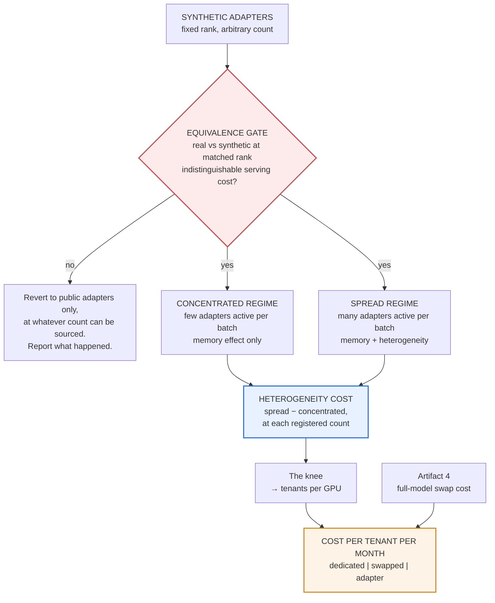

# How Many Adapters Fit on a GPU — Design

**Date:** 2026-08-17
**Status:** Approved design, ready for implementation planning
**Artifact:** 5 of 5
**Depends on:** [Artifact 4 — multi-model serving economics](2026-08-17-multi-model-serving-economics-design.md)
(hard dependency: shares base model and GPU class, and consumes artifact 4's full-model swap cost
as a reference line)

**Working post title:** *How many LoRA adapters actually fit on one GPU.* Exact wording set at
publication; the decision is that the title names the capacity question a platform team arrives
with.

**Learning guide:** §12b — concepts to work through before building, with self-check questions.

---

## 1. Position in the portfolio

Artifact 4 deliberately excluded adapter multiplexing, on the grounds that "serve 20 distinct
models" and "serve 20 variants of one base" are different business situations. That exclusion was
right for keeping artifact 4's comparison clean. **This artifact answers the excluded question
directly**, on the same hardware, so the two compose into one platform story:

| Artifact | Question |
|---|---|
| 1 | What does a replica cost to start? |
| 2 | When should you add one? |
| 4 | Should you share one across models? |
| 5 | Should you share one across adapters? |

It is also **the only pure-measurement artifact in the portfolio** — no simulator, no modeled
component, nothing to validate except a single methodological shortcut (§8). That is a deliberate
contrast after two artifacts that lean on simulation, and it makes this the cheapest and
lowest-risk artifact of the set.

---

## 2. Claim and question

### Claim

**The cost of serving many LoRA adapters on one GPU is dominated by batch heterogeneity, not by
memory** — and the curve has a knee that determines how many tenants fit on a GPU.

### Question

As adapters registered against one base model rises from 1 to 64, how do TTFT, throughput, and KV
capacity change — and how much of that change is memory versus batch heterogeneity?

### Why the naive framing measures the wrong thing

Two counts get conflated in most benchmarking of this:

**Adapters registered** — how many are loaded and available. Consumes HBM, which shrinks the KV
cache, which lowers the concurrency ceiling. A **memory** effect.

**Adapters concurrently active in a batch** — how many distinct adapters appear among requests
processed together. A batch spanning eight adapters does more work than eight requests sharing one,
because the kernel must handle heterogeneous adapters. A **compute** effect.

Serving frameworks treat these as separate concerns — there is an in-batch adapter cap alongside
however many adapters are loaded — and the existence of that separate knob is good evidence the
distinction is where the cost lives.

**Prior, to be tested rather than assumed:** adapters are megabytes, so the KV impact of loading a
few dozen should be small, while batch heterogeneity hits every token of every request. If that is
right, "how many adapters can I load" is the wrong question and "how many can I serve *at once*" is
the right one.

---

## 3. Scope

### In scope

- Registered-adapter count swept 1 → 64, at two traffic-concentration regimes.
- Synthetic adapters at fixed rank for the sweep, licensed by an equivalence check against real
  public adapters.
- KV capacity measured directly at each registered count.
- Artifact 4's full-model swap cost as a reference line.
- Cost per tenant per month, three ways, spanning artifacts 4 and 5.

### Out of scope

- **Adapter rank as a variable.** Held fixed and published; the rank effect is a stated limitation
  and a sequel.
- **Model quality.** Adapter weight values are irrelevant to serving cost (§8), which is precisely
  what licenses the synthetic shortcut. Any quality claim would require real trained adapters and a
  different artifact.
- **Adapter training.** No training pipeline, no dataset, no eval harness.
- Resident-versus-swapped adapter loading. If the sweep shows a hard knee, this becomes the obvious
  sequel.
- Heterogeneous ranks in one deployment.
- Multi-GPU or tensor-parallel serving.

### Fixed constraints

- One base model, one GPU class, one rank, one request shape.
- **Base model and GPU class must match artifact 4's** (~3B-class checkpoint, 24 GB card). This is
  a hard dependency, not a preference: if they differ, artifact 4's swap-cost reference line is not
  comparable and the headline three-way cost comparison collapses into a claim that cannot be
  supported.
- If budget or hours bind, **sweep resolution is cut before the second regime is cut.** Losing the
  spread/concentrated pairing would remove the decomposition, which is the artifact's whole
  contribution.

---

## 4. Design

### Reconnaissance — what must be discovered on hardware first

This is the **least** offline-buildable artifact in the portfolio, and for a good reason: it is pure
measurement, so there is no simulator to develop against synthetic inputs. Synthetic adapter
generation and the analysis path are local; almost everything else is the measurement itself.

Following artifact 1 §6.8, a capture-only run establishes:

- **The in-batch adapter cap** in the pinned version — its default, its maximum, and whether it can
  be raised enough for the spread regime to reach high active counts. If the cap is low, the
  observable heterogeneity effect is bounded, and the sweep range must be designed around it.
- **Whether registered-adapter count is itself bounded**, which sets the top of the sweep.
- **That synthetic adapters load and serve at all** — a shape-compatibility check on the pinned
  version before generating 64 of them.

The last item is a go/no-go: if synthetically generated adapters are rejected by the loader, the
equivalence gate is moot and the artifact reverts to public adapters from the start.

### The sweep

| | |
|---|---|
| **Swept axis** | adapters registered: 1, 2, 4, 8, 16, 32, 64 |
| **Two regimes** | concentrated (few adapters active per batch) and spread (many active) |
| **Held fixed** | base model, GPU class, rank, target modules, request shape, offered concurrency |
| **Recorded per run** | in-batch adapter cap, framework version, actual distinct adapters observed per batch |

### The decomposition

At each point on the sweep, **the gap between spread and concentrated is the batch-heterogeneity
cost, isolated by subtraction.** Concentrated traffic consumes the same HBM but keeps batches
homogeneous; spread traffic pays both costs. The difference attributes cleanly.

This is the same move artifact 1 uses for the platform residual: get at an unmeasurable quantity by
constructing two conditions that differ in exactly one term.

**The concentration parameter is defined and fixed in advance**, same discipline as artifact 4's
skew, and published.

---

## 5. Adapters — synthetic, licensed by measurement

### Why synthetic is valid

For serving cost, **adapter weight values are irrelevant**. The kernel performs identical work
whether the low-rank matrices were trained for legal summarization or drawn from a random
initializer. Only shape matters: rank and which modules are targeted.

This dissolves a real practical problem. The sweep needs 64 adapters at one rank for one base
model; public adapters vary wildly in rank, target modules, and quality, and sourcing dozens for
one specific base at one rank is awkward at best.

### Why the equivalence check is a gate rather than an assertion

Stating "weight values cannot affect throughput" is correct and would still invite the obvious
objection — *those aren't real adapters* — which would then get argued in comments instead of
settled in the post.

So it gets measured: **a handful of real public adapters at matched rank must produce serving cost
indistinguishable from synthetic ones before the synthetic sweep is licensed.** Tolerance derived
from run-to-run spread, same construction as artifact 2's validation.

**If they differ, the shortcut is invalid.** The artifact reverts to public adapters only, at
whatever count can be sourced, the sweep range shrinks accordingly, and the post states plainly
that this is what happened and why. A failed equivalence check is a publishable finding — it would
mean something about adapter serving that nobody currently believes.

Explaining *why* weight values cannot affect serving cost is one of the paragraphs that
demonstrates mechanism-level understanding rather than tooling familiarity.

---

## 6. Metrics

| Metric | Why |
|---|---|
| TTFT p50 / p90 / p95, per regime per count | The latency effect, as distributions not means |
| throughput, tokens/sec | The capacity effect |
| **KV capacity at each registered count** | The memory effect, measured directly rather than inferred |
| **heterogeneity cost** | spread − concentrated, per count — the decomposition |
| **the knee** | registered count at which marginal throughput cost crosses a stated threshold |
| distinct adapters per batch, observed | Confirms the regimes actually differ as intended |

The knee threshold is stated before data collection, so the headline number cannot be tuned after
the fact.

---

## 7. Business framing — required

Adapters per GPU converts to **tenants per GPU**, which converts to **cost per tenant per month**.

Published assumptions: GPU hourly rate, requests per tenant per month, the SLO tenants are held to.

| Quantity | Definition |
|---|---|
| tenants per GPU | registered adapters sustainable at or below the knee, within SLO |
| **cost per tenant per month** | GPU cost ÷ tenants per GPU, at stated volume |
| **three-way comparison** | cost per tenant: dedicated model vs swapped model (artifact 4) vs adapter (artifact 5) |

**The three-way comparison is the strongest business number in the portfolio**, and it exists only
because artifacts 4 and 5 share a base model and a card. It is the number someone designing a
per-customer-fine-tune product actually needs, and it is not published anywhere.

---

## 8. Protocol

All measured. No simulator, no modeled component.

- **Equivalence gate first** (§5). Nothing else runs until it passes or its failure is characterized.
- **Regimes interleaved, not blocked**, so drift affects both equally — same reasoning as artifact
  1's arm interleaving.
- Each configuration run multiple times; **distributions reported, not means.**
- Sweep points randomized in order within each session.
- The GPU-free development loop from artifacts 1 and 2 applies: harness logic, analysis, and figures
  exercised against synthetic timing fixtures before any paid run.

---

## 9. Threats to validity

| Threat | Handling |
|---|---|
| In-batch adapter cap bounds the spread regime | Recorded per run and reported. If the cap prevents reaching high active counts, the observable heterogeneity effect is capped — which is itself a finding about the framework, stated as such |
| "Synthetic adapters aren't real" | Equivalence gate (§5), plus the mechanism explained |
| Rank held fixed | Effect at other ranks unmeasured. Stated limitation and named sequel |
| Regimes not actually differing | Distinct-adapters-per-batch recorded and reported, so the manipulation is verified rather than assumed |
| One request shape | Inherited limitation from artifacts 2 and 4; stated |
| Version specificity | Pinned and published. Multi-adapter serving is an actively changing area, so claims are scoped to the pinned version and dated |
| Reference line not comparable | Base model and GPU class locked to artifact 4's as a hard constraint (§3) |

---

## 10. Publication

### Figures

1. **Throughput and TTFT versus registered count, both regimes, gap shaded** — with artifact 4's
   full-model swap cost as a horizontal reference line. The main chart; the shaded gap *is* the
   argument.
2. **KV capacity versus registered count** — the memory effect, measured, showing how small it is
   relative to the heterogeneity effect.
3. **Equivalence check** — synthetic versus real adapters at matched rank, with the tolerance band.
4. **Cost per tenant per month, three strategies** — the business chart, spanning artifacts 4 and 5.

Same constraints as the rest of the portfolio: distributions and intervals shown, N stated, no
truncated axes, legible on a phone, rendered and visually inspected before being called done.

### Post structure

1. **Lead** — the knee, and the claim that heterogeneity dominates memory.
2. **The main chart.**
3. **Why the naive question is wrong** — registered versus active, and why they are different costs.
4. **What this means for tenants per GPU** — the capacity answer, then the cost-per-tenant table.
5. **How I know synthetic adapters are valid** — the equivalence check, early rather than buried.
6. **Method** — sweep, regimes, decomposition by subtraction, pinned versions.
7. **Adapters versus model swapping** — the artifact 4 comparison.
8. **Limits** — one rank, one request shape, one base model and card, pinned version in a
   fast-moving area, in-batch cap bounding the spread regime.
9. **Reproduce it.**
10. **Next.**

### Required explanations

- Why adapter weight values cannot affect serving cost, and what that licenses.
- Why a batch spanning many adapters costs more than a batch sharing one.
- Why loading adapters barely touches KV capacity, and why that is the *less* interesting cost.
- What the knee means for a per-customer-fine-tune product.

### Pre-publish gate

Same as artifacts 1–4, including the non-negotiable employer-boundary check.

---

## 11. Budget

Single GPU, short runs, no fleet, no simulation.

| Item | Estimate |
|---|---|
| Equivalence check | ~$3 |
| Sweep, two regimes, repeats | $8–15 |
| **Artifact 5 subtotal** | **$10–20** |

**The cheapest GPU artifact in the portfolio**, and materially cheaper than artifact 4. It is also
the lowest-complexity: no simulator to build or validate, no control loop, no fleet.

Against the envelope: artifacts 1–3 consume roughly $120–195 of the original $200, artifact 4 needs
$30–45 beyond it, and artifact 5 adds $10–20 on top. The funding decision recorded in artifact 4
§11 should now cover both 4 and 5 together, since they are one story and 5 is nearly free once 4 is
funded.

---

## 12. Risks

| Risk | Handling |
|---|---|
| Equivalence check fails | Publishable outcome; artifact reverts to public adapters at reduced count, stated plainly |
| Heterogeneity effect too small to resolve | Then memory dominates, the prior is wrong, and that is the finding. Both directions publish |
| Artifact 4 slips or is dropped | The sweep and decomposition stand alone; only the reference line and the three-way cost table are lost. Those are the strongest parts, so 5 should not run before 4 |
| Framework version churn | Pinned, dated, scoped. Fast-moving area is itself worth noting for readers |
| Scope creep into rank, quality, or training | All three explicitly out of scope (§3) |

---

## 12b. Learning guide

**How this is used.** Before each build stage we work through the relevant modules together —
you ask questions until each one is solid, then we build that part. The modules are ordered so each
depends only on the ones above it. The self-check questions at the end are for you to answer out
loud or in writing; if any answer feels vague, that module needs another pass before the code does.

### Module 1 — What LoRA is, in one paragraph

Fine-tuning normally updates every weight, producing a whole new model. LoRA freezes the original
and trains a small pair of low-rank matrices that get added alongside specific layers. The result is
an *adapter* of a few megabytes instead of a few gigabytes, and one base model can host many.

**Why it matters here:** the size difference is the entire reason this is a distinct serving
strategy rather than a variant of model swapping.

### Module 2 — Rank, and what it controls

The "low-rank" part is a size knob. A higher rank means more trainable parameters, more capacity to
change behavior, and a larger adapter. Rank 8 and rank 64 are both common.

**Why it matters here:** rank is held fixed and published. It changes adapter size and therefore
compute, so letting it vary would confound the sweep.

### Module 3 — Registered versus active, the distinction the artifact rests on

**Registered** adapters are loaded and available — they consume memory. **Active** adapters are the
distinct ones appearing among requests being processed right now — they consume compute, because the
kernel must apply different adapters to different rows of the same batch.

These are different costs with different causes, and most benchmarks conflate them.

**Why it matters here:** it is the whole methodological design. The two concentration regimes exist
to separate them by subtraction.

### Module 4 — Why a mixed batch costs more

A batch where every request uses the same adapter applies one adapter once. A batch spanning eight
adapters must apply eight different ones to different rows. The batch is the same size; the work is
not.

**Why it matters here:** this is the hypothesis. If it holds, "how many can I load" is the wrong
question and "how many are active at once" is the right one.

### Module 5 — Why the adapter's contents do not matter

Serving cost is determined by shape — rank, which layers, how many — not by the values inside. The
same multiplications happen whether the weights were trained on legal documents or drawn from a
random number generator.

**Why it matters here:** it licenses synthetic adapters, which removes the sourcing problem. But
"licenses" only after the equivalence check demonstrates it rather than asserting it.

### Module 6 — Equivalence checking

Proving two things are the same is different from failing to prove they differ. The check here is
practical: measure real adapters and synthetic ones at matched shape, and show the serving cost is
indistinguishable within measurement noise.

**Why it matters here:** it is the artifact's only gate, and the whole sweep depends on it passing.

### Module 7 — Reading a knee

A curve with a knee has a region where the cost of one more unit is nearly free, and a region where
it is not. Locating the bend is often more useful than any single point on the curve.

**Why it matters here:** "how many adapters fit" is really "where is the knee," and that number
converts directly into tenants per GPU.

### Self-check questions

1. Explain LoRA to someone who understands fine-tuning but has never heard of adapters.
2. Why is an adapter measured in megabytes when the model is measured in gigabytes?
3. Distinguish registered from active adapters. Which one do you expect to cost more, and why?
4. Why does a batch spanning eight adapters cost more than a batch using one, given the same number of requests?
5. Why can synthetic adapters substitute for real ones here — and what would make that reasoning invalid?
6. The equivalence check fails. What do you do?
7. Why is rank fixed rather than swept?
8. Predict: the curve is flat to 32 adapters then rises sharply. What do you tell a team building a per-customer fine-tune product?
9. How does this artifact's answer combine with artifact 4's to produce cost per tenant per month?

---

## 13. Definition of done

- Learning-guide modules (§12b) worked through and self-check questions answered before the
  corresponding build stage.

- Artifact 4 complete, with full-model swap cost available on matching base model and GPU class.
- Base model, GPU class, rank, target modules, and concentration parameter fixed and published
  before any paid run.
- Knee threshold stated in advance.
- Reconnaissance completed: in-batch adapter cap and registered-count bounds established, synthetic
  adapter shape-compatibility confirmed.
- Harness, analysis, and figures exercised against fixtures with no GPU.
- **Equivalence gate passed**, or its failure characterized and the fallback executed.
- Sweep completed 1 → 64 registered adapters at both regimes, with repeats.
- Distinct-adapters-per-batch recorded, confirming the regimes differed as intended.
- KV capacity measured at each registered count.
- Heterogeneity cost computed by subtraction at each point.
- Knee identified and stated as tenants per GPU.
- Three-way cost-per-tenant table produced, spanning artifacts 4 and 5.
- Four figures rendered and visually inspected.
- All four required explanations present.
- Headline finding stated in **both systems units and money**, with conversion assumptions published.
- Post published at a permanent slug, linking the shared repo.
- Pre-publish boundary gate completed.
