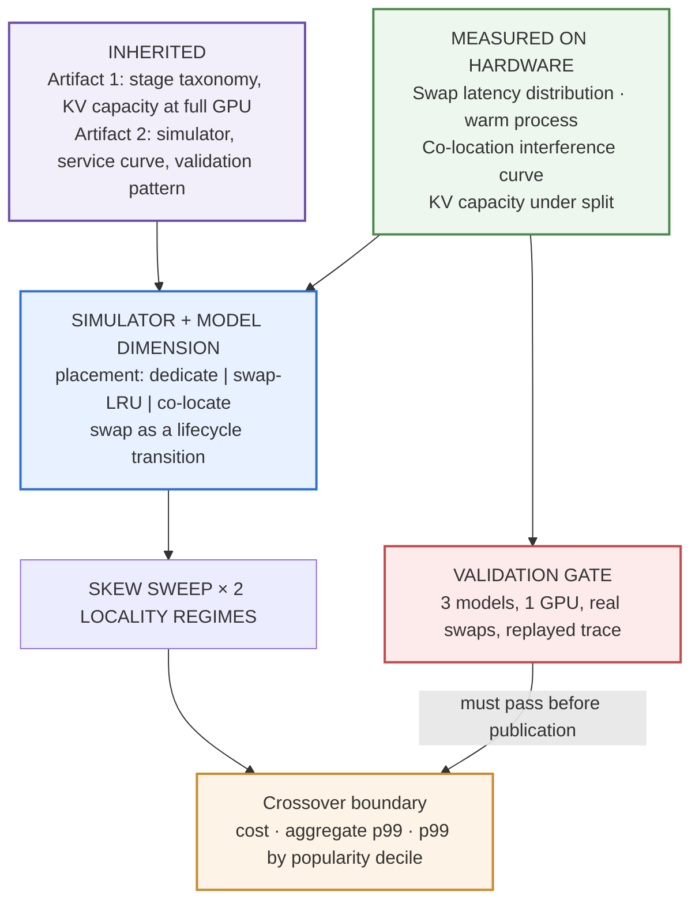

# Dedicate, Swap, or Share — Design

**Date:** 2026-08-17
**Status:** Approved design. **Provisional — not funded by the original $200 envelope; see §11.**
**Artifact:** 4 of 5
**Depends on:** [Artifact 1 — cold-start decomposition](2026-08-17-cold-start-decomposition-design.md),
[Artifact 2 — autoscaling signal comparison](2026-08-17-autoscaling-signal-comparison-design.md)

**Working post title:** *Dedicate, swap, or share: what it costs to serve N models on M GPUs.*
Exact wording set at publication; the decision is that the title names the platform decision, not
the method.

**Learning guide:** §12b — concepts to work through before building, with self-check questions.

---

## 1. Position in the portfolio

This is the third step in **Claim 1**'s arc:

| Artifact | Question |
|---|---|
| 1 | What does a replica cost to start? |
| 2 | When should you add one? |
| **4** | **Should you share one across models?** |
| 5 | Should you share one across adapters? |

The sharing questions are the ones that read as **platform** rather than serving. Artifacts 1 and 2
describe a single-tenant system well. Artifacts 4 and 5 are about allocating finite GPUs across
competing demands, which is the actual job of an ML platform team and the layer where cost decisions
get made.

Artifact 5 depends on this one for its base model, GPU class, and swap-cost reference line, and the
two together produce the portfolio's strongest business number: **cost per tenant per month,
dedicated versus swapped versus adapter.**

### Why this composes rather than sprawls

**A model swap is a strict subset of a cold start.** Swapping on already-provisioned hardware pays
weight acquisition, HBM load, and engine init — `S2`, `S3`, `S4` — but not platform provisioning
or interpreter startup. Artifact 1's stage taxonomy states exactly which stages carry over, which
turns a paragraph of hand-waving into two lines.

**Artifact 1's KV capacity number prices co-location**, because two resident models split the cache
budget, and that budget sets each model's concurrency ceiling.

**Artifact 2's simulator already models a fleet** with queueing, a measured service curve, stochastic
delays, and a replica lifecycle. A swap is a lifecycle transition with a different distribution.

**Honest qualification:** the model class changes (§3), so artifact 1's *taxonomy* transfers but its
*magnitudes* do not. Swap cost is re-measured cheaply rather than read off the existing waterfall.
The method composes; the numbers do not.

---

## 2. Claim and question

### Claim

For a fleet serving N models on M GPUs, the right strategy — dedicate, swap, or co-locate — is
determined by traffic skew and burstiness, and **the crossover point is measurable rather than a
matter of taste.**

### Question

Across a sweep of traffic skew, at two temporal-locality regimes, how do dedicated, swap-with-LRU,
and co-located placement compare on cost, aggregate p99, and per-model p99 — and where does the
ranking change?

---

## 3. Scope

### In scope

- Three placement strategies: dedicate, swap with LRU eviction, co-locate.
- A homogeneous set of small models from artifact 1's family, on one 24 GB GPU class.
- A skew sweep at two locality regimes.
- Three measured hardware primitives (§5).
- A fleet simulator extending artifact 2's, gated by replay validation.

### Out of scope

- **Adapter multiplexing.** Discussed explicitly in the post as the excluded fourth option, with
  the precondition that rules it in or out, and named as the sequel. Excluded because it is not a
  fourth point on the same axis: it requires models to be fine-tunes of a shared base, which most
  multi-model fleets do not satisfy, and comparing "serve 20 models" against "serve 20 variants of
  one model" is a different business situation. Naming the exclusion and its precondition is the
  same play as artifact 1's baked-image exclusion — command of the space rather than a gap in it.
  **Answered by [artifact 5](2026-08-17-multi-lora-serving-design.md)**, which measures adapter
  serving on this artifact's base model and GPU class and consumes this artifact's swap cost as a
  reference line. The exclusion stands for this comparison; the question does not go unanswered.
- Heterogeneous model sizes. Realistic, confounded, and the natural thing an adopter runs on their
  own fleet.
- Models spanning multiple GPUs.
- Disaggregated prefill/decode.
- Eviction policy comparison. LRU is fixed; comparing policies is a different artifact.

### Fixed constraints

- Three strategies. Not four.
- One GPU class, one model family, homogeneous sizes.
- If budget binds, **skew-sweep resolution is cut first** — before validation repeats, before the
  locality second regime, and before the per-decile analysis. Coarser resolution still yields a
  crossover; losing the second locality regime or the fairness view would remove findings.

### The co-location constraint that sets the model class

Artifact 1 runs an 8B model at bf16 — roughly 16 GB — on a 24 GB card. **Two of those do not fit.**
Co-location is infeasible at artifact 1's exact configuration.

Resolution: a homogeneous set of ~3B-class checkpoints from the same family, on the same 24 GB
class. This is the only option that honors the portfolio's one-GPU-class-per-artifact rule while
making all three strategies measurable on identical hardware. Any alternative that changes the card
for the co-location arm would confound strategy with hardware in exactly the comparison the artifact
exists to make.

It is also more realistic than it looks: **multi-model fleets are usually small-model fleets.** At 8B
and above the answer collapses to dedicate-or-swap because co-location stops fitting. The small-model
regime is where the question actually has three answers.

---

## 4. Architecture

---

## 5. Measured primitives

Everything else is inherited, derived, or simulated. These are the only new contacts with hardware.

### 5.0 Reconnaissance — the swap mechanism must be discovered, not assumed

"Swap" is ambiguous in vLLM, and **which mechanisms the pinned version actually offers cannot be
determined locally.** Following artifact 1 §6.8, a cheap capture-only run establishes:

- Whether an in-process model swap path exists in the pinned version, or whether swapping means
  tearing down and reinitializing the engine.
- Whether co-location of two engines on one card behaves as expected at the intended memory split,
  and what the actual usable split is.
- Whether the chosen ~3B model class genuinely allows all three strategies on one 24 GB card — the
  constraint the entire artifact rests on (§3).

That last item is a **go/no-go check and it runs before anything else is built.** If three strategies
do not fit the card, the model class is wrong and the design changes rather than the measurement.

Nothing from reconnaissance is published as a result. The simulator extension, placement policies,
and analysis are all built and tested offline against synthetic inputs regardless.

### 5.1 Swap latency distribution

Model A resident to model B serving, on already-provisioned hardware.

**The mechanism must be named, because "swap" is ambiguous in vLLM.** The baseline mechanism is
process-level: tear down the engine, bring up a new one against the same GPU, with container, image,
and interpreter already warm. That maps directly onto artifact 1's taxonomy — `S2`, `S3`, `S4` are
paid; `T_platform` and `S1` are not. If the pinned version offers a cheaper in-process path, it is
measured as a second arm and the difference reported.

Reported as a distribution, not a mean, consistent with the portfolio signature.

### 5.2 Co-location interference

Two models resident on one GPU, each capped at a fraction of GPU memory, both under load.

**Interference factor = latency(co-located at load L) ÷ latency(solo at load L)**, swept across the
load split between the two models.

The naive assumption is that co-located models each get half the throughput. That is almost certainly
wrong in both directions: they contend for SMs and memory bandwidth rather than a cleanly divisible
resource, and under continuous batching the interaction depends on what each model's batch looks like
at the time. Measuring it is the point.

### 5.3 KV capacity under split

With two models resident, each gets a fraction of HBM and the KV cache is what shrinks. Artifact 1
established capacity at full GPU; this measures capacity at split and the resulting concurrency
ceiling per model.

**This is the co-location cost nobody prices.** Halving a model's KV budget does not halve throughput
— it lowers the concurrency at which the latency curve bends, which under bursty traffic is a far
sharper penalty than a linear throughput cut. Artifact 2's service-curve machinery is the instrument
for showing that.

---

## 6. Simulator extension

Artifact 2's simulator gains three things:

- **A model dimension** — requests carry a model ID; a replica serves only its resident model(s).
- **A placement policy** — dedicate, swap with LRU eviction, or co-locate with fixed pairing.
- **Swap as a lifecycle transition** — sampled from the measured distribution, replica unavailable
  for its duration.

Eviction stays LRU throughout and is not a variable.

---

## 7. Traffic model

**Skew** — Zipf across models, parameter swept. The main axis; the crossover is read off it.

**Locality** — two regimes at each skew level:

| Regime | Behavior |
|---|---|
| Bursty | a model's requests cluster; one load serves many requests before eviction |
| Spread | identical frequency distribution, arrivals independent |

**Why locality is not optional.** Frequency skew and temporal locality are different things. Two
workloads can share a Zipf parameter and produce very different swap rates, because LRU behavior is
driven by whether a model's requests cluster in time, not by how often they occur. Sweeping skew
alone would earn the correct objection that the analysis ignores locality.

If the crossover moves between regimes — and bursty traffic should favor swap considerably further
down the skew axis — the finding is *"your threshold depends on burstiness, not just skew,"* which is
more useful and less obvious than a single number. Either outcome publishes.

---

## 8. Metrics

| Metric | Definition |
|---|---|
| cost | GPU-seconds to serve the workload |
| **cost per served token** | economics unit, consistent with artifact 1's token denomination |
| aggregate p99 | across all requests |
| **p99 by model popularity decile** | the fairness view |
| hit rate | model resident when the request arrived |
| swap rate | swaps per unit time — the thrash indicator |
| crossover skew | where the strategy ranking changes, per locality regime |

### The per-decile breakdown is the portfolio signature on a new axis

Under swap, aggregate p99 can look entirely acceptable while cold-tail models are catastrophic —
hot models dominate the request count, so they dominate the aggregate. A platform team that ships on
aggregate p99 discovers this when the customer using model 18 escalates.

Artifacts 1 and 2 show that point estimates hide things across **time**. This shows it across
**tenants**, which is the version a platform team lives with. It is also the argument for why the
answer is not simply "swap is cheaper" even in the regimes where it is.

---

### Business framing — required

The crossover is stated in monthly dollars, not only in cost units. Published assumptions: GPU
hourly rate, fleet size, request volume, and the SLO tail tenants are held to.

| Quantity | Definition |
|---|---|
| monthly fleet cost by strategy | GPU-seconds × hourly rate at stated volume |
| **crossover in dollars** | "below skew X, dedicating costs $Y/month more than swapping" |
| **tail-tenant SLO cost** | fraction of cold-tail requests breaching SLO, and what that means per tenant |

**The tail-tenant figure is where the business framing and the fairness finding meet.** A strategy
that cuts fleet cost 40% while pushing the bottom decile of tenants outside SLO is not cheaper — it
has moved cost from the GPU bill to the support queue and the churn rate. Reporting both is the
difference between a cost analysis and a platform decision.

## 9. Validation

Same gate structure as artifact 2, scaled down.

**Replay validation:** three models, one GPU, genuine swaps, an exact replayed arrival trace. The
simulator is fed the identical trace and checked against the observed latency and swap timeline.

**Tolerance derived from repeat-run spread**, as in artifact 2 — a model cannot be required to be
more reproducible than the system it models. Misses reported with magnitude. A genuine model bug may
be fixed and re-validated, with the fix disclosed. Persistent failure is publishable.

**The interference measurement doubles as a second check.** If the simulator's co-located predictions
do not reproduce the measured interference curve, the model is wrong in a way that would invalidate
one strategy specifically.

**Extrapolation beyond the validated point is stated in the body**, with the validated operating
point marked on the crossover chart — inherited discipline from artifact 2.

---

## 10. Publication

### Figures

1. **Cost and p99 versus skew, three strategies, two locality panels** — the crossover chart. The
   main argument.
2. **p99 by model popularity decile** — the unfairness that aggregates hide.
3. **Measured co-location interference curve** — the primitive that makes the third strategy real
   rather than assumed.
4. **Swap cost decomposed onto artifact 1's stage taxonomy** — which stages a swap pays and which it
   skips. This figure does portfolio work as well as artifact work: it makes the arc visibly one
   body of research.

Same constraints as the other artifacts: intervals shown, N stated, no truncated axes, legible on a
phone, rendered and visually inspected before being called done.

### Post structure

1. **Lead** — the crossover, stated as a decision rule.
2. **The crossover chart.**
3. **Why the naive answer is wrong** — aggregate p99 versus per-tenant p99.
4. **The three primitives, measured** — swap cost, interference, KV split.
5. **Method** — simulator, traffic model, validation, pre-registration link.
6. **Where the boundary moves** — locality regimes.
7. **The excluded option** — adapter multiplexing, its precondition, why it is a different question.
8. **Limits** — small-model regime, homogeneous sizes, LRU only, single GPU class, extrapolation
   beyond the validated point.
9. **Reproduce it.**
10. **Next.**

### Required explanations

- Why a swap is cheaper than a cold start, and exactly which stages it skips.
- Why co-located models do not simply halve each other's throughput.
- Why a shrunken KV budget hurts more than proportionally under bursty traffic.
- Why aggregate p99 is the wrong SLO for a multi-tenant fleet.

### Pre-publish gate

Same as artifacts 1–3, including the non-negotiable boundary check.

---

## 11. Budget — and an honest flag

| Item | Estimate |
|---|---|
| Swap latency distribution | $5–10 |
| Co-location interference sweep | $10–15 |
| KV split measurement | ~$5 |
| Validation run | $10–15 |
| **Artifact 4 subtotal** | **$30–45** |

**This does not fit inside the original $200 envelope.** Artifacts 1–3 consume roughly $120–195 of
it. Artifact 4 needs an increment of about $30–50, plus debugging headroom.

That is a decision to make, not something to absorb silently. Options: raise the envelope, cut
skew-sweep resolution and validation repeats to fit the residual, or run artifact 4 only if
artifacts 1–3 land near the low end. **Recommendation: decide once artifacts 1-2 finish and the
actual burn rate is known**, rather than now. This spec records that artifact 4 is the first item in
the portfolio not funded by the original constraint.

---

## 12. Risks

| Risk | Handling |
|---|---|
| Budget not available | Decision deferred to post-artifact-3; skew resolution is the first cut |
| Swap mechanism ambiguity in vLLM | Mechanism named and measured; second arm if an in-process path exists |
| Simulator not credible | Replay validation gate; interference curve as a second check |
| Co-location infeasible at chosen sizes | Model class selected specifically so all three strategies fit one card; verified in the local loop before any paid run |
| Reads as a niche configuration study | Framed as a platform decision with a decision rule as the deliverable, not as a benchmark |
| Scope creep into eviction policies or adapters | Both explicitly out of scope; adapters discussed but not measured |
| Artifacts 1 or 2 slip | Artifact 4 is sequenced last and its primitives can be measured independently if needed |

---

## 12b. Learning guide

**How this is used.** Before each build stage we work through the relevant modules together —
you ask questions until each one is solid, then we build that part. The modules are ordered so each
depends only on the ones above it. The self-check questions at the end are for you to answer out
loud or in writing; if any answer feels vague, that module needs another pass before the code does.

### Module 1 — A swap is a cold start minus the expensive parts

Swapping models on a machine that is already running skips provisioning, image pull, and interpreter
startup. It still pays weight fetch, HBM load, and engine init. Artifact 1's stage taxonomy tells you
exactly which lines of the bill you still owe.

**Why it matters here:** it is why this artifact composes cheaply instead of starting over.

### Module 2 — What sharing a GPU actually contends for

Two models on one card do not politely split it in half. They share compute units and memory
bandwidth, and each gets a slice of memory — which shrinks each one's KV cache and therefore each
one's concurrency ceiling. The interference is not a clean 2× slowdown in either direction.

**Why it matters here:** the interference curve has to be measured because it cannot be reasoned to.

### Module 3 — Zipf, or why a few models get most of the traffic

Real request traffic across many models is rarely even. A small number are hot; a long tail is cold.
Zipf is the standard shape for that, with one parameter controlling how extreme the concentration is.

**Why it matters here:** it is the swept axis. Whether swapping works at all depends almost entirely
on this shape.

### Module 4 — Frequency is not locality

Two workloads can send the same *fraction* of requests to each model and behave completely
differently. If a model's requests arrive in bursts, you load it once and serve many. If they are
scattered, you load it, evict it, load it again.

**Cache behavior follows locality, not frequency.**

**Why it matters here:** it is why skew alone is not enough, and why there are two locality regimes.

### Module 5 — LRU, and how caches thrash

Least-recently-used eviction drops whatever has gone longest without use. It works well when
recently-used things are likely to be used again. When the working set is larger than the cache,
LRU can thrash — every load immediately evicts something that is about to be needed.

**Why it matters here:** thrashing is the failure mode swap has, and the low-skew end of the sweep is
where it shows up.

### Module 6 — Averages hide tenants

Hot models dominate the request count, so they dominate any aggregate. A strategy can post an
excellent overall p99 while the bottom decile of models is unusable — and the aggregate will never
show it.

**Why it matters here:** it is why p99 is reported per popularity decile. It is the portfolio's
"point estimates hide things," applied across tenants rather than across time.

### Module 7 — Crossovers as deliverables

The useful output is not "swap is better." It is "below this skew, dedicate; above it, swap" — a
line someone can locate their own workload against.

**Why it matters here:** it is the difference between a benchmark and a decision rule.

### Self-check questions

1. Which cold-start stages does a swap pay, and which does it skip? Why?
2. Why is co-locating two models not simply "half the throughput each"?
3. Explain Zipf skew to someone who has never seen it, using a real example.
4. Two workloads have identical Zipf parameters but very different swap rates. How?
5. What is thrashing, and at which end of the skew sweep do you expect it?
6. Aggregate p99 is 800 ms and looks fine. Why might you still have a serious problem?
7. Why is eviction policy held fixed instead of compared?
8. Predict: the crossover moves substantially between bursty and spread traffic. What is the headline?
9. A strategy cuts fleet cost 40% and pushes the bottom decile outside SLO. Is it cheaper? Defend your answer.

---

## 13. Definition of done

- Learning-guide modules (§12b) worked through and self-check questions answered before the
  corresponding build stage.

- Artifacts 1 and 2 complete; stage taxonomy, KV capacity, service curve, and simulator available.
- Budget decision made explicitly, with the chosen option recorded.
- Reconnaissance completed: swap mechanism established for the pinned version, co-location memory
  split confirmed, and the three-strategies-fit-one-card go/no-go check passed.
- Model set selected and verified to fit all three strategies on one 24 GB card.
- Pre-registration extended with artifact 4's hypotheses, traffic bindings, and validation tolerance
  construction — committed before the first sweep.
- Swap latency distribution measured, with the mechanism stated.
- Co-location interference curve measured across the load split.
- KV capacity under split measured.
- Simulator extension exercised end to end against synthetic inputs with no GPU.
- Replay validation run; tolerance band established; simulator inside it or the miss reported.
- Skew sweep completed at both locality regimes.
- Crossover boundary identified and stated as a decision rule.
- Four figures rendered and visually inspected, with the validated point marked.
- All four required explanations present, plus the adapter-exclusion discussion.
- Post published at a permanent slug, linking the shared repo.
- Headline finding stated in **both systems units and money**, with all conversion assumptions
  published so a reader can substitute their own.
- Pre-publish boundary gate completed.
