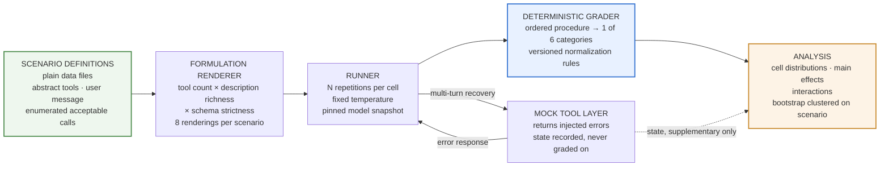

# How Your Tool Schema Changes Your Failure Rate — Design

**Date:** 2026-08-17
**Status:** Approved design. **Sequenced last and optional** — weakest of the set for the
$250k+ target band (irrelevant to quant finance, partial for the labs). Build only if hours
remain after artifacts 1, 2, 4, and 5. Retained as the agent-positioning hedge.
**Artifact:** 3 of 5 — **last and optional**
**Depends on:** nothing. No GPU, no shared harness, no dependency on artifacts 1 or 2.

**Working post title:** *How your tool schema changes your failure rate.* Exact wording set at
publication; the decision is that the title names the engineer-controlled variable, not the
models.

---

## 1. Claim and differentiation

### The claim

**Claim 2 of the portfolio: how you know your agent works.**

Tool-calling reliability is substantially governed by presentation choices the engineer controls
— how many tools are in context, how they are described, how strictly they are typed — and those
effects interact. And reliability is a **distribution, not a score**: the same scenario run
repeatedly does not produce the same outcome, and the spread is the operationally relevant
quantity.

### The prior-art problem, and the answer to it

Tool-calling benchmarks already exist and are well known — Berkeley Function Calling Leaderboard,
τ-bench, and several adjacent suites. Some already report consistency across repeated trials.

This matters because the portfolio's entire mechanism is *measurement is scarce*. An artifact that
measures tool-calling reliability across models is honestly described as a smaller
reimplementation of a public leaderboard, which is the **worst outcome available** for a
positioning artifact: it demonstrates diligence while signalling unfamiliarity with the field. Of
the artifacts, this is the one whose naive version produces negative signal.

**The differentiation is the independent variable.** Existing benchmarks vary the model and hold
the prompt fixed; they answer "which model should I pick," a decision made rarely. This varies the
prompt and holds the model fixed; it answers "how should I present my tools," a decision made
every time a tool is added.

**A related-work section naming the prior art is a design requirement**, placed early in the post
rather than buried. For a hiring reader who works on agents, command of the prior art plus a
clean orthogonal question is stronger signal than the numbers. Omitting it invites the one reading
that would sink the artifact.

Durability argument, secondary but real: a model leaderboard is stale the week a new model ships.
A finding about schema design survives model turnover — which matters for an artifact expected to
keep generating inbound after promotion stops.

### The portfolio through-line

Every artifact shares one methodological signature: **point estimates hide the thing you care
about.**

- Artifact 1 refuses to report p99 from 100 samples, publishes ECDFs, treats host variance as a
  finding.
- Artifact 2 compares achievable frontiers rather than tuned operating points.
- Artifact 3 reports outcome distributions across repetitions rather than pass rates.

All of them also correct for the same statistical error — the unit of independent variation is not
the unit of observation — clustering on host, on replayed trace, and on scenario respectively.
Three artifacts arguing one consistent thing about measurement is a materially stronger body of
work than three unrelated results.

---

## 2. Scope

### In scope

- A 2×2×2 factorial over tool count, description richness, and schema strictness.
- A nested two-level error-message-format factor inside the recovery scenarios only.
- ~20 scenarios, hybrid sourced: public seed plus purpose-built adversarial extension.
- Many repetitions per cell, reporting distributions and a six-category failure taxonomy.
- A cross-model slice on the best and worst formulations only.
- A repo built for adoption — this artifact *is* the tool.

### Out of scope

- Model ranking or leaderboard construction.
- Open-ended agent tasks whose correctness cannot be enumerated in advance.
- LLM-as-judge grading, anywhere.
- Real-world API surfaces with authentication and sprawling schemas. Sequel.
- Multi-agent orchestration.
- Temperature as a factor. Fixed and pinned; sweeping it is a sequel.

### Fixed constraints

- Three factorial dimensions. Not five.
- Deterministic grading only, so the harness returns the same answer twice.
- Small and deep beats broad and shallow: ~20 scenarios run many times, not 200 run once.
  Breadth serves leaderboards; repetition serves reliability claims.
- **If budget binds, scenarios shrink before repetitions do.** A repetition floor is stated in
  advance; below it the distribution claim is not credible. This is the most important scoping
  rule in the artifact, because cost pressure pushes exactly the wrong way — more scenarios looks
  more impressive and destroys the only thing differentiating this from a leaderboard.

---

## 3. Architecture



The dotted edge carries the design's central constraint: mock execution produces state, and that
state is recorded, but **grading never depends on it**. The verdict is structural.

---

## 4. Scenarios, grading, and the failure taxonomy

### Scenario anatomy

Each scenario is a data file, not code:

```
id, source (public seed | authored)
target_failure_mode        # what this case is designed to provoke
tool_set                   # abstract tool definitions, rendered per formulation
user_message
expectation:               # exactly one of:
    acceptable_calls: [...]    # enumerated correct (tool, args) combinations
    no_call_expected: true     # answering directly is correct; any call is a failure
recovery (optional):
    inject_at_turn, error_kind, acceptable_recovery_calls
baseline_difficulty        # filled by the pilot, published
```

**Tool definitions are abstract and rendered per formulation.** A scenario declares what tools
exist and what they do; the formulation layer decides how many appear, how richly they are
described, and how strictly they are typed. One scenario definition produces eight renderings and
**nothing else differs between them** — the same single-source manipulation discipline artifact 1
applies to cache configuration and artifact 2 applies to the scaling signal.

### Suite composition and the selection rule

Hybrid: a public seed for comparability and credibility, plus authored adversarial cases for
headroom.

**The ceiling-effect problem this solves.** If scenarios are ones a competent model already
passes ~97% of the time, no formulation change can show a measurable effect, and the artifact
would report "schema design doesn't matter" when what actually happened is the instrument had no
resolution. Public suites are largely built to discriminate *models*, and their easier categories
are close to saturated for current frontier models.

**Selection rule, pre-registered before the pilot runs:**

1. Run every candidate at the **baseline formulation only**.
2. Include scenarios whose baseline pass rate falls inside a stated band — fixed before the
   pilot, wide enough to leave detection headroom in both directions.
3. Publish every candidate considered, its baseline rate, and the include/exclude decision.
4. **Excluded scenarios stay in the repo, flagged.** Anyone can re-run the full analysis with
   them included.

Selecting on baseline difficulty is choosing an operating point where the instrument has
resolution. Selecting on *outcome* would not be. The protections: selection uses baseline data
only, the rule is committed in advance, and nothing is deleted. Point 4 matters most — a benchmark
that hides its exclusions cannot be audited, and this one is meant to be adopted.

### Grading — ordered, deterministic, exhaustive

```
1. Is the output a parseable tool call conforming to the declared schema?
       no  → MALFORMED
2. Was no call expected, and a call was made?      → SPURIOUS
3. Was a call expected, and none was made?         → MISSING
4. Is the tool name in the acceptable set?
       no  → WRONG_TOOL
5. Are the arguments in the acceptable set (after normalization)?
       no  → WRONG_PARAMS
6. otherwise                                       → CORRECT
```

Every response lands in exactly one category, so counts sum correctly.

| Category | Meaning | Intervention it points to |
|---|---|---|
| `MALFORMED` | not a valid call at all | schema strictness, output format constraints |
| `SPURIOUS` | called a tool when none was warranted | description scoping, explicit no-op guidance |
| `MISSING` | answered from parametric knowledge instead of calling | tool discoverability, description richness |
| `WRONG_TOOL` | valid call, wrong choice among confusables | disambiguation, tool count |
| `WRONG_PARAMS` | right tool, wrong arguments | typing strictness, parameter naming |
| `CORRECT` | in the acceptable set | — |

The taxonomy is designed so each category **points at a different fix**. An aggregate pass rate
tells a practitioner nothing actionable; "70% of your failures are `WRONG_TOOL`" tells them to fix
disambiguation rather than typing. That mapping is the artifact's practical payload.

### Why not an LLM judge

**The claim is about nondeterminism, so the instrument must not be nondeterministic.** Each
scenario runs many times to characterise the outcome distribution. An LLM grader superimposes its
own variance on the model's, and a run scored differently on repeat could mean the agent behaved
differently or the judge did — with no way to separate them. That contaminates the exact quantity
the artifact exists to report.

It is also fatal for adoption: a harness that gives different answers on re-run is not something
anyone builds on. Secondary reasons: deterministic grading is free, and the failure taxonomy is
structural by nature — every category is a property of the emitted call, observable without
semantic judgment.

The accepted cost: every scenario must have an **enumerable** set of acceptable calls, written in
advance. Scenarios where "correct" cannot be enumerated do not enter the suite. The honest framing,
stated in the post, is that this harness measures *structurally checkable* tool-calling
reliability, which is a subset of agent correctness rather than all of it.

### Normalization rules are published and versioned

Argument comparison requires normalization: key ordering, whitespace, numeric tolerance, enum
casing, omitted optional parameters versus explicit nulls, extra-but-harmless fields.

**These rules silently determine results.** A lenient normalizer inflates every number and a
strict one deflates them, and neither is visible in the output. So the rules are published,
versioned alongside the scenario schema, and changing them is a **breaking change** to the
harness. Anyone comparing their numbers to yours needs to know they ran the same normalizer.

### Mock execution and recovery

Mock tools exist because recovery scenarios need something to fail. Injected error kinds:
invalid-parameter rejection, timeout, malformed payload, and a result contradicting the request.
Each is rendered in two error-message formats — actionable and opaque — the nested factor.

Recovery measures, over a capped turn budget:

| Measure | Definition |
|---|---|
| recovered | reached an acceptable call within the turn budget |
| turns to recovery | attempts required |
| **identical retry rate** | repeated the exact failing call unchanged |
| gave up | stopped calling, answered without the tool |
| hallucinated success | claimed the tool succeeded when it had not |

**Identical retry rate is the headline recovery metric.** Repeating a failing call verbatim is the
specific pathology that turns a transient error into a token-burning loop, and it is precisely
what an actionable error message should prevent. A clean mechanism-level prediction that gets
tested rather than asserted.

---

## 5. Experimental design

### The factorial

2 × 2 × 2, eight cells, fully balanced, every scenario rendered into all eight.

| Dimension | Low | High |
|---|---|---|
| Tool count in context | small set, no distractors | large set with plausible distractors |
| Description richness | terse one-liners | rich descriptions with constraints and examples |
| Schema strictness | loose types, free-form strings | strict enums, patterns, disciplined required/optional |

**Error-message format** is nested inside the recovery subset only. It cannot join the main
factorial because it has no meaning where nothing fails; including it would leave most cells
undefined.

**Why factorial rather than one-factor-at-a-time:** the interaction is the plausible finding.
Description richness likely matters little at three tools and a great deal at fifteen, because the
model's problem changes from formatting a call to choosing among confusables. OFAT reports both
main effects and misses that entirely — and "rich descriptions are worth little until your tool
count grows" is far more useful to a practitioner than two independent main effects.

### Temperature, and the finding hiding in it

Temperature is fixed at the value practitioners actually use for tool calling — effectively
deterministic decoding — and pinned.

That makes the repetition design *more* interesting. At temperature 0 a model is nominally
deterministic, so naively repetitions should be identical. In practice hosted inference is not
bitwise reproducible: batching, kernel scheduling, and floating-point non-associativity mean
identical requests can produce different outputs. **Measuring the residual failure-rate variance
at temperature 0 is itself a publishable result**, and the one most likely to surprise a reader who
assumes their agent is deterministic because they set a parameter.

### Repetitions

Each scenario runs **N times per cell**. Pooled across ~20 scenarios, a cell carries 20N
observations — ample for tight cell-level intervals even though any single scenario's estimate is
noisy.

N is chosen after the pilot from measured per-call cost, subject to the stated floor. Scenarios
shrink before repetitions do.

### Statistical treatment

**Cluster by scenario.** Repetitions within a scenario are correlated — a scenario the model finds
confusing fails repeatedly for the same reason. Treating all observations in a cell as independent
would produce intervals far too narrow and manufacture significance. Confidence intervals come
from bootstrapping **over scenarios**, not over individual calls.

Reported:

- Per-cell distribution across all six failure categories, not just pass rate.
- **Wilson score intervals** on proportions, which behave correctly near 0 and 1 where the normal
  approximation fails — and failure rates will live near those edges.
- Three main effects and three two-way interactions, with intervals.
- Per-scenario variance across repetitions, as the flakiness result.
- Recovery measures with identical-retry rate broken out.

**No fishing.** Five pre-registered hypotheses; anything else is labelled exploratory in those
words and never promoted to a headline claim.

### Pre-registered hypotheses

Committed to the repo before the pilot runs.

**H1.** Description richness has a small main effect at low tool count and a large one at high tool
count — the interaction exceeds either main effect alone.

**H2.** Schema strictness reduces `MALFORMED` and `WRONG_PARAMS` specifically, with little effect
on `WRONG_TOOL`.

**H3.** Tool count is the dominant driver of `WRONG_TOOL`.

**H4.** Actionable error messages reduce identical-retry rate relative to opaque ones.

**H5.** Failure-rate variance across repetitions at fixed temperature is non-zero and large enough
to matter operationally.

Each hypothesis names a **specific failure category** rather than aggregate accuracy. That is
deliberate: it forces the taxonomy to do work, and a hypothesis about which failures move is much
harder to satisfy by accident than one about overall pass rate.

### Models

**Primary:** one current, cost-efficient model with native tool-calling support, carrying the full
factorial. Selection criteria stated; exact snapshot identifier pinned and published.

**Cross-model slice:** best and worst formulations only, against two additional models — one
frontier model from a different provider, one materially smaller. Answers "does this only apply to
the model you tested" at a fraction of a full replication's cost.

**Pin snapshot identifiers, not family names.** Providers update models behind stable aliases, and
a result that cannot be tied to a specific snapshot cannot be reproduced or contested. Same
discipline as pinning the vLLM version and model revision hash in artifact 1. The post states that
findings are scoped to those snapshots on those dates.

---

### Business framing — required

Reliability rates convert to money through tokens, and the conversion contains a real tradeoff
rather than a restatement.

Richer descriptions and larger tool sets cost more input tokens on **every** call. If they fail less
often, they may still be cheaper overall — because failures cost retries, and identical-retry loops
burn tokens for nothing.

| Quantity | Definition |
|---|---|
| **cost per successful tool call** | total tokens spent, including failed attempts and retries, ÷ successful calls |
| retry waste | tokens consumed by calls that failed and were retried |
| formulation overhead | additional input tokens per call from richer descriptions or larger tool sets |
| **break-even** | the failure-rate reduction at which a richer formulation pays for its own token overhead |

**This is the artifact's most practically useful number and it is nearly free** — token counts are
already in every API response, so it requires no additional calls. "Rich descriptions cut wrong-tool
failures by X%" is an eval result. "Rich descriptions cost Y% more per call and pay for themselves
once failure rate exceeds Z%" is an engineering decision. The second is unpublished.

## 6. Budget

| Component | Scale |
|---|---|
| Pilot for scenario selection | baseline cell only, all candidates |
| Main factorial | 8 cells × ~20 scenarios × N repetitions |
| Recovery sub-design | recovery subset × 2 error formats, multi-turn |
| Cross-model slice | 2 cells × 2 models × ~20 scenarios × N |

**Target: $40–60**, against $65–120 remaining after artifacts 1 and 2.

Cost control comes from keeping context small — tool definitions dominate input tokens, and the
high-tool-count arm is the expensive one by construction — and from choosing a cost-efficient
primary model. The cost model is expressed in the repo as a formula over N, so the repetition
count is chosen from measured per-call cost after the pilot rather than guessed in advance.

**The fixture bootstrap, and a local option the GPU artifacts do not have.**

Fixtures can be **hand-authored from documented response schemas**, so unlike the GPU artifacts this
harness can be built end to end — grader, taxonomy, normalization, statistics, figures — with zero
spend and no reconnaissance. Roughly 95% of it is offline work.

There is also a smoke test the other artifacts cannot run: point the harness at a **small local
model with tool-calling support** on the development machine. Output quality will be poor, which is
exactly what makes it useful — a weak model produces genuinely malformed calls, exercising the
grader's `MALFORMED` path and the precedence boundaries with real model output rather than fixtures
written to match one's own expectations. That is a stronger test of the grader than synthetic data,
and it costs nothing.

**Dry-run mode is a build requirement.** The full harness runs against a recorded-response fixture
set with no API calls, so grading, analysis, and figures are exercised for free before any paid
run. Same role the GPU-free loop plays in artifacts 1 and 2 — and here it doubles as the test suite
an adopter runs to verify their install.

---

## 7. Adoptability

**The primary adoption path is not "reproduce my study," it is "run this on my own agent."**

A repo that only regenerates published figures gets starred and forgotten. A repo that answers
*"what is my agent's failure taxonomy?"* gets used, because every team shipping tool-using agents
has that question and almost none can answer it. They do not care about the factorial; they want
their own breakdown of malformed versus wrong-tool versus wrong-params, because that says what to
fix on Monday.

| Requirement | Why |
|---|---|
| Scenarios are plain data files, not code | Lowest barrier to authoring your own |
| Point it at your tool schemas, get your taxonomy | The actual adoption use case, a first-class entry point |
| The factorial is optional | Single-formulation baseline diagnostic must be the easy default |
| Provider-agnostic | Adoption dies at "only works with one vendor" |
| Dry-run against fixtures | Verify install without spending money; doubles as the test suite |
| Deterministic grading | Same answer twice, or nobody builds on it |
| Every published number regenerates from the repo | Backs the post's reproduction claim |
| Permissive license | Adoption blocker otherwise |

**Licensing of the public seed** must be checked and respected before redistribution — a practical
detail that is easy to discover too late.

---

## 8. Publication

### Figures

1. **Failure taxonomy across the eight cells** — stacked composition, showing not just that
   accuracy moves but *which failure mode* moves. The main chart.
2. **The interaction plot** — description richness effect at low versus high tool count, with
   intervals. H1's evidence and the most quotable sentence.
3. **Flakiness distribution** — per-scenario outcome variance across repetitions at fixed
   temperature. H5, and the most surprising result for most readers.
4. **Identical-retry rate by error-message format** — H4.

Same constraints as the other artifacts: intervals shown, N stated, no truncated axes, legible on
a phone, and **rendered and visually inspected before being called done.**

### Post structure

1. **Lead** — the interaction finding or the flakiness finding, whichever transfers further, by
   the portfolio's transferability rule.
2. **The taxonomy chart.**
3. **Related work** — BFCL, τ-bench, neighbours, and precisely what this asks that they do not.
   Early, not buried.
4. **What to change in your agent** — actionable, mapped from failure mode to intervention.
5. **Method** — suite composition, selection rule, grading procedure, normalization, factorial,
   pinned snapshots.
6. **Results** — cell distributions, main effects, interactions, flakiness.
7. **Cross-model slice** — does it generalise past one model.
8. **Limits** — structurally checkable calls only, enumerable answers only, fixed temperature,
   pinned snapshots on stated dates, one scenario suite.
9. **Run it on your own agent** — the adoption call, prominent and concrete.
10. **Next.**

### Required explanations

Four short paragraphs, no additional measurement. Domain fluency shows in the prose around the
numbers.

- Why tool calling is not deterministic even at temperature 0, and what that means for anyone who
  assumed it was.
- Why a pass rate is the wrong summary for a reliability property, and what a distribution shows
  that it cannot.
- Why each failure category points at a different fix.
- Why grading with an LLM judge would have been a methodological error, not merely a slower choice.

### Pre-publish gate

Same as artifacts 1 and 2, including the non-negotiable item: confirm every number, diagram, and
claim derives from independently run experiments and independent reasoning, with nothing traceable
to employer internal material.

---

## 9. Risks

| Risk | Handling |
|---|---|
| Reads as a reimplementation of existing benchmarks | Orthogonal independent variable; related-work section early and explicit |
| Model updates invalidate the numbers | Snapshot IDs pinned, claims dated and scoped; the formulation finding outlives the model finding |
| Ceiling effects hide real effects | Pre-registered selection rule with a discriminating band, established by pilot |
| "You cherry-picked scenarios" | Every candidate published with its baseline rate; excluded ones stay in the repo, flagged and re-runnable |
| Normalization silently sets the results | Rules published and versioned; changes are breaking changes |
| Cost overrun | Dry-run fixtures, cost formula over N, repetitions chosen from measured per-call cost |
| Scope creep under budget pressure | Scenarios shrink before repetitions; stated repetition floor |
| Nobody adopts the harness | Adoption is a secondary benefit. Designed for adoption, not dependent on it |

**On the last row, honestly.** The brief treats adoption as this artifact's distinguishing
mechanism — a tool others use generates inbound after promotion stops. That is true and worth
designing for, but it is not within your control. The artifact must be worth publishing if it gets
thirty stars and no adopters, and it is: the interaction result and the temperature-0 flakiness
number are both publishable findings independent of whether anyone runs the harness themselves.

---

## 10. Definition of done

- Pre-registration committed to the repo — five hypotheses, selection rule and band, normalization
  rules, repetition floor — **before** the pilot runs.
- Scenario suite assembled: public seed licensed and attributed, authored adversarial extension
  written, all candidates present in the repo.
- Pilot run at baseline formulation; baseline difficulty recorded for every candidate;
  include/exclude decisions published with their rates.
- Dry-run fixture mode passes end to end with zero API calls, fixtures hand-authored from documented
  schemas.
- Grader smoke-tested against a small local model's real output, including genuinely malformed calls.
- Grader verified against hand-labelled cases covering all six categories, including the
  precedence boundaries between them.
- Full factorial run: 8 cells × included scenarios × N repetitions, at or above the repetition
  floor.
- Recovery sub-design run across both error-message formats.
- Cross-model slice run on best and worst formulations.
- Analysis bootstraps clustered on scenario; Wilson intervals on all reported proportions.
- Four figures rendered and visually inspected.
- All four required explanations present in the post, plus the related-work section.
- Bring-your-own-tools path documented and verified by running it against a tool set not in the
  suite.
- Post published at a permanent slug; repo published with scenarios, harness, fixtures, raw
  results, analysis, and figure code.
- Headline finding stated in **both systems units and money**, with all conversion assumptions
  published so a reader can substitute their own.
- Pre-publish boundary gate completed.
