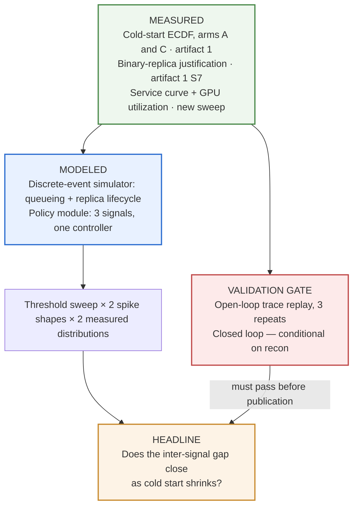

# Which Autoscaling Signal Survives a Cold Start — Final Design

**Date:** 2026-09-04
**Status:** Approved design, ready for implementation planning
**Artifact:** 2 of 5
**Amends:** [2026-08-17 autoscaling signal comparison design](2026-08-17-autoscaling-signal-comparison-design.md)
**Depends on:** [Artifact 1 — What a vLLM Replica Does Before It Can Serve](2026-08-17-cold-start-decomposition-design.md), **complete**

The August design was written before artifact 1 had numbers, and the portfolio contract
deliberately left it unfinalized so it could absorb them (artifact 1 spec §3, sequence item 3).
The numbers now exist. Some of them invalidated parts of that design.

**The August document stands unedited as the record of what was decided before the data existed.**
Where the two conflict, this one governs. Everything it does not mention is unchanged.

---

## 1. What artifact 1 measured, and what it did to this design

300 runs, 100 per arm, zero failures, zero discards, 100 host-complete triples.

| Artifact 1 result | Consequence for artifact 2 |
|---|---|
| `T_fast` = request 1 for all three arms. Request 1 sits 7.6–7.7% above steady state; steady-state medians differ across arms by **0.6 ms** | **The three-state replica model is dropped.** The degraded window is ~0.1 s |
| Cold start p50/p95: arm A **81.1 / 96.4 s**, arm C **39.4 / 54.9 s**. p95/p50 ≈ 1.2 | Scale-up lag is near-deterministic, not heavy-tailed. Binds `D` (§8) |
| Two real distributions, 2× apart, differing in exactly one interface | **H3 is promoted to the headline.** The composition slice is now the artifact |
| KV capacity 35,792 tokens (A, B) and 43,040 (C) | Not the binding concurrency constraint at artifact 1's request shape (§5) |
| All 300 runs landed on one host; artifact 1 dropped H4 for it | Motivates recon question 2 (§9). **Not evidence that scale-ups get warm hosts** — artifact 1 submitted serially, so the platform never needed a second worker |
| One first-touch run at **2266.6 s**, 28× its arm's median | New risk: a single host-novelty event inside a validation run would look like a model failure (§14) |

### The differentiator that was lost, and what replaces it

The August design named the warmup curve "the input most analyses omit" and built the
`degraded-window share` metric on it. Artifact 1 measured that window at ~0.1 s, so both are gone.

What replaces it is smaller and honestly earned. Nearly every autoscaling analysis models replicas
as binary *because it is convenient*. This one models them as binary **because it measured that
binary is correct for this stack**, and states the boundary: vLLM finishes its warmup before
answering `/health`, so the expensive work lands inside `S4`, ahead of readiness. On a serving stack
that reports ready earlier, the three-state model would be necessary again and this simplification
would be wrong. That claim is falsifiable and rests on measurement; the original one rested on an
assumption that turned out to be false.

---

## 2. Claim and question

### Claim

Unchanged in scope, changed in emphasis: **what elastic LLM serving actually costs, measured** —
the second half of portfolio Claim 1. Artifact 1 established what a cold replica costs. This
artifact establishes how often you pay it, what choosing a different scaling signal buys you, and
**whether the two are substitutes**.

### Question — revised

> For an LLM serving deployment whose scale-up lag is a measured cold-start distribution, does
> reducing that lag change how much your choice of autoscaling signal matters?

Supporting, and the August question in full: what cost/p99 tradeoffs can each of GPU utilization,
queue depth, and in-flight concurrency achieve under a step and a ramp, and does any signal's
frontier dominate?

The framing stays *achievable frontiers*, not *which signal is best*. The latter is ill-posed —
every policy has thresholds, and whichever set you publish determines the winner.

### Why the promotion is the right call

The composition question is the one neither artifact can answer alone, and it is the one an
operator actually faces: *should I fix my cold start or tune my autoscaler first?* It also makes
artifacts 1 and 2 one argument rather than two adjacent posts, which the portfolio contract wants
and which no amount of cross-linking achieves on its own.

---

## 3. Delta from the August design

**Dropped**

- The three-state replica model (absent → serving-but-slow → fast).
- The `degraded-window share` metric in §9.
- Every claim resting on the warmup curve as a *model input*. It survives only as the measurement
  justifying the binary model.

**Changed**

- Scale-up lag is sampled by **resampling artifact 1's empirical ECDF**, not a fitted distribution.
  100 measured runs per arm, and a p95/p50 of ~1.2 means fitting a parametric tail would invent
  structure the data does not show.
- Lag **includes `T_platform`** (median 4.07–4.83 s of platform queueing). From the autoscaler's
  point of view the wait is the wait, regardless of which layer owns it.
- The closed-loop confirmatory gate becomes **conditional** on reconnaissance (§9).

**Promoted**

- H3, sharpened into a falsifiable threshold (§7), tested against arm A and arm C rather than a
  modeled contrast.
- The frontier-convergence chart, from figure 4 to figure 1.

**Standing unchanged**

H1, H2, H4. The service-curve sweep. The three signals and the single controller. The Pareto
frontier construction and the iso-cost slice. The open-loop trace-replay gate with tolerance
derived from three real repeats. The disclosure rule. The business framing requirement.

---

## 4. Architecture

Every parameter is measured. Only the control loop is modeled. That division is still the whole
methodological argument, and the validation gate still exists to test exactly the modeled part.

---

## 5. Measured inputs

| Input | Source | Status |
|---|---|---|
| Cold-start distribution, arm A | Artifact 1, empirical ECDF, 100 runs | **Available** |
| Cold-start distribution, arm C | Artifact 1, empirical ECDF, 100 runs | **Available** |
| Binary-replica justification | Artifact 1 `S7` | **Available** — retired as a parameter, retained as evidence |
| Service curve | New sweep | Not yet measured |
| GPU utilization vs concurrency | Same sweep | Not yet measured |

### The service curve sweep

One replica, inherited configuration, concurrency swept across the operating range. At each level,
record end-to-end latency, TTFT, throughput, and GPU utilization.

**Request shape: artifact 1's exact shape** — the prompt `"Explain what a key-value cache does, in
two sentences."` at `max_tokens=16`. Not a more realistic one. It is the only shape for which
artifact 1's measurements exist, and the August design requires this curve to connect to artifact
1's KV capacity number; a different shape severs that connection for no gain the artifact can use.

**KV is not the binding constraint at this shape.** Roughly 30 tokens per request against a
measured 43,040-token cache is ~1,400 concurrent requests before KV binds. Compute and vLLM's
`max_num_seqs` (default 256) will bind first. The pilot sweep therefore stands exactly as the
August design wrote it — artifact 1 offers no shortcut to where the curve bends, and the pilot must
record which limit actually binds.

**Limitation, stated in the post:** one fixed request shape. Real traffic is heterogeneous in input
and output length and the curve shifts with both.

---

## 6. Replica model

A replica is **absent** or **serving**. On a scale-up decision, its lag is one sample resampled
from the arm's empirical cold-start ECDF, and it begins serving at full steady-state rate when
that lag elapses.

Justified by measurement, not convenience: artifact 1's `T_fast` equals request 1 for all three
arms, request 1 sits 7.6–7.7% above steady state, and per-arm steady-state medians differ by
0.6 ms. Modeling a degraded window here would model 0.1 s.

**Where this stops being true, stated in the post:** vLLM answers `/health` only after its warmup
completes, so the expensive work is inside `S4`, ahead of readiness. A stack that reports ready
earlier serves its degraded window to real users, and this model would understate every policy's
damage.

---

## 7. Pre-registered hypotheses

Committed to `docs/experiment-a2.md` before any sweep runs.

**H1.** In-flight concurrency dominates the other two on the cost/p99 frontier for the step spike.

**H2.** GPU utilization is the worst of the three, and the mechanism is censoring — its frontier
degrades most in the high-load region where the signal has saturated.

**H3 — the headline, sharpened.** The inter-signal frontier gap at iso-cost **shrinks by at least
half** between the arm-A distribution (p50 81.1 s) and the arm-C distribution (p50 39.4 s).

The August wording — "the gap narrows as cold start shrinks" — is directional with no threshold,
so nearly any result confirms it. The half stated above is a number the experiment can miss.

**Gap** is the p99-damage spread between the best and worst signal at the iso-cost slice, in
seconds. It is computed **separately for the step and the ramp, and both are reported.** H3 holds
only if the halving occurs under **both** spike shapes; halving under one and not the other is a
partial result and is published as one, not rounded up to confirmation. Stated this way because
H4 predicts the margins shrink on the ramp anyway, which makes a ramp-only halving the easier and
less interesting outcome.

**H4.** The ranking is stable across step and ramp, but the margins shrink on the ramp, because a
gradual buildup gives even a lagging signal time to respond.

**Retired:** every hypothesis and metric resting on a degraded window.

---

## 8. Traffic model — binding rules, now bound

Arrivals are Poisson with a time-varying rate. Step: rate jumps to `k ×` baseline, sustained for
`D`. Ramp: rate rises linearly over `R`, then sustained for `D`.

| Parameter | Rule (August) | Value (now) |
|---|---|---|
| `D` sustain | a stated multiple of measured p95 cold start | **2 × p95(arm A) = 192.7 s, rounded to 190 s** |
| `R` ramp | relative to `D`, meaningfully gradual | **`D`/2 = 95 s** |
| baseline | a stated fraction of measured saturation | **40% of saturation** — fraction fixed now, absolute rate set by the sweep |
| `k` magnitude | sized to require a stated number of additional replicas | **3 additional replicas** — rule fixed now, absolute rate set by the sweep |

**`D` is pinned to arm A's p95 and held constant across both distributions.** If `D` moved with each
arm's own p95, the arm-A-versus-arm-C comparison would differ in spike duration *and* lag
simultaneously, and H3 would be uninterpretable — the whole composition claim rests on varying
exactly one thing. Pinning to the slower arm also guarantees the spike outlasts even the uncached
cold start, which is the only regime in which scaling can help anyone.

**Why p95 and not p50:** a spike that only outlasts median cold start is one where the tail
replicas arrive after it is over — a scenario in which scaling cannot help regardless of signal,
which would flatten the differences the experiment exists to detect.

**Ordering rule, pre-registered:** the two absolute rates above are computed from the service curve
and committed **before any policy sweep runs**. Choosing them after seeing frontier results would
let the traffic model be tuned until a signal wins.

---

## 9. Reconnaissance — go/no-go before anything is built

Capture-only, following artifact 1 §6.8. Nothing here publishes as a result. Raw API responses are
committed as fixtures.

**Q1 — Does the platform API expose replica-count control?** Scale-up and scale-down actions,
their acknowledgement semantics, and their latency. Needed both to drive the closed-loop gate and
to *pin* capacity for the open-loop one.

**Q2 — Under concurrent load, does the platform start distinct workers, and is a driven scale-up a
genuine cold start or a warm-host restart?** This is the question artifact 1 structurally could not
answer: it submitted serially, so the platform never had reason to start a second worker. Its
single-host result motivates the question and does not settle it.

**Q3 — Where does the latency curve bend, and what binds concurrency first** — `max_num_seqs`,
compute, or KV? Sets the range for the full sweep.

### Go/no-go rules, fixed in advance

| Outcome | Consequence |
|---|---|
| Q1 fails | **Stop and redesign.** Without capacity control there is no validation gate, and this artifact does not publish an unvalidated simulation |
| Q2 shows warm-host restarts | Confirmatory gate is **dropped**, and the reason is published: *on this provider, a scale-up does not reproduce a cold start.* A useful negative finding about serverless GPU platforms |
| Q2 shows genuine cold starts | Both gates stand as the August design wrote them |
| Q3 | Range-setting measurement, not a gate |

---

## 10. Validation protocol

**Primary gate — open-loop trace replay. Unchanged and unconditional.** Fix replica count, drive a
real transient load, replay the *exact* arrival trace into the simulator, compare predicted latency
trajectory against what happened. Three real repeats; their spread sets the tolerance band. A model
cannot be required to be more reproducible than the system it models.

This gate needs no scale-up control — only pinned capacity — which is why it is the primary one and
why it survives any recon outcome except Q1 failing outright.

**Confirmatory gate — closed loop, conditional on Q2.** One real closed-loop run, same policy code,
driving actual replica changes. Run it with **GPU utilization**, the signal H2 predicts is worst:
reproducing the real behaviour of the policy being argued *against* is the harder test and disarms
the obvious objection that the favourite was modeled carefully and the others sloppily.

**New requirement: record `host_id` for every replica in every validation run.** Artifact 1
measured one first-touch cold start at 2266.6 s against a 39–96 s norm. A single host-novelty event
inside a validation run would dominate the trajectory and be indistinguishable from a simulator
bug without the host recorded. With it, the two are separable after the fact.

**Not validated empirically, deliberately:** controller arithmetic, covered by unit tests with
hand-computed scenarios. Frontier regions far from the validated operating point are extrapolation
and the post says so in those words, with the validated point marked on the charts.

**Disclosure rule:** misses are reported with magnitude. A genuine model bug may be fixed and
re-validated, but the post discloses that a fix occurred and what it was. Persistent failure to
validate is itself a publishable result.

---

## 11. Metrics and figures

Pareto frontier of cost against p99 damage, per signal, per spike shape, per distribution. Compare
frontiers, not points. The headline sentence comes from the iso-cost slice.

### Figures — four in the body

1. **Frontier convergence, two panels side by side.** Left: **measured** — arm A versus arm C,
   three signals, the two-point answer to H3. Right: **modeled** — lag swept 20–120 s, showing
   where the gap closes. The measured/modeled boundary is drawn on the chart itself, not left to
   the caption, so a reader who only looks at figures still sees which half is measurement. The
   main argument.
2. **Pareto frontiers** — cost versus p99 damage, three signals, two panels for step and ramp,
   validated operating point marked. Formerly the headline; now the evidence beneath it.
3. **Validation overlay** — predicted versus actual trajectory with the three-run reality band.
   Appears early in the post, not buried in method.
4. **Measured service curve with utilization censoring visible** — latency, throughput and GPU
   utilization against concurrency. H2's mechanism in measured data rather than asserted.

Same constraints as artifact 1: no truncated axes, N stated on every figure, intervals shown,
legible on a phone, and **rendered and visually inspected before being called done.** Published
copies live beside the post and are guarded against drift, as artifact 1's are.

### Business framing — required

Cost expressed in both systems units and money, with every conversion assumption published so a
reader can substitute their own. Artifact 1's `Assumptions` machinery is reused; its illustrative
rates are re-stated as illustrative.

---

## 12. Post structure

1. **Lead** — the composition finding: does fixing your cold start change how much your signal
   choice matters?
2. **Figure 1**, and the one-sentence answer.
3. **What was measured versus what was modeled** — early, because it is the credibility claim.
4. **Figure 3, the validation overlay** — with the tolerance band and how it was derived.
5. **The three signals and their frontiers** — figure 2, H1 and H2.
6. **The service curve** — figure 4, and why utilization censors.
7. **Step versus ramp** — H4.
8. **What this costs** — the business framing.
9. **Limits** — one provider, one GPU, one model, one request shape, one engine version; binary
   replica model and the stack property it depends on; extrapolation away from the validated point.
10. **Reproduce it.**
11. **Next.**

---

## 13. Budget

The August estimate of **$35–60** stands. The sweep is one replica for under an hour, reconnaissance
is capture-only, and validation is three short spikes plus at most one closed-loop run.

**Open item, blocking commitment to that number: artifact 1's actual spend is not recorded
anywhere in the repository.** Its definition of done required the campaign to land within $45–75 and
nothing captured the outcome — the post publishes 6.14 measured GPU-hours but explicitly states it
never recorded an invoice. Read the actual figure off the RunPod console and record it before
artifact 2 commits any spend, so the remaining envelope against the original $200 is a known
quantity rather than an assumption.

**This artifact records its own spend when it completes.** Not repeating artifact 1's omission.

---

## 14. Risks and limitations

| Risk | Handling |
|---|---|
| **The result does not discriminate** — with lag near-deterministic and its spread narrow, all three frontiers could land nearly on top of each other | Under the August headline this was a failure. Under the composition headline it *is* the finding: *with a cold start this tight, signal choice barely matters — fix the cold start instead.* The reframing absorbs the risk rather than hedging it |
| Q1 fails — no capacity control | Stop and redesign; stated in §9 |
| Q2 shows warm restarts | Confirmatory gate dropped, negative finding published |
| **Host novelty inside a validation run** — a scale-up onto a host without the image costs ~2266 s, not 39–96 s, and would dominate a trajectory | `host_id` recorded per replica (§10), making a platform event separable from a model error. Disclosed if it happens |
| Simulator agrees too easily | Tolerance is derived from reality's own three-run spread, fixed before comparison |
| Extrapolation beyond the validated point | Marked on the charts and named in the body, in those words |

### Standing limitations, stated in the post

One provider, one GPU class, one model, one engine version, one request shape. A binary replica
model whose validity is a measured property of this serving stack, not a general one. Frontiers away
from the validated operating point rest on a model behaving sensibly outside its tested range.

---

## 15. Expected decomposition into plans

Artifact 1 needed two implementation plans — a harness plan proved every component against stubs
and fixtures, and a campaign plan spent the money. This artifact has the same shape and should
split the same way:

1. **Reconnaissance and harness** — Q1/Q2/Q3, the service-curve sweep, the simulator, the policy
   module, and the whole analysis path, built and tested against synthetic inputs. Roughly nine
   tenths of the artifact, and nearly all of it GPU-free.
2. **Measurement and validation** — the real sweep, the three open-loop repeats, the conditional
   closed-loop run, the frontiers, and publication.

Splitting at that seam keeps the expensive half from starting until the cheap half is proven, which
is the discipline that gave artifact 1 zero failures and zero discards across 300 paid runs.

---

## 16. Definition of done

- Learning-guide modules from the August design worked through before the corresponding build stage.
- Artifact 1's actual spend read off the console and recorded; remaining envelope known.
- `docs/experiment-a2.md` committed with H1–H4 and the analysis plan **before** the first paid run.
- Reconnaissance complete; Q1/Q2/Q3 answered; API responses committed as fixtures; the go/no-go
  outcome recorded, including the confirmatory gate's fate.
- Simulator, policy module and sweep pass end-to-end against synthetic inputs with no GPU.
- Service curve measured, with the binding concurrency limit identified and recorded.
- Absolute baseline rate and `k` computed from the service curve and committed before any policy
  sweep runs.
- Open-loop gate passed, or its failure characterized and published instead of the frontiers.
- Confirmatory gate passed, or dropped with the recon finding published.
- `host_id` recorded for every replica in every validation run.
- Frontiers produced for both spike shapes against both measured distributions.
- H3 evaluated against its stated threshold, and reported whether or not it holds.
- Four body figures rendered, visually inspected at full size and phone width, published beside the
  post and guarded against drift.
- Cost reported in both systems units and money, with assumptions published.
- Post published at a permanent slug with byline, date, and repo link.
- This artifact's own spend recorded.
- Pre-publish gate completed, including the employer-boundary check.
